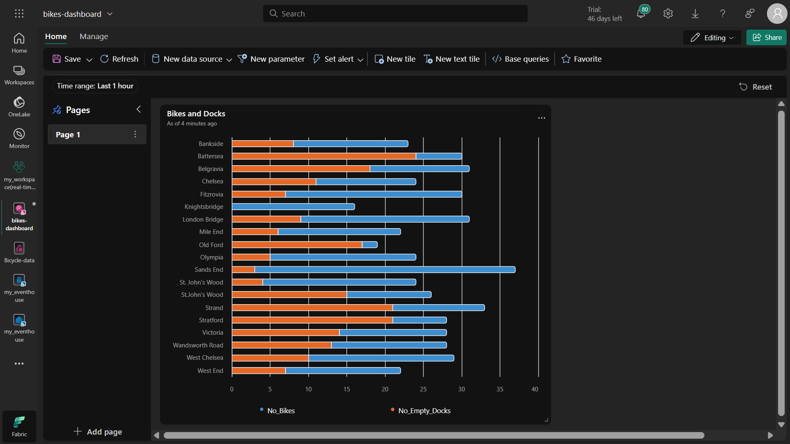
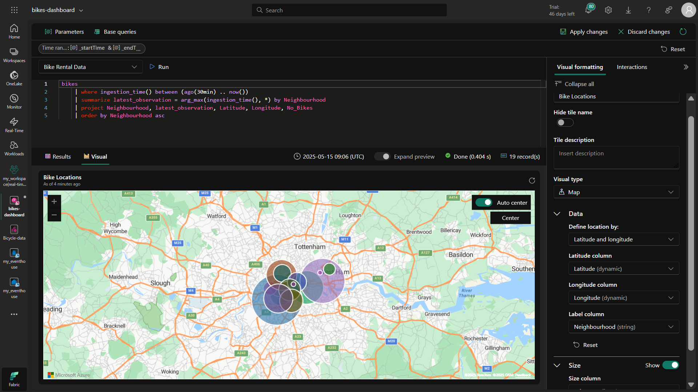
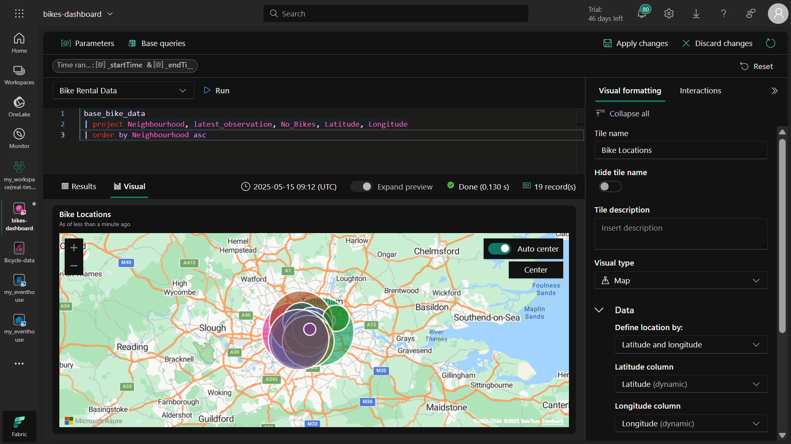
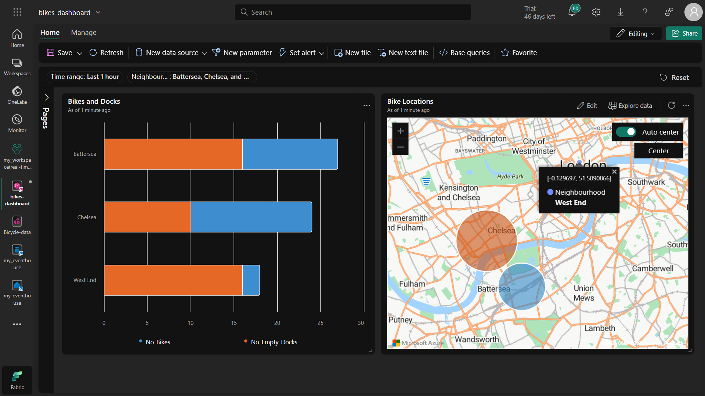

# Real-Time Dashboard in Microsoft Fabric - Step-by-Step Guide
## Overview
This project demonstrates how to create a real-time dashboard in Microsoft Fabric to visualize streaming bicycle rental data. The solution includes setting up an eventhouse, creating an eventstream to ingest sample bicycle data, and building an interactive dashboard with multiple visualizations.

## Prerequisites
Microsoft Fabric tenant account

Workspace with Fabric capacity (Trial, Premium, or Fabric)

## Step 1: Create a Workspace
Navigate to Microsoft Fabric

Select Workspaces from the left menu

Click New Workspace

Provide a name and select a licensing mode with Fabric capacity

Click Apply

### Purpose: Workspaces are containers for your Fabric items and require Fabric capacity to use real-time analytics features.

## Step 2: Create an Eventhouse
In your workspace, click Create from the left menu

Under Real-Time Intelligence, select Eventhouse

Provide a unique name and click Create

Note the automatically created KQL database with the same name

### Purpose: Eventhouse is a specialized data store optimized for real-time data ingestion and querying using KQL.

## Step 3: Create and Configure an Eventstream
In your KQL database, click Get data

Select Eventstream > New eventstream

Name it "Bicycle-data" and click Create

Select Use sample data as the source

Name the source "Bicycles" and select the sample dataset

Configure the destination:

Select Eventhouse as destination type

Choose your workspace and eventhouse

Set table name to "bikes"

Select JSON format

Connect the source to destination and click Publish

Verify data ingestion in the preview pane

### Purpose: Eventstreams enable continuous data ingestion from sources to destinations in real-time.

## Step 4: Create a Real-Time Dashboard
From the home page, create a new Real-Time Dashboard named "bikes-dashboard"

Add a data source:

Select One lake data hub

Choose your eventhouse

Name: "Bike Rental Data"

Enable passthrough identity

Add First Tile (Bar Chart)
Click Add tile

**Run this KQL query:**
```
kql
bikes
| where ingestion_time() between (ago(30min) .. now())
| summarize latest_observation = arg_max(ingestion_time(), *) by Neighbourhood
| project Neighbourhood, latest_observation, No_Bikes, No_Empty_Docks
| order by Neighbourhood asc
```
Format as stacked bar chart:

Title: "Bikes and Docks"

Y columns: No_Bikes, No_Empty_Docks

X column: Neighbourhood

Legend at bottom

Add Second Tile (Map)
Click Add tile

**Run this KQL query:**
```
kql
bikes
| where ingestion_time() between (ago(30min) .. now())
| summarize latest_observation = arg_max(ingestion_time(), *) by Neighbourhood
| project Neighbourhood, latest_observation, Latitude, Longitude, No_Bikes
| order by Neighbourhood asc
```

**Format as map:**

**Title:** "Bike Locations"

**Location by** Latitude/Longitude

**Label by** Neighbourhood

**Size by** No_Bikes

### Purpose: Visualizations help users quickly understand bike availability patterns across neighborhoods.

## Step 5: Optimize with Base Query
Create a base query named "base_bike_data":
```
kql
bikes
| where ingestion_time() between (ago(30min) .. now())
| summarize latest_observation = arg_max(ingestion_time(), *) by Neighbourhood
```
Modify both tiles to use this base query with appropriate projections

### Purpose: Base queries reduce code duplication and make maintenance easier.

## Step 6: Add Neighborhood Filter
**Create a parameter:**

**Name:** "Neighbourhood"

**Type:** Multiple selection

**Source query:** bikes | distinct Neighbourhood

**Modify base query to include filter:**
```
kql
bikes
| where ingestion_time() between (ago(30min) .. now())
  and (isempty(['selected_neighbourhoods']) or Neighbourhood in (['selected_neighbourhoods']))
| summarize latest_observation = arg_max(ingestion_time(), *) by Neighbourhood
```
### Purpose: Parameters enable interactive filtering for more focused analysis.

## Step 7: Add Dashboard Page
**Click + Add page and name it "Page 2"**

**Add a tile with query:**

```
kql
base_bike_data
| project Neighbourhood, latest_observation
| order by latest_observation desc
```
### Purpose: Additional pages can organize related visualizations or provide alternative views.

## Step 8: Configure Auto-Refresh
Go to Manage > Auto refresh

Enable with 30-minute interval

### Purpose: Ensures dashboard shows current data without manual refreshing.

## Step 9: Save and Share
Click Save on the toolbar

Click Share and copy the dashboard link

Cleanup
To remove resources:

Navigate to workspace settings

Select Remove this workspace

## Key Concepts
**Eventhouse:** Real-time optimized data store

**Eventstream:** Pipeline for continuous data ingestion

**KQL:** Powerful query language for time-series data

**Real-Time Dashboard:** Visualizations that update automatically

**Parameters:** Interactive filters for users

This solution demonstrates end-to-end real-time analytics capabilities in Microsoft Fabric, from data ingestion to interactive visualization.














