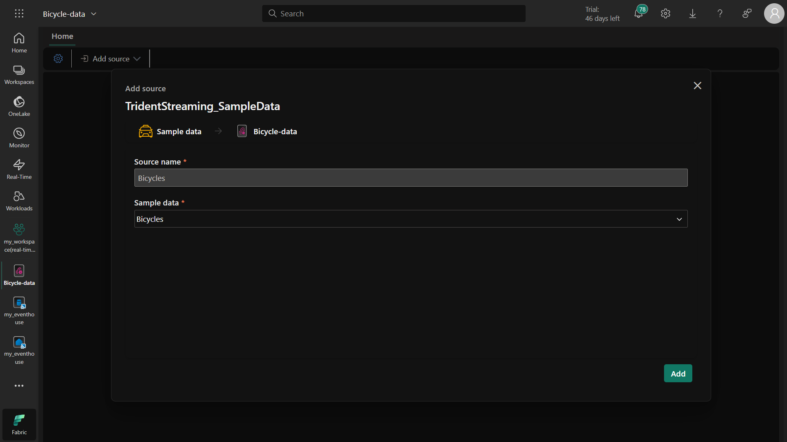

# Real-Time Dashboard in Microsoft Fabric - Stapsgewijze Handleiding 
## Overzicht
Dit project demonstreert hoe je een real-time dashboard maakt in Microsoft Fabric om streaming data van fietsverhuur te visualiseren. De oplossing omvat het opzetten van een eventhouse, het creëren van een eventstream voor voorbeeld-fietsdata en het bouwen van een interactief dashboard met meerdere visualisaties.

## Vereisten
Microsoft Fabric tenant account

Werkruimte met Fabric capaciteit (Trial, Premium of Fabric)

## Stap 1: Werkruimte Aanmaken
Ga naar Microsoft Fabric

Selecteer Werkruimten in het linkermenu

Klik op Nieuwe werkruimte

Geef een naam op en selecteer een licentie met Fabric capaciteit

Klik op Toepassen

### Doel: Werkruimten zijn containers voor je Fabric-items en vereisen Fabric capaciteit voor real-time analytics functies.

## Stap 2: Eventhouse Aanmaken
Klik in je werkruimte op Maken in het linkermenu

Selecteer Eventhouse onder Real-Time Intelligence

Geef een unieke naam op en klik op Maken

Let op de automatisch aangemaakte KQL-database met dezelfde naam

### Doel: Een Eventhouse is een gespecialiseerde dataopslag geoptimaliseerd voor real-time data-opname en query's met KQL.

## Stap 3: Eventstream Maken en Configureren
Klik in je KQL-database op Gegevens ophalen

Selecteer Eventstream > Nieuwe eventstream

Noem het "Bicycle-data" en klik op Maken

Selecteer Voorbeeldgegevens gebruiken als bron

Noem de bron "Bicycles" en selecteer de voorbeelddataset

Configureer de bestemming:

Selecteer Eventhouse als bestemmingstype

Kies je werkruimte en eventhouse

Stel tabelnaam in op "bikes"

Selecteer JSON-formaat

Verbind de bron met de bestemming en klik op Publiceren

Verifieer data-opname in het voorbeeldvenster

### Doel: Eventstreams maken continue data-opname mogelijk van bronnen naar bestemmingen in real-time.

## Stap 4: Real-Time Dashboard Maken
Maak vanaf de startpagina een nieuw Real-Time Dashboard genaamd "bikes-dashboard"

Voeg een gegevensbron toe:

Selecteer One lake data hub

Kies je eventhouse

Naam: "Bike Rental Data"

Schakel passthrough-identiteit in

Eerste Tegel Toevoegen (Staafdiagram)
Klik op Tegel toevoegen

**Voer deze KQL-query uit:**
```
kql
bikes
| where ingestion_time() between (ago(30min) .. now())
| summarize latest_observation = arg_max(ingestion_time(), *) by Neighbourhood
| project Neighbourhood, latest_observation, No_Bikes, No_Empty_Docks
| order by Neighbourhood asc
```
**Formatteer als gestapeld staafdiagram:**

**Titel:** "Bikes and Docks"

**Y-kolommen:** No_Bikes, No_Empty_Docks

**X-kolom:** Neighbourhood

Legenda onderaan

Tweede Tegel Toevoegen (Kaart)
Klik op Tegel toevoegen

**Voer deze KQL-query uit:**
```
kql
bikes
| where ingestion_time() between (ago(30min) .. now())
| summarize latest_observation = arg_max(ingestion_time(), *) by Neighbourhood
| project Neighbourhood, latest_observation, Latitude, Longitude, No_Bikes
| order by Neighbourhood asc
```
**Formatteer als kaart:**

**Titel:** "Bike Locations"

**Locatie** door Breedtegraad/Lengtegraad

**Label** door Neighbourhood

**Grootte** door No_Bikes

### vDoel: Visualisaties helpen gebruikers snel patronen in fietsbeschikbaarheid tussen wijken te begrijpen.

## Stap 5: Optimaliseren met Basisquery
**Maak een basisquery genaamd "base_bike_data":**
```
kql
bikes
| where ingestion_time() between (ago(30min) .. now())
| summarize latest_observation = arg_max(ingestion_time(), *) by Neighbourhood
```
Pas beide tegels aan om deze basisquery met geschikte projecties te gebruiken

### Doel: Basisquery's verminderen code-duplicatie en maken onderhoud eenvoudiger.

## Stap 6: Wijkfilter Toevoegen
**Maak een parameter:**

**Naam:** "Neighbourhood"

**Type:** Meervoudige selectie

**Bronquery:** bikes | distinct Neighbourhood

Pas basisquery aan om filter te includeren:
```
kql
bikes
| where ingestion_time() between (ago(30min) .. now())
  and (isempty(['selected_neighbourhoods']) or Neighbourhood in (['selected_neighbourhoods']))
| summarize latest_observation = arg_max(ingestion_time(), *) by Neighbourhood
```
### Doel: Parameters maken interactief filteren mogelijk voor meer gerichte analyse.

## Stap 7: Dashboardpagina Toevoegen
Klik op Pagina toevoegen en noem het "Pagina 2"

**Voeg een tegel toe met query:**
```
kql
base_bike_data
| project Neighbourhood, latest_observation
| order by latest_observation desc
```

### Doel: Extra pagina's kunnen gerelateerde visualisaties organiseren of alternatieve weergaven bieden.

## Stap 8: Automatisch Vernieuwen Configureren
Ga naar Beheren > Automatisch vernieuwen

Schakel in met interval van 30 minuten

### Doel: Zorgt dat dashboard actuele data toont zonder handmatig te vernieuwen.

## Stap 9: Opslaan en Delen
Klik op Opslaan in de werkbalk

Klik op Delen en kopieer de dashboardlink

## Opruimen
Om resources te verwijderen:

Ga naar werkruimte-instellingen

Selecteer Deze werkruimte verwijderen

## Kernconcepten
**Eventhouse:** Real-time geoptimaliseerde dataopslag

**Eventstream:** Pijplijn voor continue data-opname

**KQL:** Krachtige querytaal voor tijdreeksdata

**Real-Time Dashboard:** Visualisaties die automatisch updaten

**Parameters:** Interactieve filters voor gebruikers

Deze oplossing demonstreert end-to-end real-time analytics mogelijkheden in Microsoft Fabric, van data-opname tot interactieve visualisatie.





