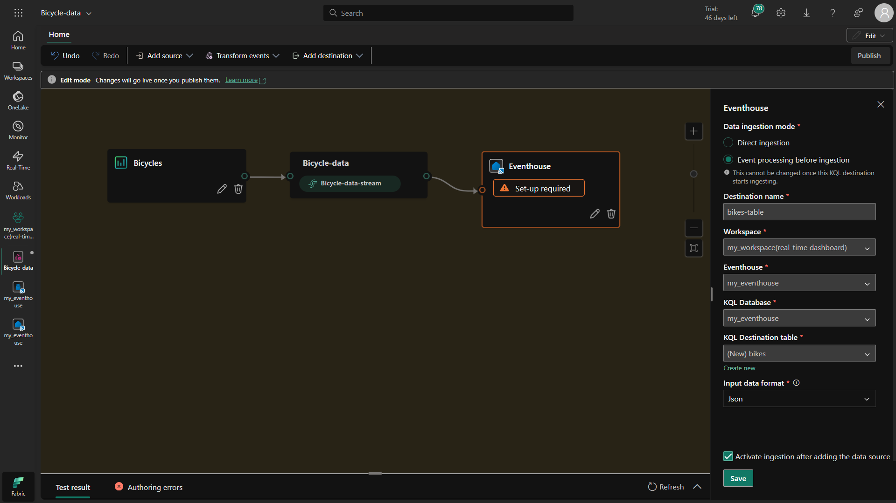
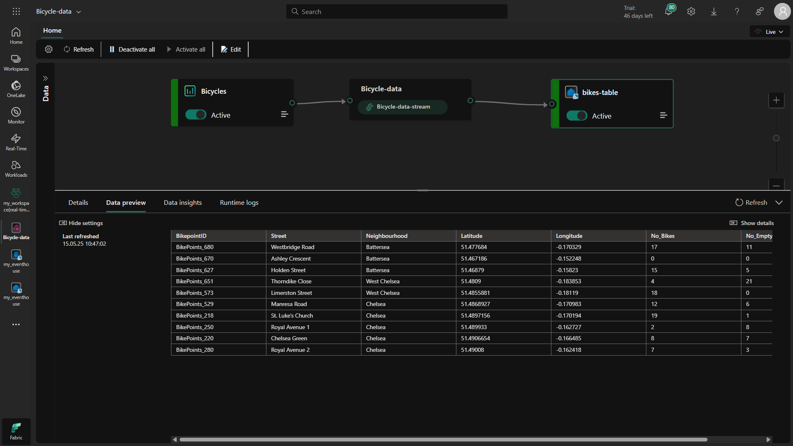
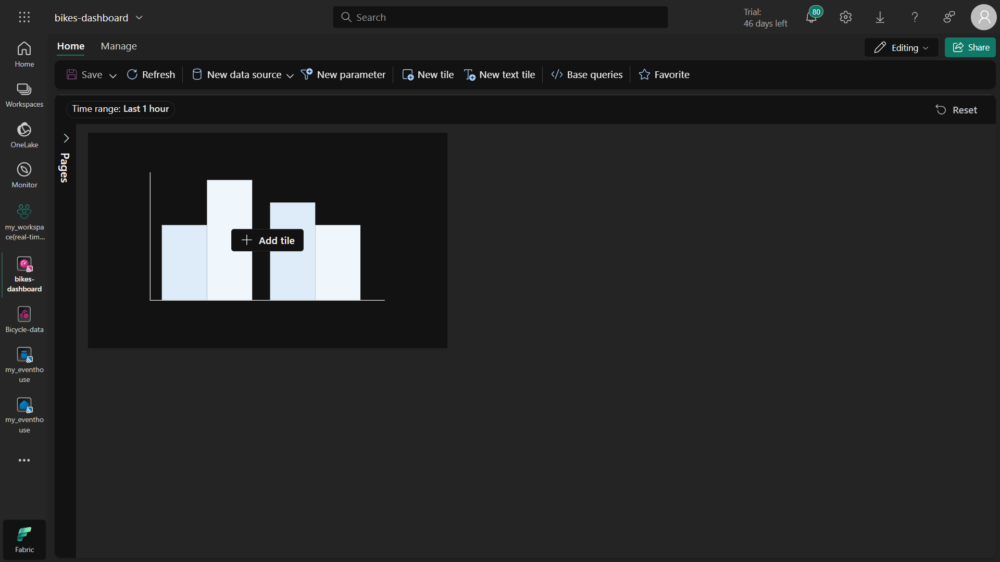
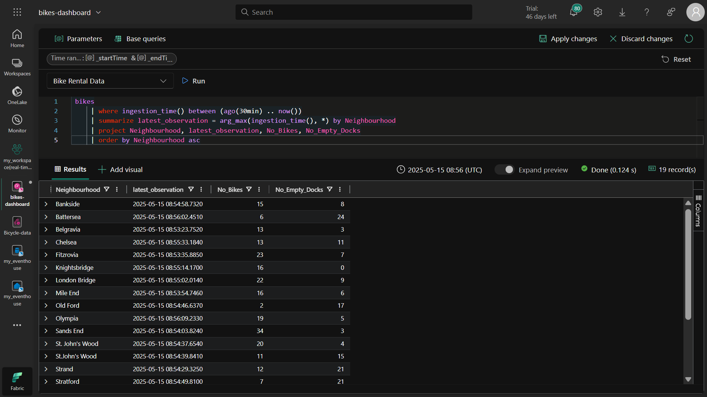
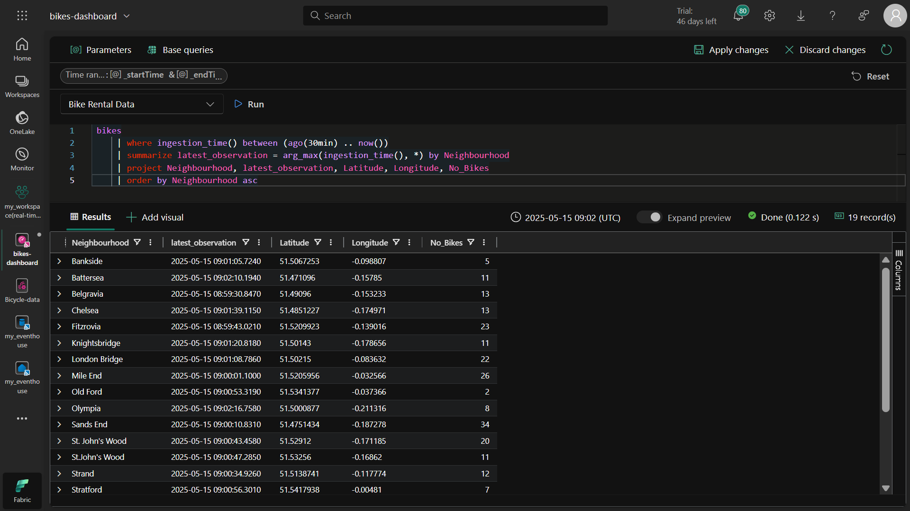
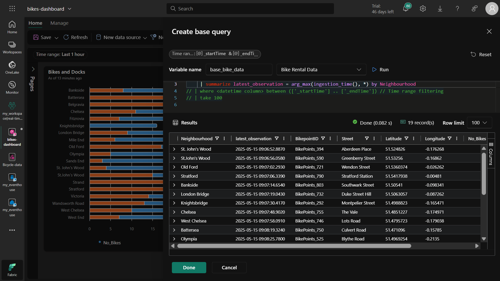
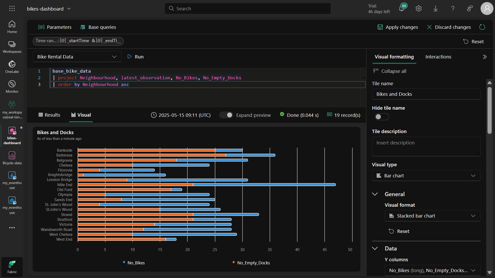
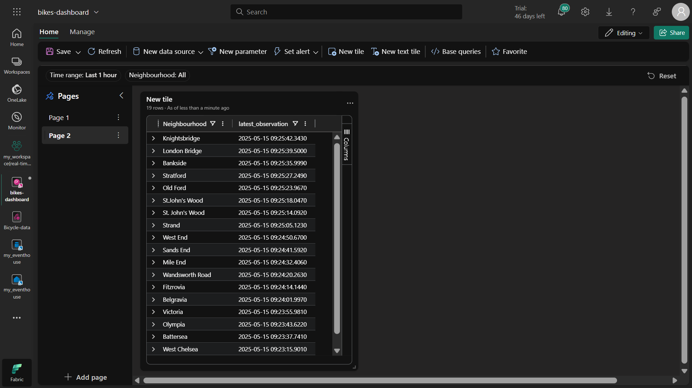
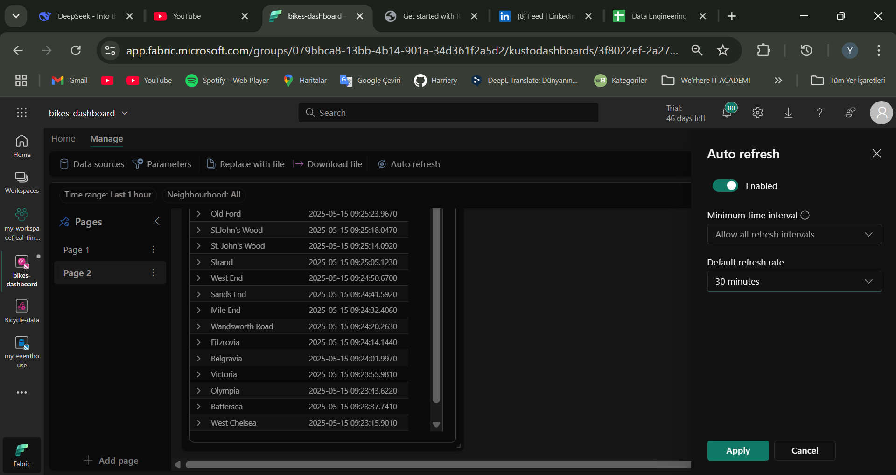

# Microsoft Fabric ile Gerçek Zamanlı Dashboard Oluşturma - Adım Adım Kılavuz
## Genel Bakış
Bu proje, Microsoft Fabric kullanarak bisiklet kiralama verilerini görselleştiren gerçek zamanlı bir dashboard oluşturmayı göstermektedir. Çözüm, bir eventhouse kurmayı, örnek bisiklet verilerini almak için bir eventstream oluşturmayı ve çoklu görselleştirmeler içeren etkileşimli bir dashboard oluşturmayı içerir.

## Ön Gereksinimler
Microsoft Fabric hesabı

Fabric kapasitesi olan bir çalışma alanı (Deneme, Premium veya Fabric)

## Adım 1: Çalışma Alanı Oluşturma
Microsoft Fabric adresine gidin

Sol menüden Çalışma Alanları'nı seçin

Yeni Çalışma Alanı'na tıklayın

Bir isim verin ve Fabric kapasitesi olan bir lisans modu seçin

Uygula'ya tıklayın

### Amaç: Çalışma alanları, Fabric öğeleriniz için kapsayıcılardır ve gerçek zamanlı analiz özelliklerini kullanmak için Fabric kapasitesi gerektirir.

## Adım 2: Eventhouse Oluşturma
Çalışma alanınızda sol menüden Oluştur'a tıklayın

Gerçek Zamanlı İstihbarat altında Eventhouse'u seçin

Benzersiz bir isim verin ve Oluştur'a tıklayın

Aynı isimle otomatik oluşturulan KQL veritabanını not edin

### Amaç: Eventhouse, gerçek zamanlı veri alımı ve KQL kullanarak sorgulama için optimize edilmiş özel bir veri deposudur.

## Adım 3: Eventstream Oluşturma ve Yapılandırma
KQL veritabanınızda Veri Al'a tıklayın

Eventstream > Yeni eventstream'i seçin

"Bicycle-data" olarak adlandırın ve Oluştur'a tıklayın

Kaynak olarak Örnek veri kullan'ı seçin

Kaynağı "Bicycles" olarak adlandırın ve örnek veri setini seçin

Hedefi yapılandırın:

Hedef türü olarak Eventhouse'u seçin

Çalışma alanınızı ve eventhouse'unuzu seçin

Tablo adını "bikes" olarak ayarlayın

JSON formatını seçin

Kaynağı hedefe bağlayın ve Yayınla'ya tıklayın

Önizleme panosunda veri alımını doğrulayın

### Amaç: Eventstream'ler, kaynaklardan hedeflere gerçek zamanlı olarak sürekli veri alımını sağlar.

## Adım 4: Gerçek Zamanlı Dashboard Oluşturma
Ana sayfadan Gerçek Zamanlı Dashboard oluşturun ve "bikes-dashboard" olarak adlandırın

Veri kaynağı ekleyin:

One lake data hub'ı seçin

Eventhouse'unuzu seçin

Ad: "Bike Rental Data"

Passthrough kimliğini etkinleştirin

İlk Tile Ekleme (Çubuk Grafik)
Tile ekle'ye tıklayın

**Bu KQL sorgusunu çalıştırın:**
```
kql
bikes
| where ingestion_time() between (ago(30min) .. now())
| summarize latest_observation = arg_max(ingestion_time(), *) by Neighbourhood
| project Neighbourhood, latest_observation, No_Bikes, No_Empty_Docks
| order by Neighbourhood asc
```
**Yığılmış çubuk grafik olarak biçimlendirin:**

Başlık: "Bikes and Docks"

Y sütunları: No_Bikes, No_Empty_Docks

X sütunu: Neighbourhood

Açıklama altta

İkinci Tile Ekleme (Harita)
Tile ekle'ye tıklayın

**Bu KQL sorgusunu çalıştırın:**
```
kql
bikes
| where ingestion_time() between (ago(30min) .. now())
| summarize latest_observation = arg_max(ingestion_time(), *) by Neighbourhood
| project Neighbourhood, latest_observation, Latitude, Longitude, No_Bikes
| order by Neighbourhood asc
```
**Harita olarak biçimlendirin:**

**Başlık:** "Bike Locations"

**Konum:** Enlem/Boylam

**Etiket:** Neighbourhood

**Boyut:** No_Bikes

### Amaç: Görselleştirmeler, kullanıcıların mahalleler arasındaki bisiklet kullanılabilirliği modellerini hızlıca anlamalarına yardımcı olur.

## Adım 5: Temel Sorgu ile Optimizasyon
**"base_bike_data" adında bir temel sorgu oluşturun:**
```
kql
bikes
| where ingestion_time() between (ago(30min) .. now())
| summarize latest_observation = arg_max(ingestion_time(), *) by Neighbourhood
```
Her iki tile'ı da uygun projeksiyonlarla bu temel sorguyu kullanacak şekilde değiştirin

### Amaç: Temel sorgular, kod tekrarını azaltır ve bakımı kolaylaştırır.

### Adım 6: Mahalle Filtresi Ekleme
Bir parametre oluşturun:

Ad: "Neighbourhood"

Tür: Çoklu seçim

Kaynak sorgu: bikes | distinct Neighbourhood

**Temel sorguyu filtreyi içerecek şekilde değiştirin:**
```
kql
bikes
| where ingestion_time() between (ago(30min) .. now())
  and (isempty(['selected_neighbourhoods']) or Neighbourhood in (['selected_neighbourhoods']))
| summarize latest_observation = arg_max(ingestion_time(), *) by Neighbourhood
```

### Amaç: Parametreler, daha odaklı analiz için etkileşimli filtrelemeye olanak tanır.

## Adım 7: Dashboard Sayfası Ekleme
Sayfa ekle'ye tıklayın ve "Sayfa 2" olarak adlandırın

**Bu sorguyla bir tile ekleyin:**
```
kql
base_bike_data
| project Neighbourhood, latest_observation
| order by latest_observation desc
```

### Amaç: Ek sayfalar, ilgili görselleştirmeleri düzenleyebilir veya alternatif görünümler sağlayabilir.

## Adım 8: Otomatik Yenilemeyi Yapılandırma
Yönet > Otomatik yenileme'ye gidin

30 dakikalık aralıkla etkinleştirin

### Amaç: Dashboard'un manuel yenileme olmadan güncel verileri göstermesini sağlar.

## Adım 9: Kaydetme ve Paylaşma
Araç çubuğunda Kaydet'e tıklayın

Paylaş'a tıklayın ve dashboard bağlantısını kopyalayın

## Temizlik
Kaynakları kaldırmak için:

Çalışma alanı ayarlarına gidin

Bu çalışma alanını kaldır'ı seçin

## Temel Kavramlar
**Eventhouse:** Gerçek zamanlı optimize edilmiş veri deposu

**Eventstream:** Sürekli veri alımı için boru hattı

**KQL:** Zaman serisi verileri için güçlü sorgu dili

**Gerçek Zamanlı Dashboard:** Otomatik olarak güncellenen görselleştirmeler

**Parametreler:** Kullanıcılar için etkileşimli filtreler

Bu çözüm, Microsoft Fabric'te veri alımından etkileşimli görselleştirmeye kadar uçtan uca gerçek zamanlı analiz yeteneklerini göstermektedir.






















