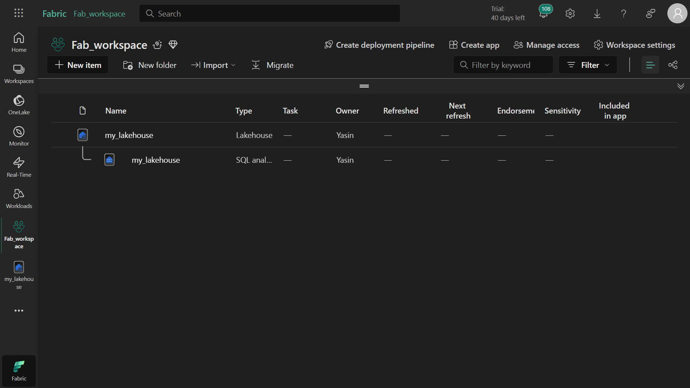
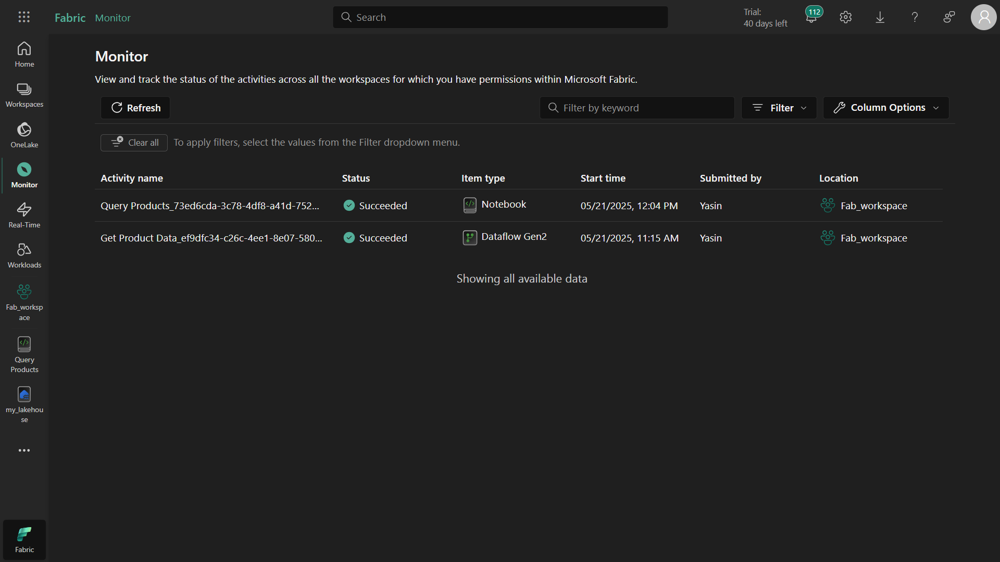

# Monitoring Activities in Microsoft Fabric with Monitoring Hub
## 📌 Project Purpose
This exercise teaches you how to use the Monitoring Hub in Microsoft Fabric to track and manage data activities. The Monitoring Hub allows you to:

Monitor all data activities from a central location

Review operation history

Create customized views with filters

Quickly identify issues

## 🎯 What You Will Learn
By completing this exercise, you will learn how to:

Create a workspace in Microsoft Fabric

Create and manage a Lakehouse

Import and transform data using Dataflow (Gen2)

Run Spark notebooks

Monitor all these activities using the Monitoring Hub

## ⚠️ Important Notes
Access: You need access to a Microsoft Fabric tenant to complete this exercise.

Capacity Selection: Choose between Trial, Premium, or Fabric capacity when creating workspaces.

Dataflow Status: Dataflows may take several minutes to complete - be patient.

Notebook Execution: Remember to close the session after running Spark notebooks.

## 🕒 When Is This Useful?
This knowledge is helpful when:

You need to centrally monitor data operations

Tracking team member activities

Troubleshooting by reviewing historical runs

Performing performance analysis

## 🛠️ Step-by-Step Guide
### 1. Create a Workspace
Go to the Microsoft Fabric homepage and sign in

Select Workspaces (🗇 icon) from the left menu

Create a new workspace (selecting Fabric capacity)

Verify your workspace is empty

### 2. Create a Lakehouse
Select Create from the left menu

Choose Lakehouse under Data Engineering

Give your lakehouse a unique name and create it

Observe tables and files in Lakehouse Explorer (initially empty)

### 3. Create and Monitor a Dataflow
From the lakehouse home page, select Get data > New Dataflow Gen2

Name the dataflow "Get Product Data" and create it

In the designer, select Import from Text/CSV

**Connect to this CSV file:**
```
https://raw.githubusercontent.com/MicrosoftLearning/dp-data/main/products.csv
```

Publish the dataflow

Open the Monitoring Hub from the left menu

Wait for status to show "Succeeded"

Verify the "products" table was created in your lakehouse

### 4. Create and Monitor a Spark Notebook
Select Create > Notebook under Data Engineering

Rename the notebook to "Query Products"

Add your lakehouse via Add data items > Existing data sources

For the "products" table, select Load data > Spark

Run all cells and observe results

Stop the Spark session

View notebook activity in Monitoring Hub

### 5. Monitor Activity History
Return to your workspace and rerun the dataflow

Observe the dataflow status in Monitoring Hub

Select Historical runs for the dataflow

View details of any run

### 6. Customize Monitoring Hub Views
Apply these filters:

Status: Succeeded

Item type: Dataflow Gen2

Customize columns to show:

Activity name

Status

Item type

Start/End time

Duration

etc.

## 🏁 Conclusion
You now know how to use Microsoft Fabric's Monitoring Hub to track data activities - an essential skill for managing data projects effectively.




