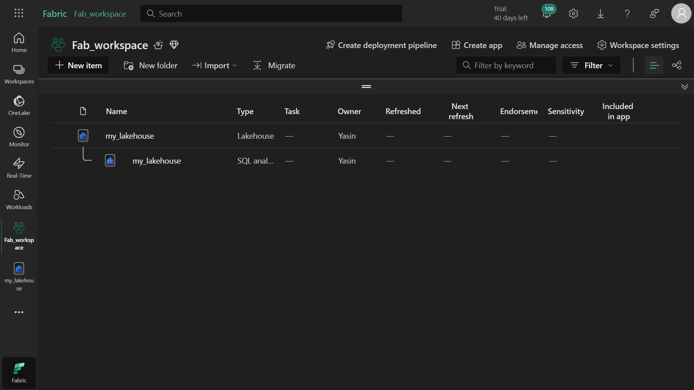
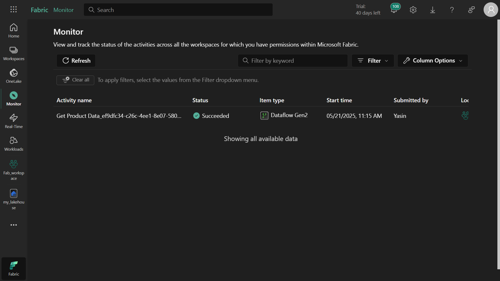
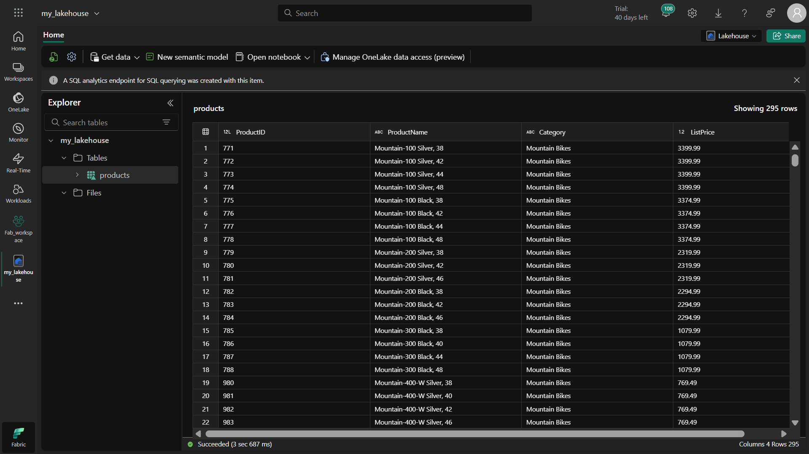
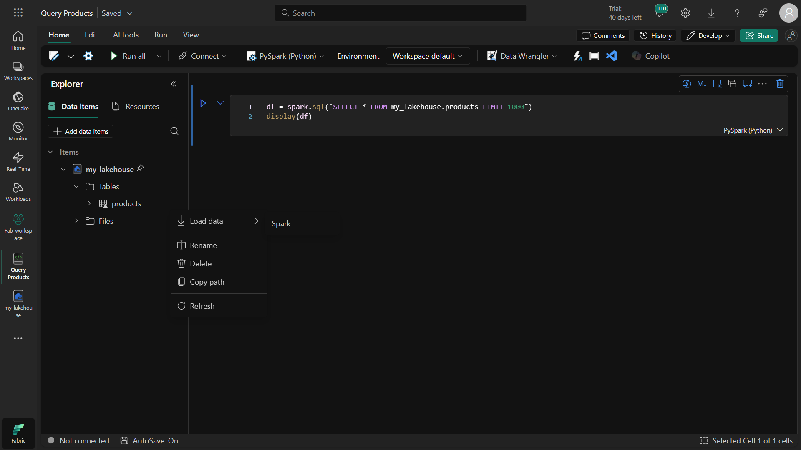
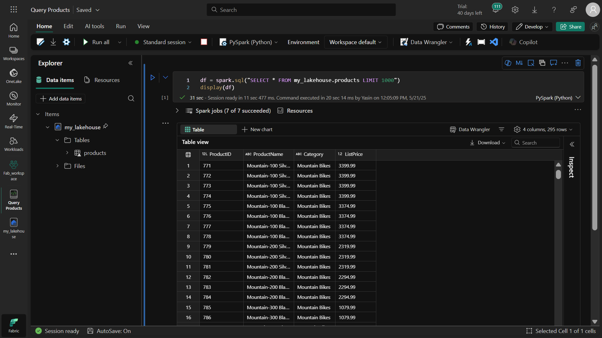
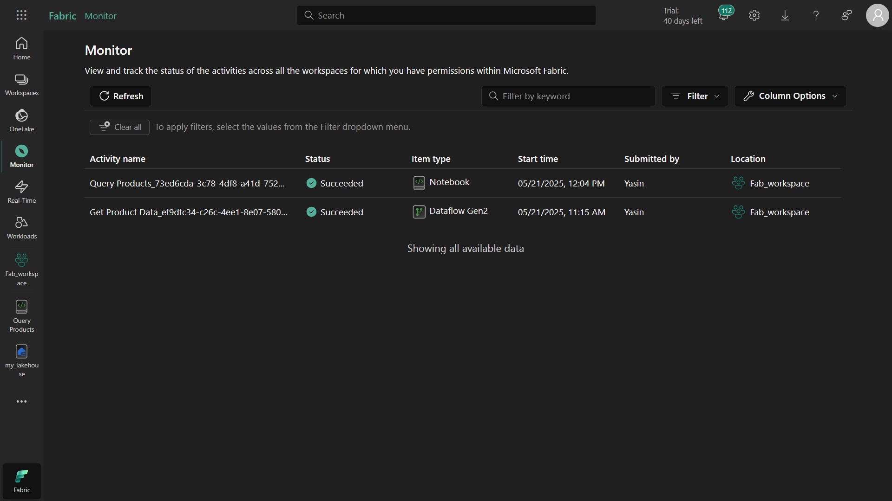

# Activiteiten Monitoren in Microsoft Fabric met Monitoring Hub
## 📌 Doel van de Oefening
Deze oefening leert je hoe je de Monitoring Hub in Microsoft Fabric kunt gebruiken om data-activiteiten te volgen. Met de Monitoring Hub kun je:

Alle data-activiteiten centraal volgen

Uitvoeringsgeschiedenis bekijken

Aangepaste weergaven met filters maken

Problemen snel identificeren

## 🎯 Wat Je Zult Leren
Na deze oefening weet je hoe je:

Een workspace in Microsoft Fabric aanmaakt

Een Lakehouse creëert en beheert

Data importeert met Dataflow (Gen2)

Spark-notebooks uitvoert

Alle activiteiten volgt via de Monitoring Hub

## ⚠️ Belangrijke Punten
Toegang: Je hebt een Microsoft Fabric tenant nodig

Capaciteit: Kies Trial, Premium of Fabric-capaciteit

Dataflow-status: Kan enkele minuten duren - geduld aub

Notebooks: Vergeet de sessie niet af te sluiten

## 🕒 Wanneer is Dit Nuttig?
Deze kennis is handig wanneer je:

Data-activiteiten centraal wilt monitoren

Activiteiten van teamleden wil volgen

Problemen wil oplossen via historische runs

Prestatie-analyses wil uitvoeren

## 🛠️ Stappenplan
### 1. Workspace Aanmaken
Ga naar Microsoft Fabric

Kies Workspaces (🗇-icoon)

Maak een nieuwe workspace aan (met Fabric-capaciteit)

Controleer dat de workspace leeg is

## 2. Lakehouse Maken
Selecteer Maken in het linkermenu

Kies Lakehouse onder Data Engineering

Geef een unieke naam en maak aan

Bekijk tabellen/bestanden in Lakehouse Explorer (initieel leeg)

### 3. Dataflow Maken en Monitoren
Selecteer Get data > New Dataflow Gen2

Noem de dataflow "Get Product Data"

Kies Import from Text/CSV

**Verbind met deze CSV:**
```
https://raw.githubusercontent.com/MicrosoftLearning/dp-data/main/products.csv
```

Publiceer de dataflow

Open de Monitoring Hub

Wacht op status "Succeeded"

Controleer de "products" tabel in je lakehouse

### 4. Spark Notebook Maken
Selecteer Maken > Notebook

Hernoem naar "Query Products"

Voeg je lakehouse toe via Add data items

Laad de "products" tabel via Load data > Spark

Voer alle cellen uit

Stop de Spark-sessie

Bekijk activiteit in Monitoring Hub

### 5. Activiteitengeschiedenis Bekijken
Draai de dataflow opnieuw

Bekijk status in Monitoring Hub

Selecteer Historical runs

Bekijk details van eerdere runs

### 6. Monitoring Hub Aanpassen
Pas filters toe:

Status: Succeeded

Item type: Dataflow Gen2

Pas kolommen aan om te tonen:

Activiteitnaam

Status

Start-/Eindtijd

Duur

etc.

## 🏁 Conclusie
Je kunt nu de Monitoring Hub gebruiken om data-activiteiten te volgen - een cruciale vaardigheid voor effectief datawerk!












