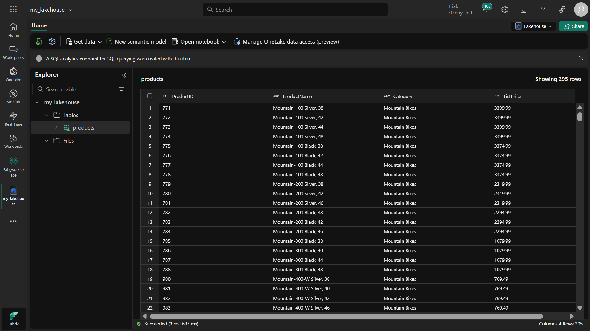

# Microsoft Fabric'te Monitoring Hub ile Aktivite İzleme
## 📌 Proje Amacı
Bu çalışma, Microsoft Fabric'te Monitoring Hub kullanarak veri aktivitelerini nasıl izleyeceğinizi ve yöneteceğinizi öğretmeyi amaçlamaktadır. Monitoring Hub sayesinde:

Tüm veri aktivitelerini merkezi bir yerden izleyebilirsiniz

İşlem geçmişini gözden geçirebilirsiniz

Filtrelerle özelleştirilmiş görünümler oluşturabilirsiniz

Sorunları hızlıca tespit edebilirsiniz

## 🎯 Ne Öğreneceksiniz?
### Bu çalışmayı tamamladığınızda:

#### Microsoft Fabric'te çalışma alanı oluşturmayı

#### Lakehouse oluşturmayı ve yönetmeyi

#### Dataflow (Gen2) ile veri almayı ve dönüştürmeyi

#### Spark notebook'ları çalıştırmayı

#### Monitoring Hub'ı kullanarak tüm bu aktiviteleri izlemeyi öğrenmiş olacaksınız.

## ⚠️ Dikkat Edilmesi Gerekenler
**Erişim:** Bu alıştırmayı yapabilmek için Microsoft Fabric tenant'ına erişiminiz olmalıdır.

Kapasite Seçimi: Çalışma alanı oluştururken Fabric deneme sürümü, Premium veya Fabric kapasitesi seçebilirsiniz.

Dataflow Durumu: Dataflow'ların tamamlanması birkaç dakika sürebilir, sabırlı olun.

Notebook Çalıştırma: Spark notebook'larını çalıştırdıktan sonra oturumu kapatmayı unutmayın.

## 🕒 Ne Zaman İhtiyaç Duyulur?
Bu çalışmada öğrendikleriniz aşağıdaki durumlarda faydalı olacaktır:

Veri işlemlerinizi merkezi olarak izlemek istediğinizde

Ekip üyelerinin aktivitelerini takip etmeniz gerektiğinde

Sorun giderme yaparken geçmiş çalışmaları incelemeniz gerektiğinde

Performans analizi yapmanız gerektiğinde

## 🛠️ Çalışma Adımları
### 1. Çalışma Alanı Oluşturma
Microsoft Fabric ana sayfasına gidin ve oturum açın

Sol menüden Çalışma Alanları'nı seçin (🗇 simgesi)

Yeni bir çalışma alanı oluşturun (Fabric kapasitesi seçerek)

Çalışma alanınızın boş olduğunu doğrulayın

### 2. Lakehouse Oluşturma
Sol menüden "Oluştur"u seçin

"Data Engineering" bölümünden "Lakehouse" seçeneğini seçin

Lakehouse'a benzersiz bir ad verin ve oluşturun

Lakehouse Explorer'da tablo ve dosyaları gözlemleyin (henüz boş olacak)

### 3. Dataflow Oluşturma ve İzleme
Lakehouse ana sayfasında "Get data" menüsünden "New Dataflow Gen2" seçin

Dataflow'a "Get Product Data" adını verin ve oluşturun

Dataflow designer'da "Import from a Text/CSV file" seçeneğini seçin

**Şu CSV dosyasını kullanarak bağlantı oluşturun:**
```
https://raw.githubusercontent.com/MicrosoftLearning/dp-data/main/products.csv
```

Dataflow'u yayınlayın

Sol menüden "Monitor"u seçerek Monitoring Hub'ı açın

Dataflow durumunun "Succeeded" olmasını bekleyin

Lakehouse'a dönerek "products" tablosunun oluşturulduğunu doğrulayın

### 4. Spark Notebook Oluşturma ve İzleme
Sol menüden "Oluştur"u seçin

"Data Engineering" bölümünden "Notebook" seçeneğini seçin

Notebook adını "Query Products" olarak değiştirin

"Add data items" > "Existing data sources" ile lakehouse'unuzu ekleyin

"products" tablosunu bulun ve "Load data" > "Spark" seçeneğini seçin

Tüm hücreleri çalıştırın ve sonuçları gözlemleyin

Spark oturumunu durdurun

Monitoring Hub'a dönerek notebook aktivitesini gözlemleyin

### 5. Aktivite Geçmişini İzleme
Çalışma alanına dönün ve Dataflow'u yeniden çalıştırın

Monitoring Hub'da Dataflow durumunu gözlemleyin

Dataflow için "Historical runs" seçeneğini seçerek geçmiş çalıştırmaları görüntüleyin

Herhangi bir çalıştırmanın detaylarını görüntüleyin

### 6. Monitoring Hub Görünümlerini Özelleştirme
Monitoring Hub'da filtre uygulayın:

Status: Succeeded

Item type: Dataflow Gen2

Sütun seçeneklerini düzenleyerek şu sütunları ekleyin:

Activity name

Status

Item type

Start time

Submitted by

Location

End time

Duration

Refresh type

Özelleştirilmiş görünümü inceleyin

## 🏁 Sonuç
Bu çalışmayı tamamladığınızda, Microsoft Fabric'te Monitoring Hub'ı kullanarak veri aktivitelerini nasıl izleyeceğinizi ve yöneteceğinizi öğrenmiş olacaksınız. Bu beceri, veri projelerinizin sağlığını ve performansını takip etmenize yardımcı olacaktır.





