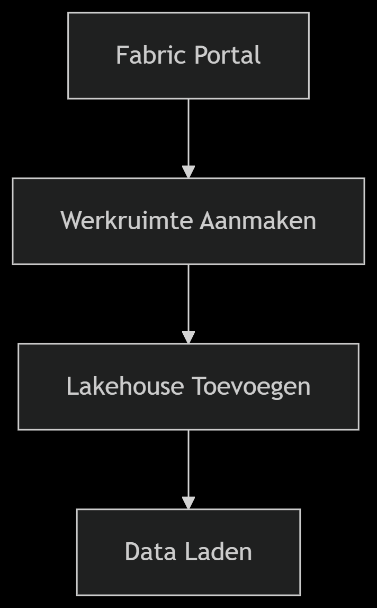
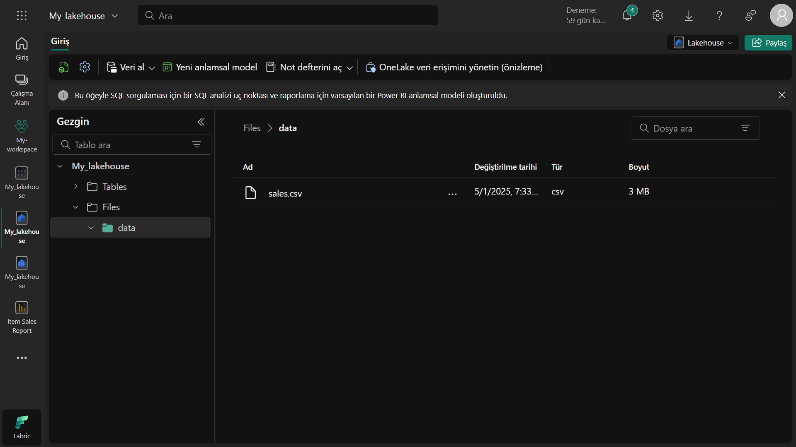
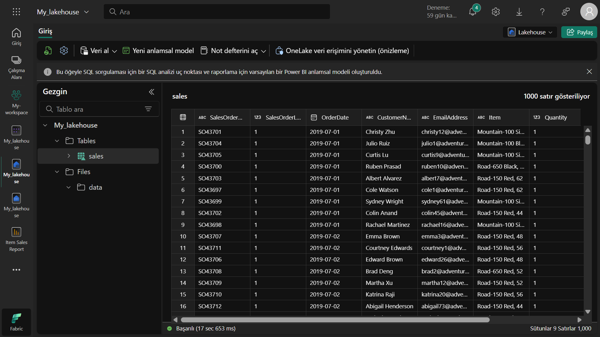
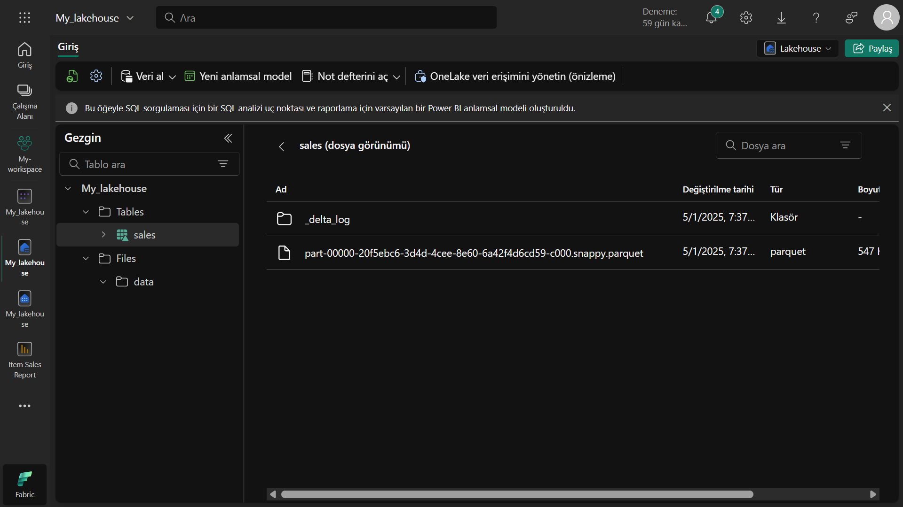
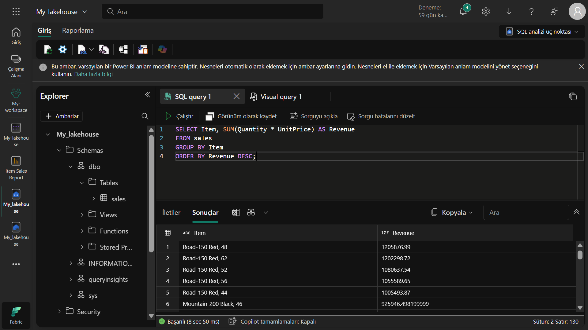
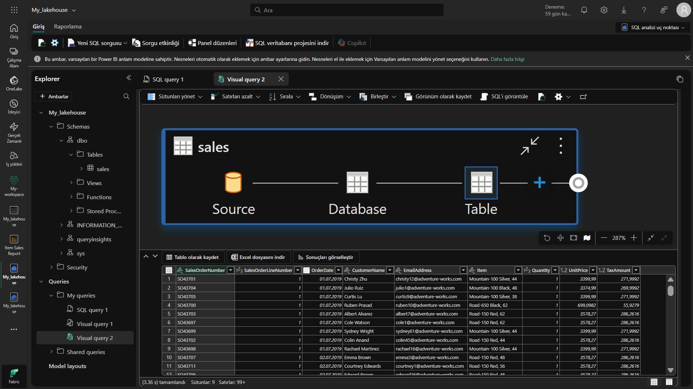
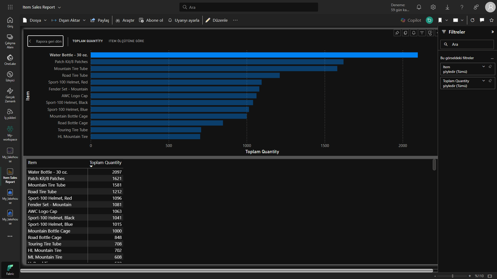

🚀 Data-analyse met Microsoft Fabric: Lakehouse Aanmaakproject
Microsoft Fabric Lakehouse
(Illustratieve afbeelding)

🌟 Projectsamenvatting
In dit project heb ik met Microsoft Fabric, een van de krachtigste tools in moderne data-analyse:

✔️ Een volledig functionele Lakehouse-omgeving opgezet
✔️ Gewerkt met real-world data
✔️ Mijn SQL- en Power Query-vaardigheden toegepast
✔️ Interactieve Power BI-rapporten gemaakt

🛠️ Gebruikte Technologieën
Microsoft Fabric
Delta Lake
Power BI
SQL

📂 Projectstructuur
bash
├── data/                   # Ruwedata-bestanden
│   └── sales.csv           # Voorbeeldverkoopdata
├── reports/                # Gemaakte rapporten
│   └── item_sales_report   # Power BI-rapport
└── queries/                # SQL- en Power Query-query's
🎯 Stapsgewijze Implementatie
1. 🏗️ Lakehouse Opzetten
Diagram
Code

2. 📊 Data Laden en Transformeren
Voorbeelddataset downloaden:

powershell
Invoke-WebRequest -Uri "https://raw.githubusercontent.com/MicrosoftLearning/dp-data/main/sales.csv" -OutFile "sales.csv"
CSV naar Delta-tabel converteren

Data-kwaliteitscontroles

3. 🔍 Data-analyse
sql
-- Meest winstgevende producten
SELECT 
    Item, 
    SUM(Quantity * UnitPrice) AS Revenue,
    AVG(UnitPrice) AS AvgPrice
FROM sales
GROUP BY Item
ORDER BY Revenue DESC
4. 📈 Visualisatie
Power BI Rapportvoorbeeld

🏆 Verworven Vaardigheden
✅ Microsoft Fabric-omgevingsbeheer
✅ Werken met Delta Lake-tabellen
✅ SQL Endpoint-gebruik
✅ Power BI-integratie
✅ Data-modelleringstechnieken

🚦 Aan de Slag
Vereisten
Microsoft Fabric Trial Account

Moderne webbrowser (Chrome, Edge, Firefox)

Basiskennis SQL

Installatie
Meld aan bij Fabric-portal

Maak nieuwe werkruimte aan

Voeg "Lakehouse"-component toe

Laad databestanden

python
# Voorbeeld data-load code (PySpark)
df = spark.read.csv("sales.csv", header=True, inferSchema=True)
df.write.format("delta").saveAsTable("sales")
🤝 Bijdragen
Bijdragen zijn welkom! Volg deze stappen:

Fork de repository

Maak een nieuwe branch aan (git checkout -b feature/geweldige-feature)

Commit je wijzigingen (git commit -m 'Voeg geweldige feature toe')

Push naar de branch (git push origin feature/geweldige-feature)

Open een Pull Request

