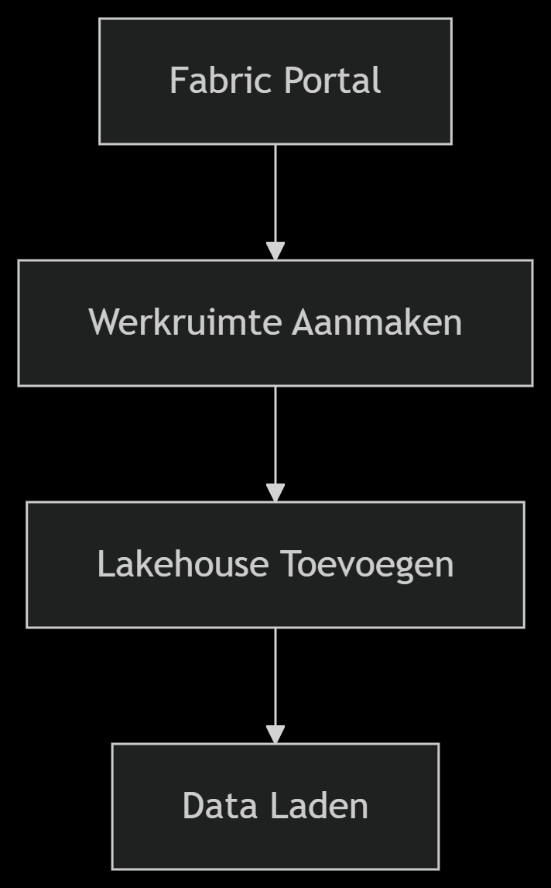
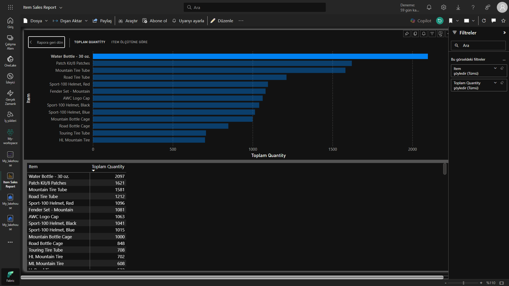

🚀 Microsoft Fabric ile Veri Analizi: Lakehouse Oluşturma Projesi
Microsoft Fabric Lakehouse
(Görsel temsilidir)

🌟 Proje Özeti
Bu projede, modern veri analitiği dünyasının en güçlü araçlarından biri olan Microsoft Fabric kullanarak:

✔️ Tam fonksiyonel bir Lakehouse ortamı kurdum
✔️ Gerçek dünya verileriyle çalıştım
✔️ SQL ve Power Query becerilerimi uyguladım
✔️ Etkileşimli Power BI raporları oluşturdum

🛠️ Kullanılan Teknolojiler
Microsoft Fabric
Delta Lake
Power BI
SQL

📂 Proje Yapısı
bash
├── data/                   # Ham veri dosyaları
│   └── sales.csv           # Örnek satış verileri
├── reports/                # Oluşturulan raporlar
│   └── item_sales_report   # Power BI raporu
└── queries/                # SQL ve Power Query sorguları
🎯 Adım Adım Uygulama
1. 🏗️ Lakehouse Kurulumu
Diagram
Code

2. 📊 Veri Yükleme ve Dönüşüm
Örnek veri setini indirme:

powershell
Invoke-WebRequest -Uri "https://raw.githubusercontent.com/MicrosoftLearning/dp-data/main/sales.csv" -OutFile "sales.csv"
CSV'den Delta tablosuna dönüştürme

Veri kalitesi kontrolleri

3. 🔍 Veri Analizi
sql
-- En çok gelir getiren ürünler
SELECT 
    Item, 
    SUM(Quantity * UnitPrice) AS Revenue,
    AVG(UnitPrice) AS AvgPrice
FROM sales
GROUP BY Item
ORDER BY Revenue DESC
4. 📈 Görselleştirme
Power BI Rapor Önizleme

🏆 Kazanılan Beceriler
✅ Microsoft Fabric ortam yönetimi
✅ Delta Lake tablolarıyla çalışma
✅ SQL Endpoint kullanımı
✅ Power BI ile entegrasyon
✅ Veri modelleme teknikleri

🚦 Başlarken
Ön Koşullar
Microsoft Fabric Trial Hesabı

Modern web tarayıcısı (Chrome, Edge, Firefox)

Temel SQL bilgisi

Kurulum
Fabric portalında oturum açın

Yeni çalışma alanı oluşturun

"Lakehouse" bileşeni ekleyin

Veri dosyalarını yükleyin

python
# Örnek veri yükleme kodu (PySpark)
df = spark.read.csv("sales.csv", header=True, inferSchema=True)
df.write.format("delta").saveAsTable("sales")
🤝 Katkıda Bulunma
Katkılarınızı bekliyoruz! Lütfen:

Repoyu fork edin

Yeni branch oluşturun (git checkout -b feature/amazing-feature)

Değişikliklerinizi commit edin (git commit -m 'Add some amazing feature')

Branch'e push yapın (git push origin feature/amazing-feature)

Pull Request açın

📜 Lisans
Bu proje MIT lisansı altında lisanslanmıştır - detaylar için LICENSE.md dosyasına bakın.

✉️ İletişim
Proje ile ilgili sorularınız için:
Twitter
LinkedIn

