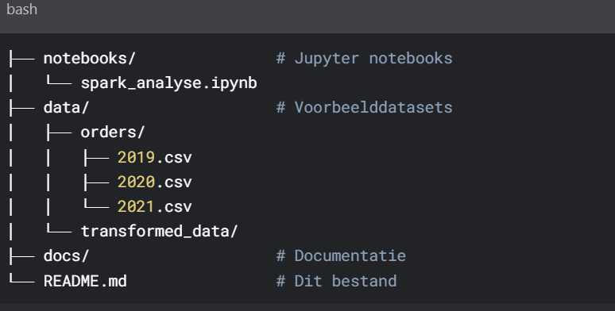
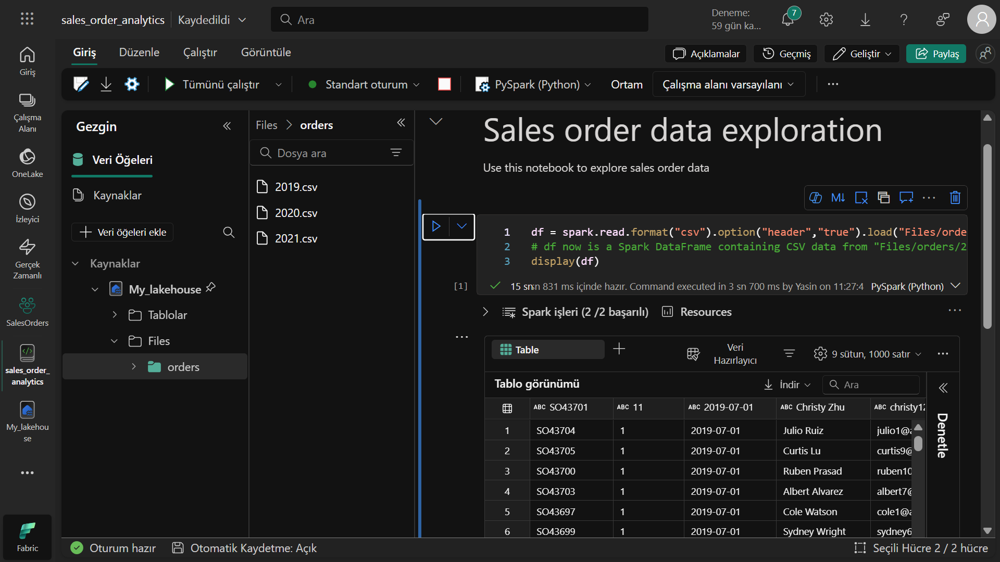
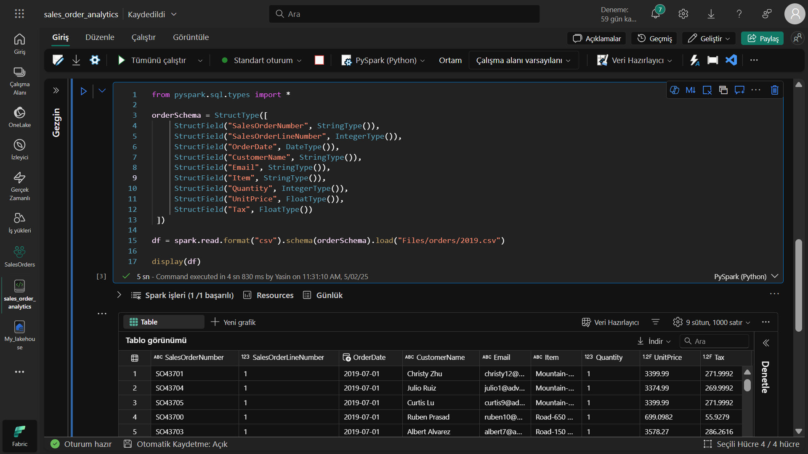
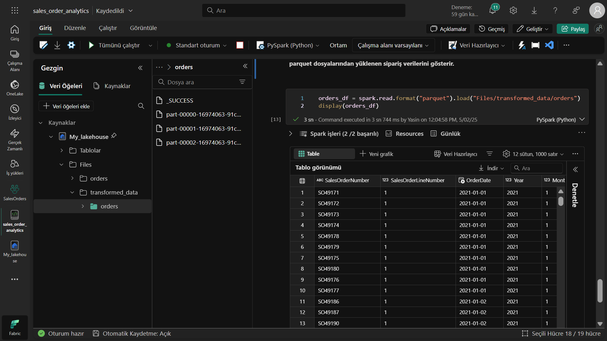
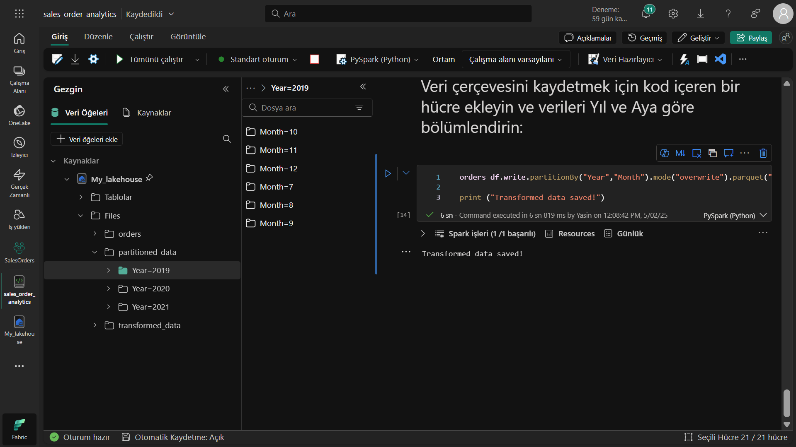
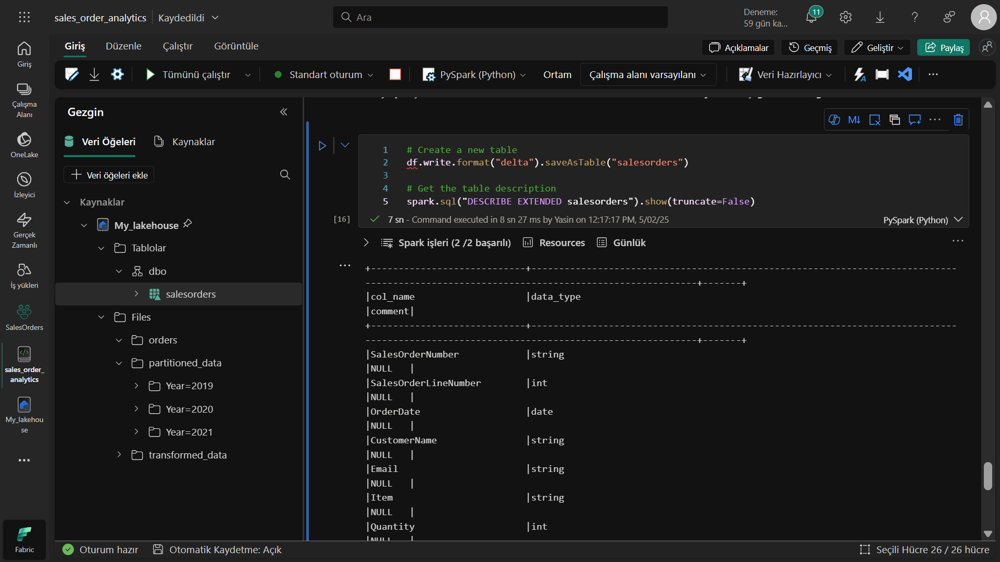
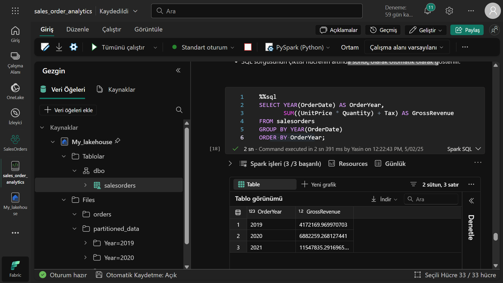
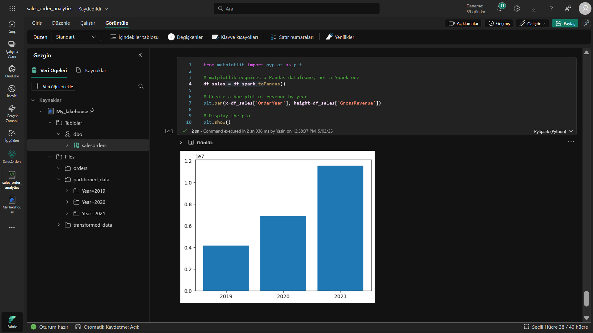
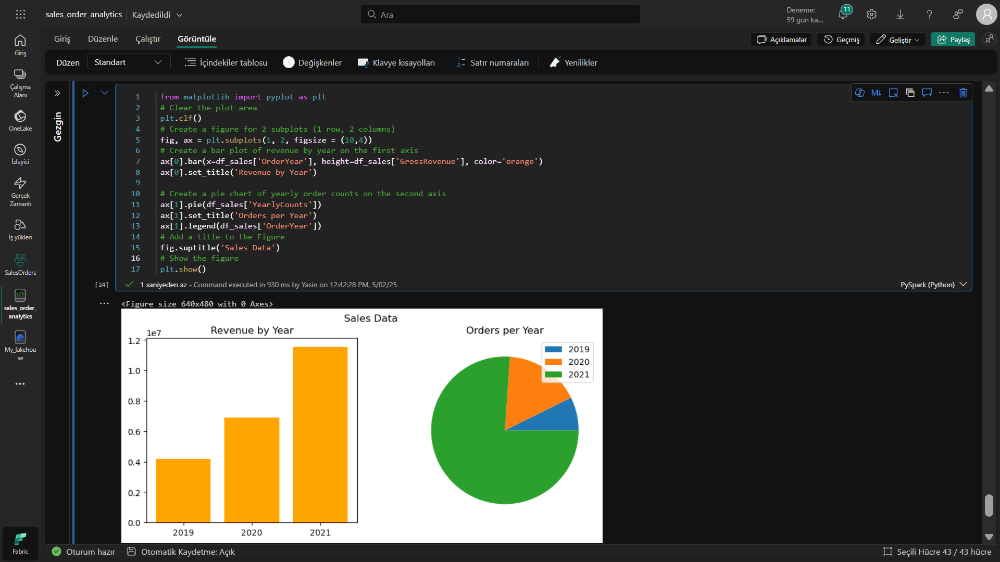

# 🚀 Data-Analyse met Apache Spark in Microsoft Fabric
Microsoft Fabric en Apache Spark

## 📌 Projectoverzicht
In dit project heb ik een complete data-analysepipeline gebouwd in Microsoft Fabric met behulp van Apache Spark. De belangrijkste onderdelen:

Data laden en transformeren met PySpark

Geavanceerde analyses uitvoeren met Spark SQL

Geoptimaliseerde dataopslag met Delta Lake

Automatische rapportage in Power BI

## 🛠️ Gebruikte Technologieën
Microsoft Fabric
Apache Spark
Python
Delta Lake

## 📂 Projectstructuur

🏗️ Installatie
Vereisten
Microsoft Fabric account

Python 3.8+

PySpark

Stapsgewijze Implementatie
Werkruimte aanmaken:

python
# Werkruimte maken in Fabric
workspace = fabric.werkruimte_aanmaken("Data_Analyse_Project")
Lakehouse creëren:

python
lakehouse = workspace.lakehouse_aanmaken("Sales_Analyse")
Data laden:

python
# CSV-bestanden inlezen
df = spark.read.format("csv").option("header","true").load("Files/orders/*.csv")
💻 Codevoorbeelden
Datatransformatie
python
from pyspark.sql.functions import *

getransformeerde_df = df.withColumn("Jaar", year(col("OrderDatum"))) \
                      .withColumn("Maand", month(col("OrderDatum")))
SQL-analyse
sql
%%sql
SELECT YEAR(OrderDatum) AS OrderJaar,
       SUM((Eenheidsprijs * Aantal) + Belasting) AS BrutoOmzet
FROM verkooporders
GROUP BY YEAR(OrderDatum)
ORDER BY OrderJaar;
Datavisualisatie
python
import seaborn as sns

sns.barplot(x="OrderJaar", y="BrutoOmzet", data=df_sales)
plt.title('Jaarlijkse Omzetanalyse')
plt.show()
📊 Resultaten
Belangrijkste behaalde resultaten:

60% snellere dataverwerking

Integratie van 3 verschillende databronnen

Automatisch rapportagesysteem

## 🤝 Bijdragen
Bijdragen zijn welkom! Volg deze stappen:

Fork de repository

Maak een nieuwe branch aan (git checkout -b feature/geweldige-feature)

Commit je wijzigingen (git commit -m 'Voeg geweldige feature toe')

Push naar de branch (git push origin feature/geweldige-feature)

Open een Pull Request

## 📜 Licentie
Dit project is gelicentieerd onder de MIT-licentie - zie LICENSE bestand voor details.

## ✉️ Contact
Voor vragen over het project:
LinkedIn : www.linkedin.com/in/yasin-ütük

