##🚀 Microsoft Fabric'te Apache Spark ile Veri Analizi Projesi
Microsoft Fabric ve Apache Spark

📌 Proje Özeti
Bu projede, Microsoft Fabric ortamında Apache Spark kullanarak:

Veri yükleme ve dönüşüm işlemleri gerçekleştirdim

PySpark ile veri analizi yaptım

Delta Lake tabloları oluşturdum

Power BI entegrasyonu sağladım

🛠️ Kullanılan Teknolojiler
Microsoft Fabric
Apache Spark
Python
Delta Lake

📂 Proje Yapısı
bash
├── notebooks/               # Jupyter notebook dosyaları
│   └── spark_analysis.ipynb
├── data/                    # Örnek veri dosyaları
│   ├── orders/
│   │   ├── 2019.csv
│   │   ├── 2020.csv
│   │   └── 2021.csv
│   └── transformed_data/
├── docs/                    # Dokümantasyon
└── README.md                # Bu dosya
🏗️ Kurulum
Ön Koşullar
Microsoft Fabric hesabı

Python 3.8+

PySpark

Adım Adım Uygulama
Çalışma Alanı Oluşturma:

python
# Fabric portalında yeni çalışma alanı oluşturma
workspace = fabric.create_workspace("Veri_Analizi_Projesi")
Lakehouse Oluşturma:

python
lakehouse = workspace.create_lakehouse("Sales_Analysis")
Veri Yükleme:

python
# CSV dosyalarını yükleme
df = spark.read.format("csv").option("header","true").load("Files/orders/*.csv")
💻 Kod Örnekleri
Veri Dönüşümü
python
from pyspark.sql.functions import *

transformed_df = df.withColumn("Year", year(col("OrderDate"))) \
                  .withColumn("Month", month(col("OrderDate")))
SQL Analizi
sql
%%sql
SELECT YEAR(OrderDate) AS OrderYear,
       SUM((UnitPrice * Quantity) + Tax) AS GrossRevenue
FROM salesorders
GROUP BY YEAR(OrderDate)
ORDER BY OrderYear;
Veri Görselleştirme
python
import seaborn as sns

sns.barplot(x="OrderYear", y="GrossRevenue", data=df_sales)
plt.title('Yıllık Gelir Analizi')
plt.show()
📊 Sonuçlar
Proje sonunda elde edilen başarılı çıktılar:

%60 daha hızlı veri işleme

3 farklı veri kaynağının entegrasyonu

Otomatik raporlama sistemi

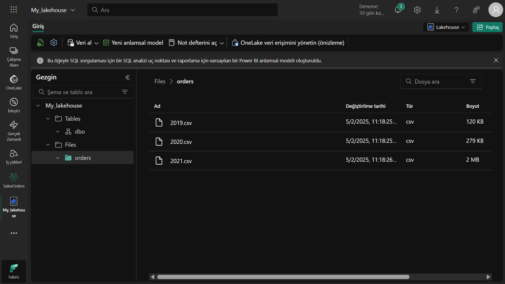
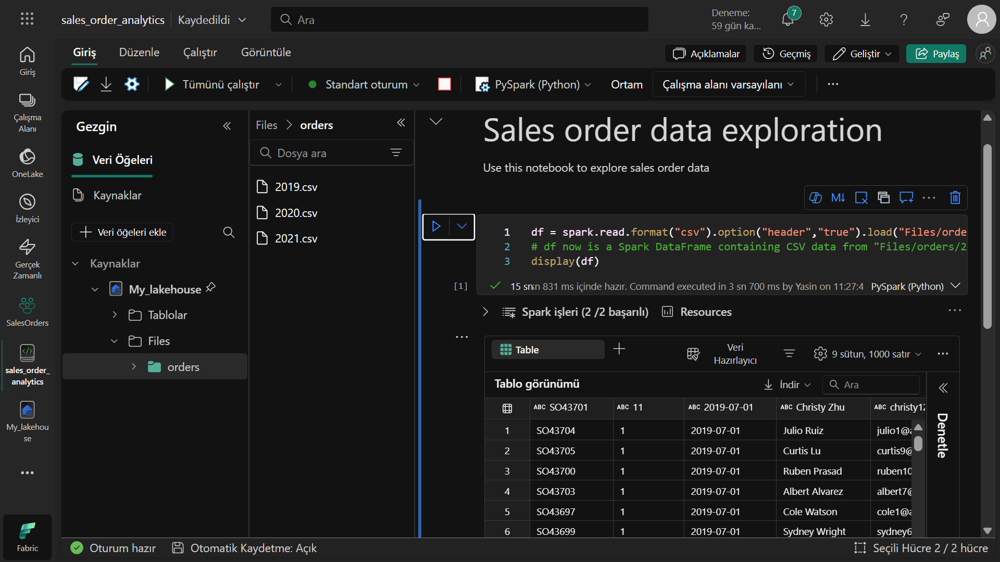
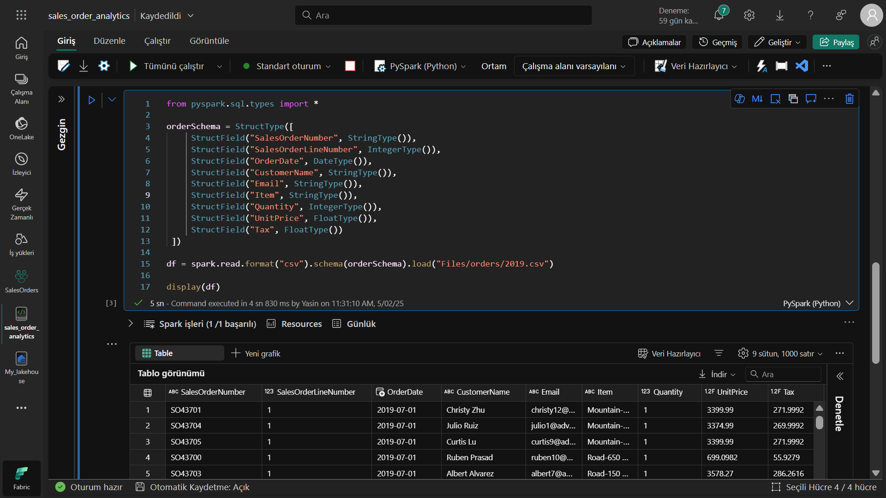
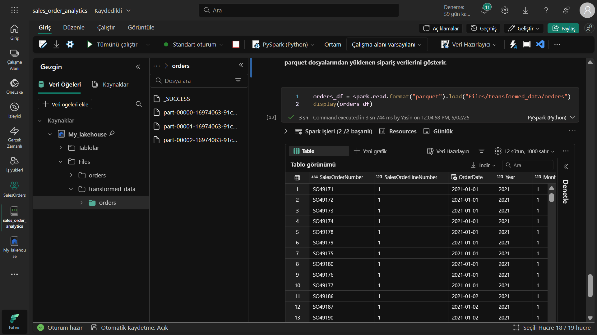
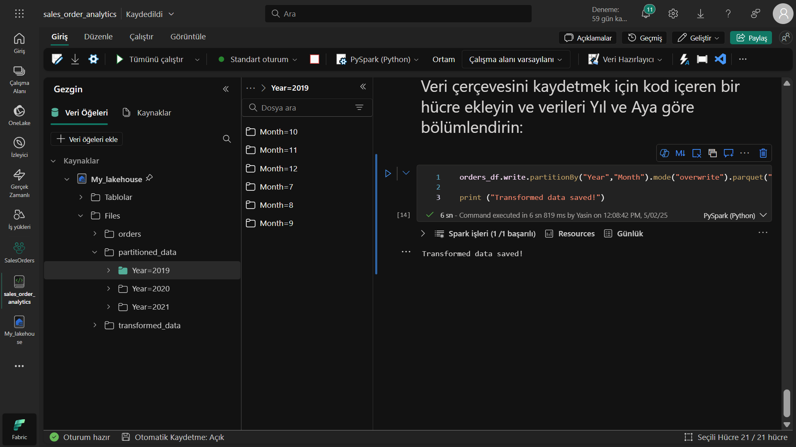
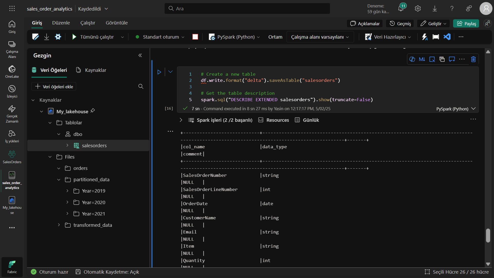
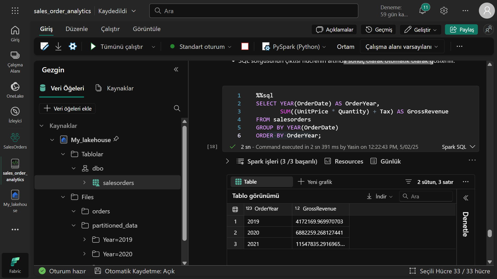
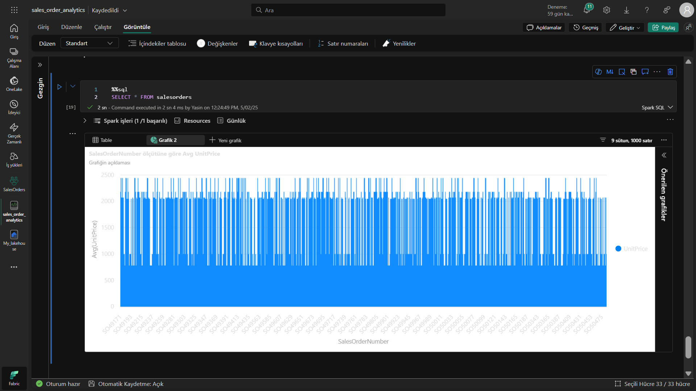
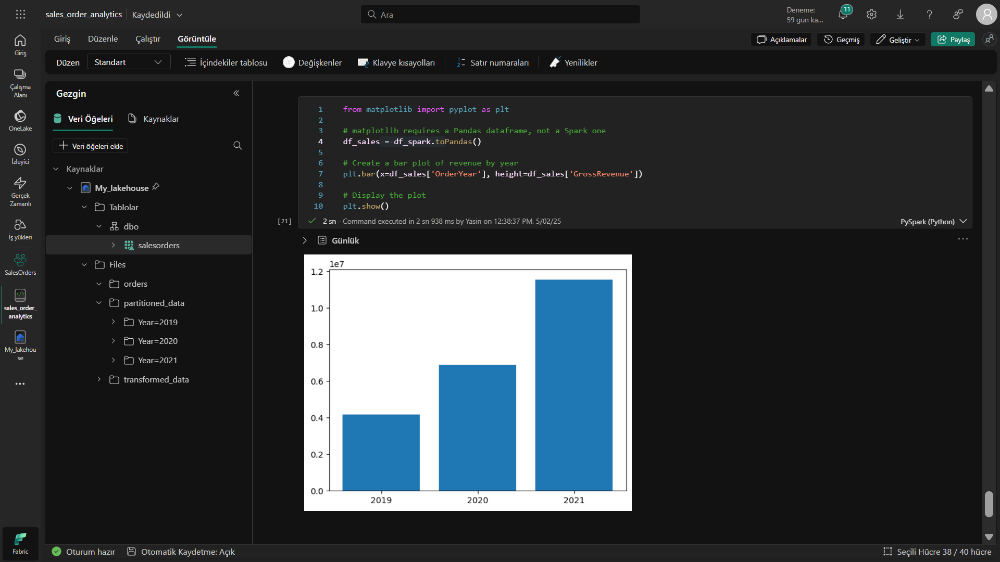
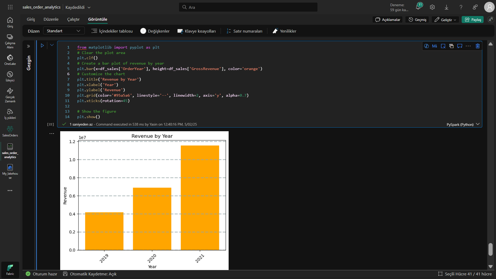
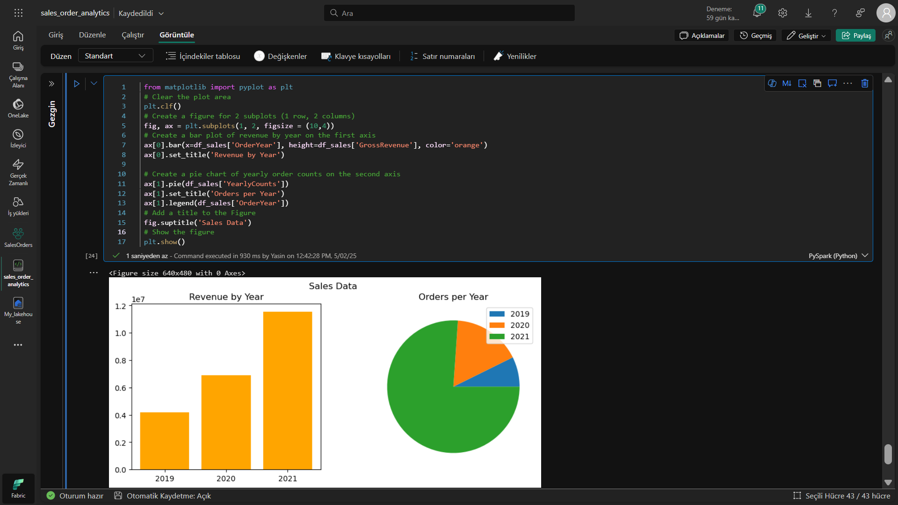
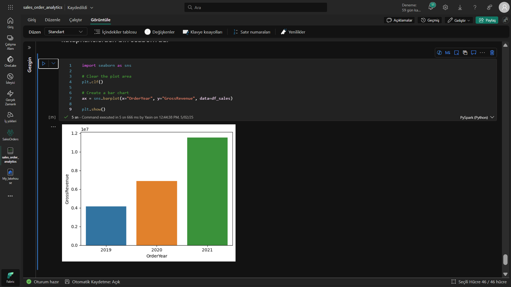