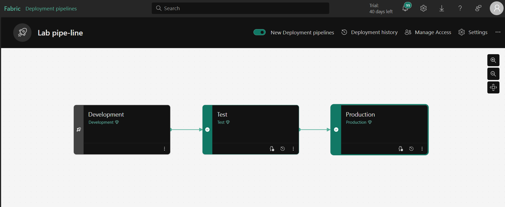

# Managing Content with Deployment Pipelines in Microsoft Fabric
## 📌 Project Purpose
This exercise teaches you how to use deployment pipelines in Microsoft Fabric to manage and distribute content across different environments (development, test, production). Deployment pipelines allow you to:

Release changes in a controlled manner

Ensure consistency across environments

Conduct testing before moving to production

Facilitate team collaboration

## 🎯 What You Will Learn
By completing this exercise, you will learn how to:

Create workspaces in Microsoft Fabric

Set up and configure a deployment pipeline

Deploy content between different environments (stages)

Manage the lifecycle of Fabric items like Lakehouse

Synchronize content across environments

## ⚠️ Important Notes
Permissions: You must have Fabric workspace admin rights to complete this exercise.

Workspace Names: If unique names are required, add random numbers to "Development," "Test," or "Production."

Capacity Selection: Choose between Trial, Premium, or Fabric capacity when creating workspaces.

## Sync Indicators:

### ❌ (Red X): Content mismatch between stages

### 🟠 (Orange X): Partial synchronization

### ✅ (Green check): All stages are synchronized

## 🕒 When Is This Useful?
This exercise is helpful when:

Working on team-based data projects

Testing changes before production deployment

Ensuring consistent content across environments

Setting up CI/CD (Continuous Integration/Deployment) processes

## 🛠️ Step-by-Step Guide
### 1. Create Workspaces
Go to the Microsoft Fabric homepage and sign in.

Select Workspaces (🗇 icon) from the left menu.

Create a new workspace named "Development" (select a Fabric capacity).

Repeat for "Test" and "Production" workspaces.

Verify all three workspaces exist.

### 2. Create a Deployment Pipeline
From the left menu, select Workspaces > Deployment Pipelines > New Pipeline.

Name your pipeline and click Next.

Click Create and Continue.

### 3. Assign Workspaces to Stages
Select your pipeline from the left menu.

Map each stage to its corresponding workspace:

Development stage → Development workspace

Test stage → Test workspace

Production stage → Production workspace

Confirm each assignment.

### 4. Create Content (Lakehouse)
Open the Development workspace.

Click New Item > Lakehouse, name it "LabLakehouse", and create it.

In Lakehouse Explorer, select "Get started with sample data" and load "NYCTaxi".

### 5. Deploy Content Across Stages
Select your pipeline from the left menu.

Click Deploy in the Development stage to copy the Lakehouse to Test.

Click Deploy in the Test stage to copy it to Production.

Verify all stages show a green checkmark (✅).

### 6. Verify Results
Open the Test and Production workspaces.

Confirm the Lakehouse is deployed in both.

## 🏁 Conclusion
You now know how to manage content across environments using deployment pipelines in Microsoft Fabric—a crucial skill for professional data project management.

