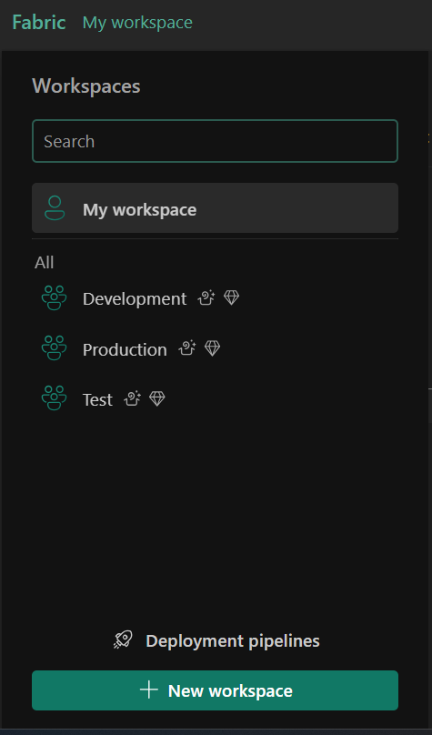

# Inhoud Beheren met Implementatiepijplijnen in Microsoft Fabric
## 📌 Doel van de Oefening
Deze oefening leert je hoe je implementatiepijplijnen in Microsoft Fabric kunt gebruiken om inhoud tussen verschillende omgevingen (ontwikkeling, test, productie) te beheren. Met implementatiepijplijnen kun je:

Wijzigingen gecontroleerd uitrollen

Consistentie tussen omgevingen garanderen

Testen voordat je naar productie gaat

Samenwerking in teams vereenvoudigen

## 🎯 Wat Je Zult Leren
Na deze oefening weet je hoe je:

Workspaces in Microsoft Fabric aanmaakt

Een implementatiepijplijn instelt

Inhoud tussen fasen (development → test → productie) verdeelt

De levenscyclus van Fabric-items (zoals Lakehouse) beheert

Synchronisatie tussen omgevingen controleert

## ⚠️ Belangrijke Punten
Rechten: Je moet Fabric workspace-admin zijn.

Workspace-namen: Voeg eventueel cijfers toe aan "Ontwikkeling", "Test" of "Productie" als unieke namen nodig zijn.

Capaciteit: Kies Trial, Premium of Fabric-capaciteit bij het aanmaken van workspaces.

## Synchronisatie-indicatoren:

### ❌ (Rood kruis): Inhoud komt niet overeen

### 🟠 (Oranje kruis): Gedeeltelijk gesynchroniseerd

### ✅ (Groen vinkje): Alles is gesynchroniseerd

## 🕒 Wanneer is Dit Nuttig?
Deze kennis is handig wanneer je:

In teams aan dataprojecten werkt

Eerst wilt testen voordat je naar productie gaat

Inhoud tussen omgevingen consistent wilt houden

CI/CD-processen (Continuous Integration/Deployment) opzet

## 🛠️ Stappenplan
### 1. Workspaces Aanmaken
Ga naar Microsoft Fabric en log in.

Kies Workspaces (🗇-icoon) in het linkermenu.

Maak een workspace "Ontwikkeling" aan (kies een Fabric-capaciteit).

Herhaal dit voor "Test" en "Productie".

Controleer of alle drie de workspaces bestaan.

### 2. Implementatiepijplijn Maken
Ga naar Workspaces > Implementatiepijplijnen > Nieuwe pijplijn.

Geef de pijplijn een naam en klik op Volgende.

Klik op Maken en doorgaan.

### 3. Workspaces aan Fases Koppelen
Selecteer je pijplijn in het linkermenu.

Koppel elke fase aan de juiste workspace:

Ontwikkeling-fase → Ontwikkeling-workspace

Test-fase → Test-workspace

Productie-fase → Productie-workspace

Bevestig elke koppeling.

### 4. Inhoud Maken (Lakehouse)
Open de Ontwikkeling-workspace.

Klik op Nieuw Item > Lakehouse, noem het "LabLakehouse" en maak het aan.

Kies "Begin met voorbeeldgegevens" en laad "NYCTaxi".

### 5. Inhoud Implementeren Tussen Fases
Selecteer je pijplijn in het linkermenu.

Klik op Implementeren in de Ontwikkeling-fase om de Lakehouse naar Test te kopiëren.

Klik op Implementeren in de Test-fase om deze naar Productie te kopiëren.

Controleer of alle fasen een groen vinkje (✅) tonen.

### 6. Resultaten Controleren
Open de Test- en Productie-workspaces.

Controleer of de Lakehouse in beide staat.

## 🏁 Conclusie
Je kunt nu inhoud tussen omgevingen beheren met implementatiepijplijnen in Microsoft Fabric—een essentiële vaardigheid voor professioneel datawerk!

