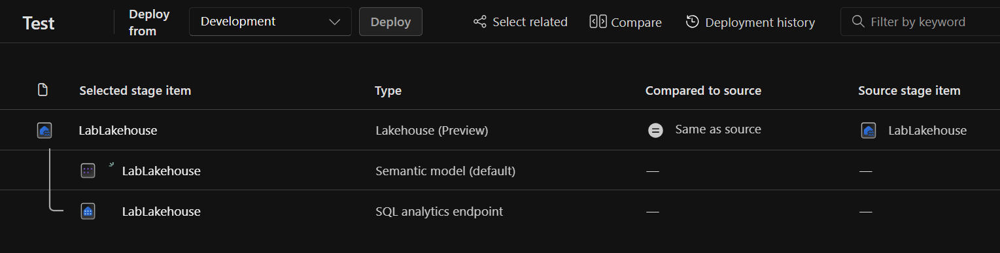
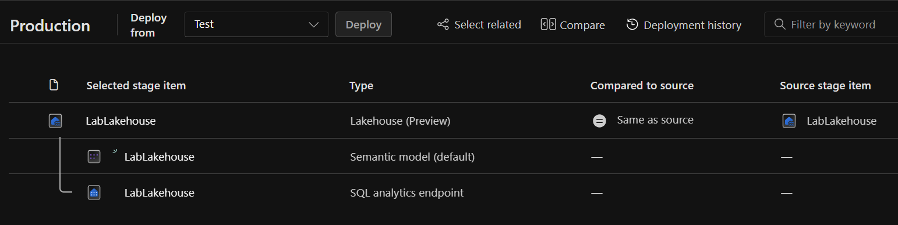

# Microsoft Fabric'te Dağıtım Hatları ile İçerik Yönetimi
## 📌 Proje Amacı
Bu çalışma, Microsoft Fabric'te dağıtım hatlarını (deployment pipelines) kullanarak içerikleri farklı ortamlar (geliştirme, test, üretim) arasında nasıl yöneteceğinizi ve dağıtacağınızı öğretmeyi amaçlamaktadır. Dağıtım hatları sayesinde:

Değişiklikleri kontrollü bir şekilde yayınlayabilirsiniz

Farklı ortamlarda tutarlılık sağlayabilirsiniz

Üretim ortamına geçmeden önce testler yapabilirsiniz

Ekip çalışmasını kolaylaştırabilirsiniz

## 🎯 Ne Öğreneceksiniz?
Bu çalışmayı tamamladığınızda:

Microsoft Fabric'te çalışma alanları oluşturmayı

Dağıtım hattı oluşturmayı ve yapılandırmayı

Farklı ortamlar (aşamalar) arasında içerik dağıtmayı

Lakehouse gibi Fabric öğelerinin yaşam döngüsünü yönetmeyi

Ortamlar arası senkronizasyonu sağlamayı öğrenmiş olacaksınız.

## ⚠️ Dikkat Edilmesi Gerekenler
Yetkilendirme: Bu alıştırmayı yapabilmek için Fabric çalışma alanı yönetici rolüne sahip olmalısınız.

Çalışma Alanı Adları: Benzersiz çalışma alanı adları gerekiyorsa, "Geliştirme", "Test" veya "Üretim" kelimelerine rastgele sayılar ekleyin.

Kapasite Seçimi: Çalışma alanları oluştururken Fabric deneme sürümü, Premium veya Fabric kapasitesi seçebilirsiniz.

## Senkronizasyon Göstergeleri:

### ❌ (Kırmızı X): Aşamalar arasında içerik uyumsuzluğu var

### 🟠 (Turuncu X): Bazı aşamalar senkronize ama hepsi değil

### ✅ (Yeşil onay): Tüm aşamalar senkronize

## 🕒 Ne Zaman İhtiyaç Duyulur?
Bu çalışmada öğrendikleriniz aşağıdaki durumlarda faydalı olacaktır:

Takım halinde veri projeleri geliştirirken

Üretim ortamına geçmeden önce testler yapmanız gerektiğinde

Farklı ortamlarda tutarlı içerik dağıtımı yapmanız gerektiğinde

CI/CD (Sürekli Entegrasyon/Sürekli Dağıtım) süreçleri oluştururken

## 🛠️ Çalışma Adımları
### 1. Çalışma Alanları Oluşturma
Microsoft Fabric ana sayfasına gidin ve oturum açın

Sol menüden Çalışma Alanları'nı seçin (🗇 simgesi)

"Geliştirme" adında yeni bir çalışma alanı oluşturun (Fabric kapasitesi seçerek)

Aynı adımları tekrarlayarak "Test" ve "Üretim" çalışma alanlarını oluşturun

Sol menüden Çalışma Alanları'nı seçerek üç çalışma alanının da oluşturulduğunu doğrulayın

### 2. Dağıtım Hattı Oluşturma
Sol menüden Çalışma Alanları'nı seçin

"Dağıtım Boru Hatları" ve ardından "Yeni boru hattı"nı seçin

Boru hattına benzersiz bir ad verin ve "İleri"yi seçin

"Oluştur ve devam et" butonuna tıklayın

### 3. Çalışma Alanlarını Aşamalara Atama
Oluşturduğunuz boru hattını sol menüden seçin

Her dağıtım aşaması için ilgili çalışma alanını atayın:

Geliştirme aşaması → Geliştirme çalışma alanı

Test aşaması → Test çalışma alanı

Üretim aşaması → Üretim çalışma alanı

Her atama için onay işaretini seçin

### 4. İçerik Oluşturma (Lakehouse)
Sol menüden Çalışma Alanları'nı seçin

"Geliştirme" çalışma alanını açın

"Yeni Öğe" butonuna tıklayın

"Göl Evi"ni seçin ve "LabLakehouse" adını verin

"Oluştur" butonuna tıklayın

Göl Evi Gezgini'nde "Örnek verilerle başla"yı seçin

"Örnek NYCTaxi" veri setini seçin

### 5. Aşamalar Arasında İçerik Dağıtımı
Sol menüden oluşturduğunuz boru hattını seçin

Geliştirme aşamasında "Dağıt" butonuna tıklayarak göl evini Test aşamasına kopyalayın

Açılan pencerede "Dağıt" butonuna tıklayın

Test aşamasında "Dağıt" butonuna tıklayarak göl evini Üretim aşamasına kopyalayın

Tüm aşamalarda yeşil onay işareti göründüğünü doğrulayın

### 6. Sonuçları Doğrulama
Sol menüden Çalışma Alanları'nı seçin

"Test" çalışma alanını açın ve göl evinin kopyalandığını doğrulayın

"Üretim" çalışma alanını açın ve göl evinin kopyalandığını doğrulayın

## 🏁 Sonuç
Bu çalışmayı tamamladığınızda, Microsoft Fabric'te dağıtım hatlarını kullanarak içerikleri farklı ortamlar arasında nasıl yöneteceğinizi öğrenmiş olacaksınız. Bu beceri, veri projelerinizin yaşam döngüsünü profesyonel bir şekilde yönetmenize yardımcı olacaktır.

