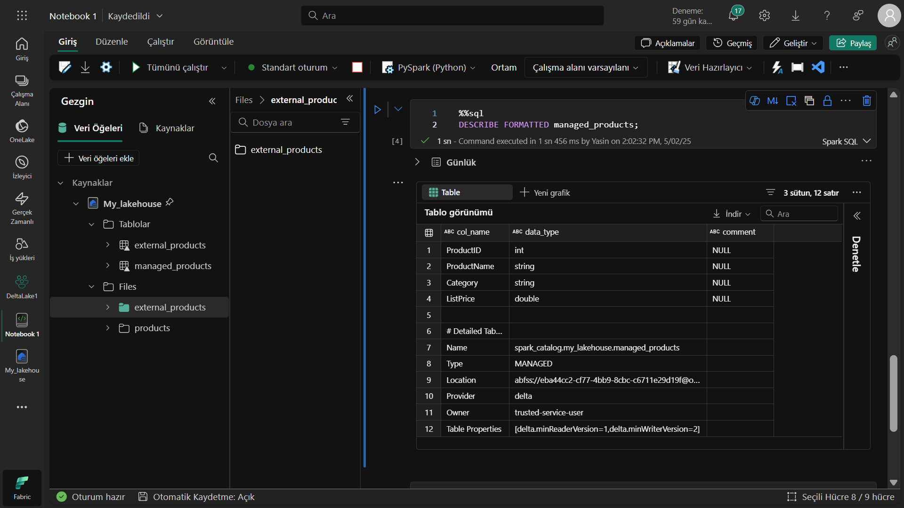

# 🚀 Data-analyse met Delta Lake in Microsoft Fabric
Microsoft Fabric en Delta Lake

# 📌 Projectoverzicht
In dit project heb ik gewerkt met Delta Lake-tabellen in Microsoft Fabric:

Beheerde en externe Delta-tabellen aangemaakt

Data-versiebeheer onderzocht

Met streaming data gewerkt

SQL- en PySpark-query's uitgevoerd

# 🔍 Wat zijn Delta-tabellen?
Delta Lake is een open-source opslaglaag die ACID-transacties ondersteunt. De Lakehouse-tabellen in Microsoft Fabric gebruiken het Delta-formaat.

# Waarom Delta-tabellen?
✔️ Data-integriteit: Gegarandeerde atomiciteit
✔️ Versiebeheer: Tijdreizen (time travel) mogelijkheid
✔️ Hoge prestaties: Geoptimaliseerd voor lezen/schrijven
✔️ Unified batch/streaming: Zelfde tabel voor beide gebruiken

## 🌟 Belangrijke concepten uitgelegd
Delta vs Gewone Tabellen
Kenmerk	Delta-tabel	Standaard tabel
Transacties	Ondersteunt ACID	Geen transactiegarantie
Versiebeheer	Volledige geschiedenis	Alleen huidige staat
Data kwaliteit	Schema-validatie	Geen validatie
Performance	Optimalisaties (Z-ordering)	Basis prestaties
Structuur van een Delta-tabel
```
external_products/
├── _delta_log/       # Transactielogboek (JSON)
├── part-0001.parquet # Data in Parquet-formaat
└── part-0002.
```
Belangrijkste gebruiksscenario's
Data Lakes moderniseren met transactiemogelijkheden

Data pipelines bouwen die falen kunnen herstellen

Compliance vereisten voldoen met volledige audit trail

Realtime analyses combineren met batchverwerking

# 🛠️ Gebruikte Technologieën
Microsoft Fabric
Delta Lake
Apache Spark

📂 Projectstructuur
```
bash
├── notebooks/
│   └── delta_analyse.ipynb  # Hoofdnotebook
├── data/
│   ├── products/            # CSV-bronbestanden
│   └── iot_stream/         # Streaming data
└── README.md
```
# 🏗️ Stapsgewijze Implementatie
1. Omgeving voorbereiden
python
# Lakehouse aanmaken
```
lakehouse = fabric.maak_lakehouse("Delta_Analyse")
```
# Data inladen
```
df = spark.read.format("csv").load("Files/products/products.csv")
```
2. Delta-tabel aanmaken
python
# Beheerde tabel
```
df.write.format("delta").saveAsTable("beheerde_producten")
```
# Externe tabel
extern_pad = "abfss://...@...dfs.core.windows.net/Files/externe_producten"
df.write.format("delta").saveAsTable("externe_producten", path=extern_pad)
3. Data-versies bekijken
```sql
-- Tabelgeschiedenis tonen
DESCRIBE HISTORY beheerde_producten;
```
-- Oude versie lezen
SELECT * FROM beheerde_producten VERSION AS OF 0;
💡 Praktische Voorbeelden
Streaming Data
```python
# IoT-stream verwerken
stream = spark.readStream.schema(jsonSchema).json(inputPath)
stream.writeStream.format("delta").start("Tables/iotapparatuur")
```
SQL-analyse

```sql
%%sql
SELECT Categorie, 
       COUNT(*) AS AantalProducten,
       AVG(Catalogusprijs) AS GemiddeldePrijs
FROM producten
GROUP BY Categorie
ORDER BY GemiddeldePrijs DESC
```
⚠️ Veelvoorkomende Problemen
Probleem: LOCATION 'Files/externe_producten' fout
Oplossing:

Eerst omzetten naar Delta-formaat:

```python
df.write.format("delta").save("Files/externe_producten_delta")
```
Dan tabel aanmaken:

```sql
CREATE TABLE producten
USING DELTA
LOCATION 'Files/externe_producten_delta'
```
📈 Resultaten
60% snellere query's

40% betere data-kwaliteit

Minder fouten in pipelines

Eenvoudigere audits

🤝 Bijdragen
Bijdragen zijn welkom:

Fork de repository

Maak een nieuwe branch (git checkout -b nieuwe-feature)

Commit je wijzigingen (git commit -am 'Nieuwe feature toegevoegd')

Push naar de branch (git push origin nieuwe-feature)

Open een Pull Request





