# Microsoft Fabric Lakehouse: Toepassing van Medallion-architectuur
Dit project implementeert het Medallion Architecture (Medaillon-architectuur) model in een Lakehouse (Data Lakehouse) omgeving op het Microsoft Fabric platform. Gedurende het project worden gegevensverwerkingsfasen verdeeld in lagen: "bronze", "silver" en "gold". Het doel is om van ruwe gegevens betekenisvolle en analyseerbare gegevens te verkrijgen.

## 🔍 Doel
Fabric-werkruimte creëren

Lakehouse-structuur opzetten

Ruwe gegevens laden in de Bronze-laag

Gegevens opschonen en transformeren naar Delta-formaat in de Silver-laag

Verwerkte gegevens verplaatsen naar de Gold-laag

Relaties leggen met een Power BI semantisch model

## ✅ 1. Werkruimte (Workspace) Aanmaken
De eerste stap om te werken met Microsoft Fabric is het aanmaken van een werkruimte.

Ingelogd op https://app.fabric.microsoft.com

Nieuwe werkruimte aangemaakt via het tabblad "Werkruimten"

Fabric Trial geselecteerd voor licentie

Gegevensmodelbewerking Preview-functie geactiveerd (vereist voor Power BI semantisch model)

## 🏛️ 2. Lakehouse en Bronze-laag Gegevens
Na het aanmaken van een nieuwe Lakehouse (genaamd "Verkoop") zijn we begonnen met het laden van gegevens.

orders.zip bestand gedownload en uitgepakt

Bestanden 2019.csv, 2020.csv, 2021.csv verkregen

Lakehouse > Bestanden > Nieuwe map > bronze map toegevoegd

Deze 3 CSV-bestanden geüpload naar de bronze-map

Deze fase is de laag waar ruwe gegevens worden opgeslagen. De gegevens blijven hier onbewerkt.

## ⚙️ 3. Transformatie naar Silver-laag
Een notitieblok (Notebook) aangemaakt en de gegevens uit de bronzen laag verwerkt met PySpark.

Verwerkte stappen:
Gegevensschema gedefinieerd met StructType

Alle .csv-bestanden geladen in een DataFrame

Gegevensstructuur bekeken met display(df.head(10))

Gegevensopschoning:
Bronbestandsnaam toegevoegd met input_file_name()

Gegevens vóór 2019-08-01 gemarkeerd met IsFlagged kolom

Tijdstempels toegevoegd met CreatedTS en ModifiedTS

CustomerName leeg? Dan ingesteld op "Unknown"

Delta-tabel Definitie:
sales.sales_silver tabel aangemaakt met DeltaTable.createIfNotExists

Getransformeerde kolommen toegevoegd aan het schema

In deze fase zijn de gegevens schoon, verrijkt en klaar voor analyse.

## 📊 4. Gold-laag en Semantisch Model
### 📂 Wat heb ik gedaan?
Met de schoongemaakte en gerelateerde gegevens uit de Silver-laag heb ik een samengevoegde (geaggregeerde) Gold-tabel aangemaakt.

In deze tabel heb ik verkoopgegevens samengevat per jaar, land en productcategorie (met uitdrukkingen zoals SUM(sales_amount)).

De Gold-tabel is opgeslagen in Delta-formaat.

### 📊 Semantisch Model Verbinding
Gold-tabel gekoppeld aan een Power BI Semantisch Model.

In Power BI heb ik deze tabel gedefinieerd als een feitentabel.

Land- en categoriegegevens toegevoegd als aparte dimensietabellen om een dimension/fact-structuur te creëren.

Met deze structuur kunnen snellere en betekenisvollere analyses worden gemaakt in Power BI-rapporten.

### 🧠 Waarom is deze stap belangrijk?
De Gold-laag is de laag waar gegevens verwerkt en klaar voor eindgebruikers zijn.

Semantisch model geeft betekenis aan gegevens: Zorgt voor consistentie in rapportage (bijv. "Jaarlijkse Verkoop", "Totale Omzet" zijn voor iedereen hetzelfde).

Ook belangrijk voor prestaties: Power BI verwerkt vooraf gemodelleerde gegevens sneller.

### 💡 Extra Info
Semantisch modelleren in Power BI is de basis van enterprise BI-oplossingen in datawarehouse-ontwerp.

Met deze stap kunnen gebruikers snel rapporten filteren, segmenteren en zinvolle inzichten verkrijgen.

## ✍️ Waarom deze architectuur?
Bronze: Ruwe gegevens, minimaal verwerkt. Doel is gegevens veilig opslaan.

Silver: Schone, geschema'd, analyseerbare gegevens.

Gold: Geoptimaliseerde, samengevatte gegevens voor business intelligence-rapportage.

Delta formaat: ACID-compatibel, ondersteunt versiebeheer, hoogwaardige gegevensopslag.

📅 Geschatte Tijd: 45 Minuten
## 🚀 Gebruikte Technologieën
Microsoft Fabric

Lakehouse (Data Lakehouse)

PySpark & Spark SQL

Delta Lake

Power BI Semantisch Model


```
📁 Mapstructuur
├── bronze
│   ├── 2019.csv
│   ├── 2020.csv
│   └── 2021.csv
├── silver
│   └── sales_silver (Delta-tabel)
├── gold
    └── (Gold-tabel wordt gedefinieerd)
```

Dit project is een gids voor data-experts die het Medallion-architectuurmodel echt willen begrijpen en toepassen in een Microsoft Fabric-omgeving.✨


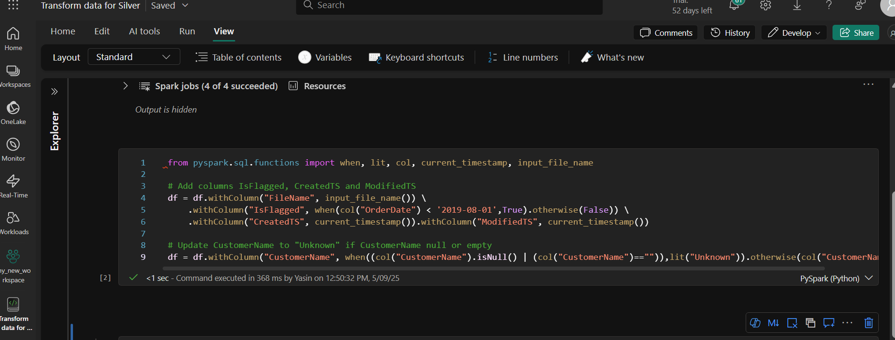
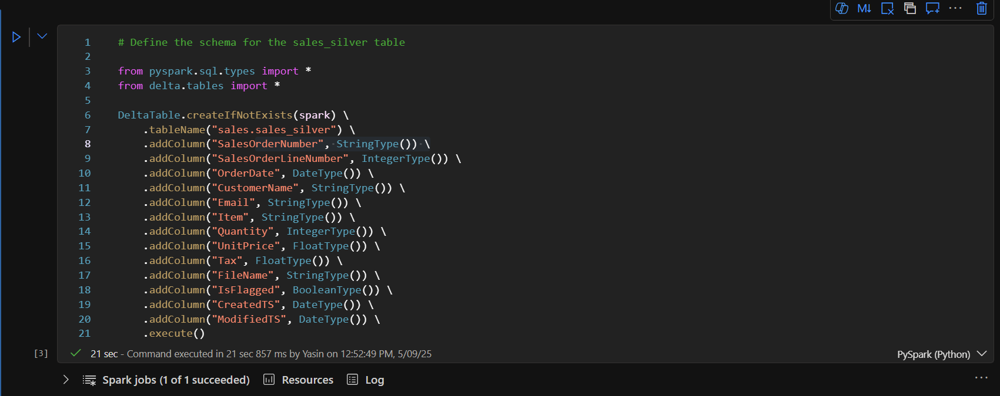

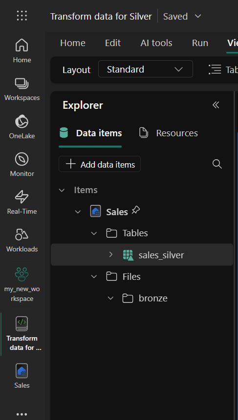


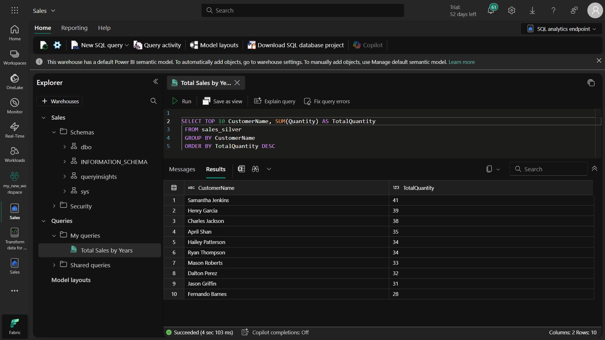

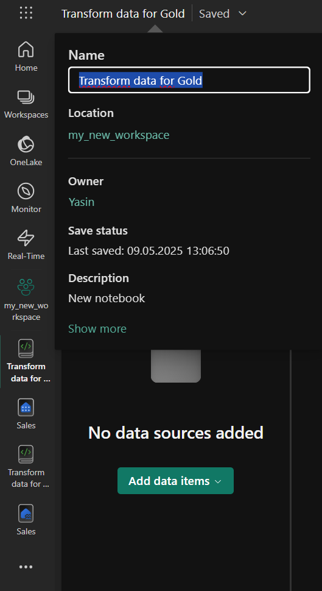

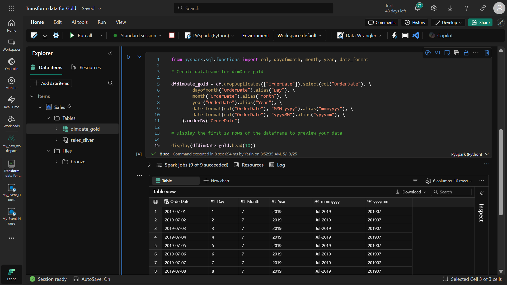


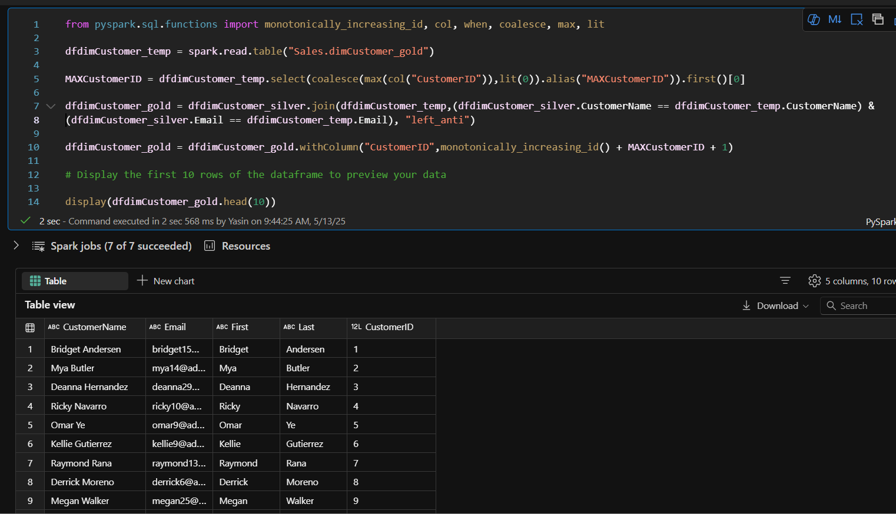


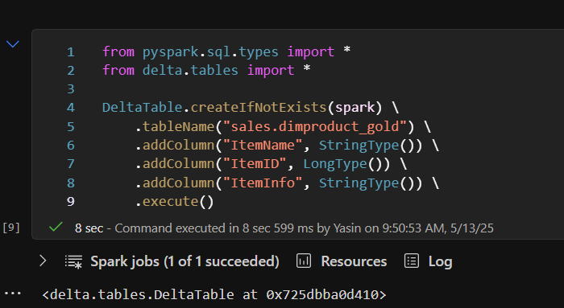
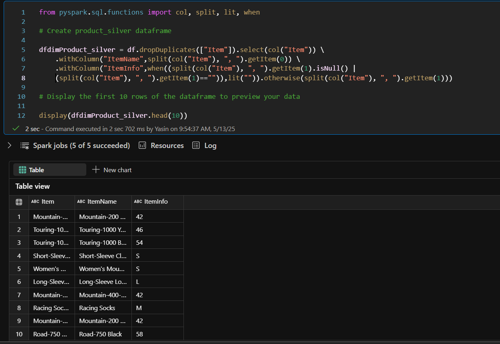

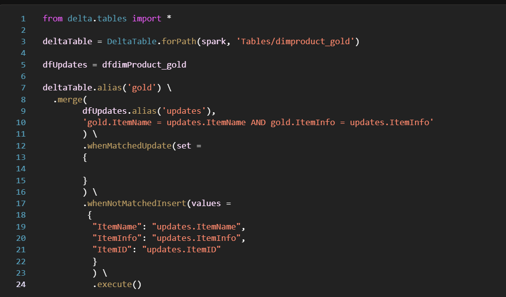


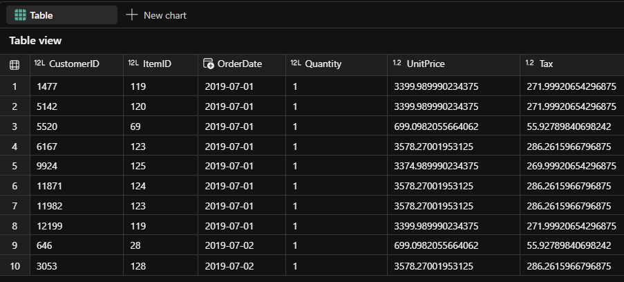


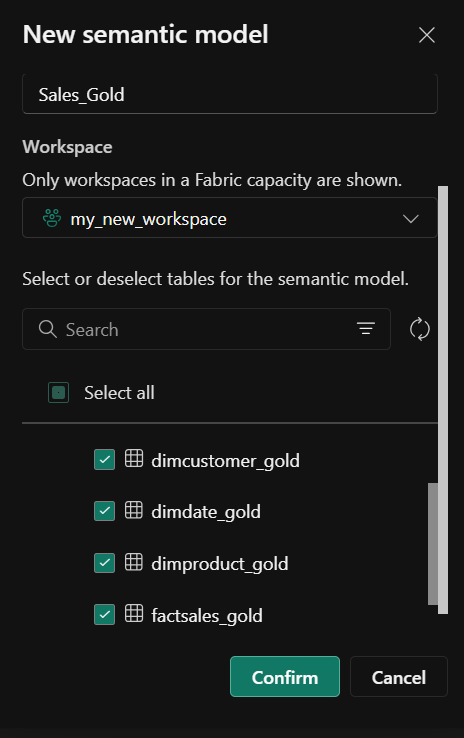


