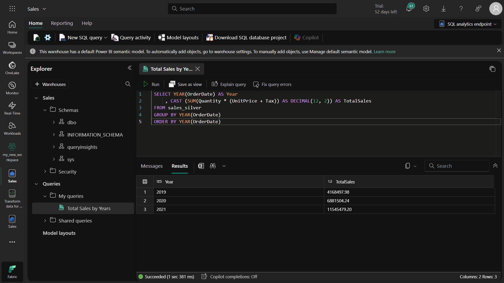

# Microsoft Fabric Göl Evi: Madalyon Mimarisi Uygulaması

Bu çalışma, Microsoft Fabric platformu üzerinde bir **Lakehouse (Veri Gölü Evi)** ortamında **Medallion Architecture (Madalyon Mimarisi)** modelini uygulamalı olarak gerçekleştirir. Proje boyunca veri işleme aşamaları "bronze", "silver" ve "gold" olmak üzere katmanlara ayrılmıştır. Amaç, ham veriden anlamlı ve analiz edilebilir veri çıkarmaktır.

## 🔍 Amaç

* Fabric çalışma alanı oluşturmak
* Lakehouse yapısını kurgulamak
* Ham verileri Bronze katmana yüklemek
* Verileri temizleyip Silver katmana Delta formatında dönüştürmek
* Daha fazla işlenmiş verileri Gold katmana taşımak
* Power BI semantik modeli ile ilişkileri kurmak

---

## ✅ 1. Çalışma Alanı (Workspace) Oluşturma

Microsoft Fabric üzerinde çalışma yapabilmek için ilk adımda bir çalışma alanı oluşturuldu.

* [https://app.fabric.microsoft.com](https://app.fabric.microsoft.com) adresinden oturum açıldı.
* "Çalışma Alanları" sekmesinden yeni bir alan oluşturuldu.
* Lisanslama için Fabric Deneme (Trial) seçildi.
* Veri Modeli Düzenleme Önizleme özelliği aktif edildi. (Power BI semantik model İçin şart)

---

## 🏛️ 2. Lakehouse ve Bronze Katman Verileri

Yeni bir **Lakehouse** (Satış adlı) oluşturulduktan sonra veri yükleme işlemine geçildi.

* [orders.zip](https://github.com/MicrosoftLearning/dp-data/blob/main/orders.zip) dosyası indirildi ve çıkarıldı.
* 2019.csv, 2020.csv, 2021.csv dosyaları elde edildi.
* Lakehouse > Files > Yeni klasör > **bronze** klasörü eklendi.
* Bu 3 CSV dosyası bronze klasörüne yüklendi.

Bu aşama, ham verilerin saklandığı katmandır. Veriler şimdilik İşlenmeden burada tutulur.

---

## ⚙️ 3. Silver Katmana Dönüşüm

Bir not defteri (Notebook) oluşturularak bronz katmandaki veriler PySpark kullanılarak işlendi.

### İşlenilen adımlar:

* `StructType` kullanarak veri şeması tanımlandı
* Tüm .csv dosyaları DataFrame'e yüklendi
* `display(df.head(10))` ile verinin yapısı görüldü

### Veri Temizleme Adımları:

* `input_file_name()` ile kaynak dosya adı eklendi
* `IsFlagged` kolonu ile 2019-08-01 öncesi veriler işaretlendi
* `CreatedTS` ve `ModifiedTS` ile zaman damgaları eklendi
* `CustomerName` boşsa "Unknown" olarak düzenlendi

### Delta Tablosu Tanımı:

* `DeltaTable.createIfNotExists` kullanılarak `sales.sales_silver` tablosu tanımlandı
* Schema içine tüm dönüştürülmüş kolonlar eklendi

Bu aşamada veriler temiz, zenginleştirilmiş ve analiz edilebilir hale getirildi.

---

## 📊 4. Gold Katman ve Semantik Model
### 📂 Ne Yaptım?
Silver katmandan elde ettiğim temizlenmiş ve ilişkilendirilmiş verileri kullanarak özetlenmiş (aggregated) bir Gold tablo oluşturdum.

Bu tabloda satış verilerini yıl, ülke ve ürün kategorisine göre toplulaştırdım (SUM(sales_amount) gibi ifadelerle).

Oluşturulan Gold tablosunu Delta formatında kaydettim.

### 📊 Semantik Model Bağlantısı
Gold tablosunu Power BI Semantic Model ile ilişkilendirdim.

Power BI'da bu tabloyu bir fact tablosu olarak tanımladım.

Ülke ve kategori bilgilerini ayrı boyut tabloları olarak ekleyerek dimension/fact yapısı oluşturdum.

Bu yapı sayesinde Power BI raporlarında daha anlamlı ve hızlı analizler yapılabiliyor.

### 🧠 Neden Bu Adım Önemli?
Gold katman, verilerin işlenmiş ve son kullanıcıya sunulmaya hazır olduğu katmandır.

Semantik model sayesinde veri anlam kazanır: Raporlama sırasında her kullanıcının aynı kavramları aynı şekilde görmesini sağlar (örneğin "Yıllık Satış", "Toplam Gelir" gibi metrikler herkes için aynıdır).

Performans açısından da önemlidir: Power BI, önceden modellenmiş verileri daha hızlı işler.

### 💡 Ekstra Bilgi
Power BI'da semantik modelleme, veri ambarı tasarımında kurumsal BI çözümlerinin temelidir.

Bu adım sayesinde kullanıcılar raporları hızlıca filtreleyebilir, dilimleyebilir ve anlamlı içgörüler elde edebilir.

---

## ✍️ Neden Bu Mimariyi Kullandık?

* **Bronze**: Ham veri, minimum işlenmiş. Amaç veriyi kaybetmeden depolamak.
* **Silver**: Temizlenmiş, şemalaştırılmış, analiz edilebilir veri.
* **Gold**: İş zekası raporlaması için optimize edilmiş, özetlenmiş veriler.
* **Delta** formatı: ACID uyumlu, versiyonlama destekli, performanslı veri tabanı.

---

## 📅 Tahmini Süre: 45 Dakika

---

## 🚀 Kullanılan Teknolojiler

* Microsoft Fabric
* Lakehouse (Veri Gölü Evi)
* PySpark & Spark SQL
* Delta Lake
* Power BI Semantik Model

---

## 📁 Klasör Yapısı

```
├── bronze
│   ├── 2019.csv
│   ├── 2020.csv
│   └── 2021.csv
├── silver
│   └── sales_silver (Delta Table)
├── gold
    └── (Gold tablosu tanımlanacak)
```

---

> Bu proje, Microsoft Fabric ortamında Medallion mimarisini gerçekten anlamak ve uygulamak isteyen veri uzmanları için rehber niteliğindedir.

Devam eden çalışma için Gold katman ve Power BI semantik modeli detayları eklenecektir. ✨





