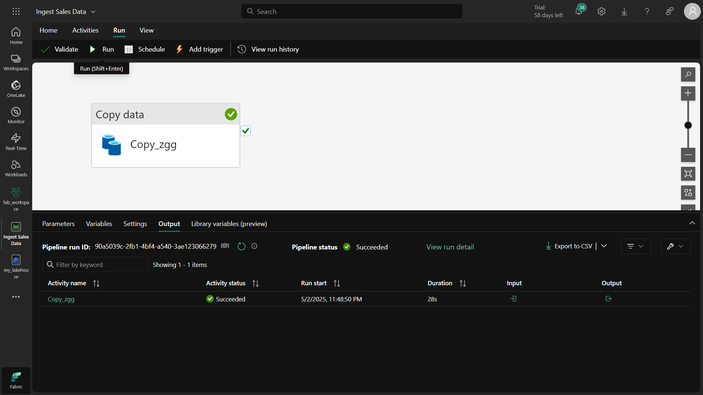
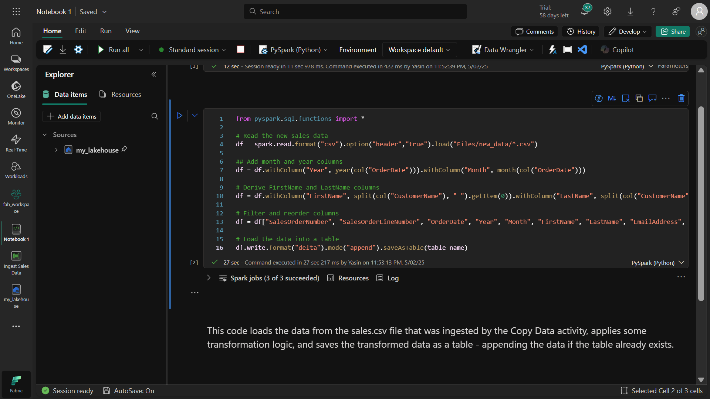
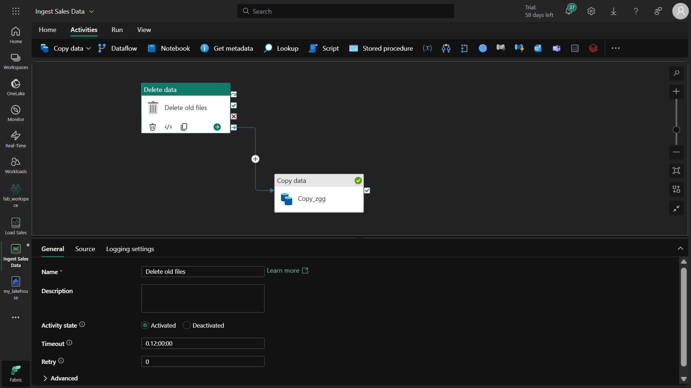
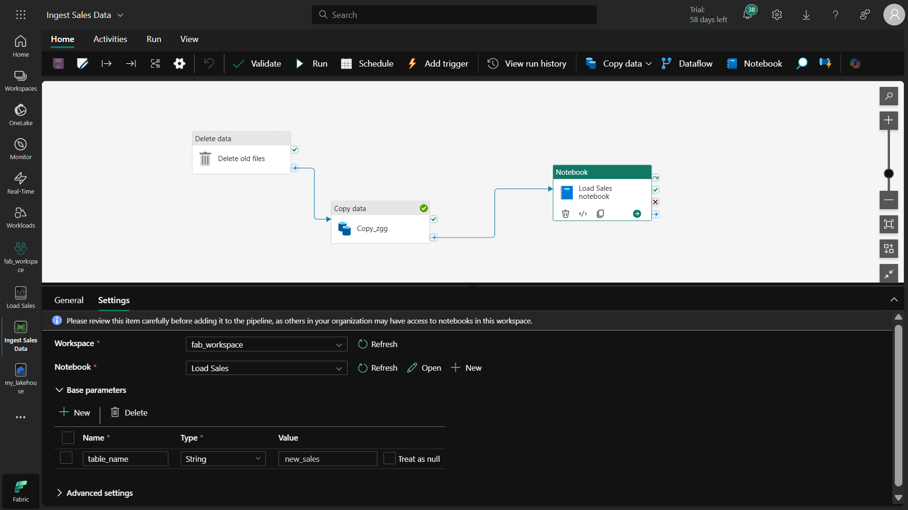
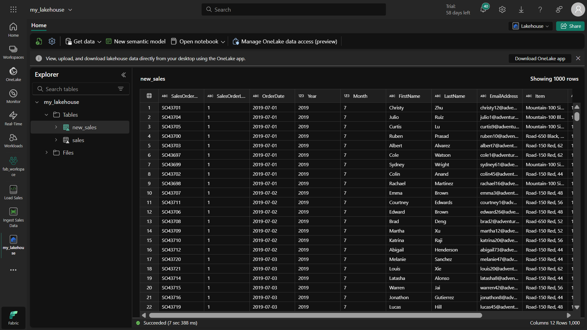

# 📊 Data-opname en -transformatieproject in Microsoft Fabric
## 🌟 Projectoverzicht
In dit project heb ik een data-opnamepijplijn gebouwd in Microsoft Fabric om gegevens van een externe bron te extraheren, transformeren en analyseren.

## 🎯 Doel van het Project
Gegevensopname uit een HTTP-bron automatiseren

Data-pijplijn ontwerpen voor workflowautomatisering

Gegevenstransformaties uitvoeren met PySpark

Gegevens opslaan als Delta-tabel

## 🛠️ Gebruikte Technologieën
Microsoft Fabric Data Pipeline

PySpark

Delta Lake

HTTP-connector

## 🔍 Stapsgewijze Uitvoering
1. Omgeving Voorbereiden
Lakehouse aangemaakt

Map new_data aangemaakt voor opslag

2. Data-opnamepijplijn
python
##  Gegevens ophalen van HTTP-bron
```
source_url = "https://raw.githubusercontent.com/MicrosoftLearning/dp-data/main/sales.csv"
destination_path = "Files/new_data/sales.csv"
```
Werking:

Verkoopgegevens opgehaald via HTTP-verbinding

Opgeslagen in CSV-formaat in de lakehouse

3. Gegevenstransformaties
```
python
from pyspark.sql.functions import *
```

## Gegevens inlezen
```
df = spark.read.format("csv").option("header","true").load("Files/new_data/*.csv")
```

# Datumtransformaties
```
df = df.withColumn("Year", year(col("OrderDate"))) 
       .withColumn("Month", month(col("OrderDate")))
```

# Naamsplitsing
```
df = df.withColumn("FirstName", split(col("CustomerName"), " ").getItem(0))
       .withColumn("LastName", split(col("CustomerName"), " ").getItem(1))
```

### Transformatielogica:
✔️ Jaar en maand extraheren uit datum
✔️ Klantnaam splitsen in voor- en achternaam

4. Opslaan als Delta-tabel
python
## Opslaan in Delta-formaat
```
df.write.format("delta").mode("append").saveAsTable("sales")
```
### Waarom Delta?

Gegevensversiebeheer

Hogere queryprestaties

ACID-transactieondersteuning

## 📈 Behaalde Resultaten
Geautomatiseerde data-opnamepijplijn

Getransformeerde gegevens in Delta-tabel

Analyseklaar gestructureerd dataset

### 💡 Opgedane Kennis
✔️ Aanmaken van Fabric-pijplijnen
✔️ Gegevenstransformatietechnieken met Spark
✔️ Voordelen en use cases van Delta-tabellen

### 🚀 Volgende Stappen
Pijplijn volgens schema laten uitvoeren

Gegevenskwaliteitscontroles toevoegen

Power BI-rapporten maken


### 💡 Tips voor Nederlandse Context:

Gebruik in bankwezen voor transactiehistorie

Toepasbaar bij gemeenten voor burgerdata

Handig voor logistieke bedrijven met IoT-data

### Voorbeeld Nederlandse Use Case:
"Bij een Nederlandse retailer gebruikten we Delta-tabellen om winkeltransacties te versiebeheren en voorraadniveaus in realtime bij te werken."










