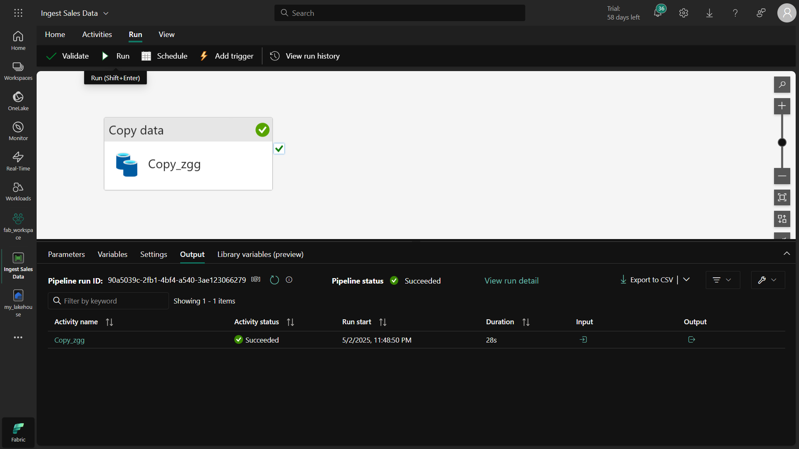
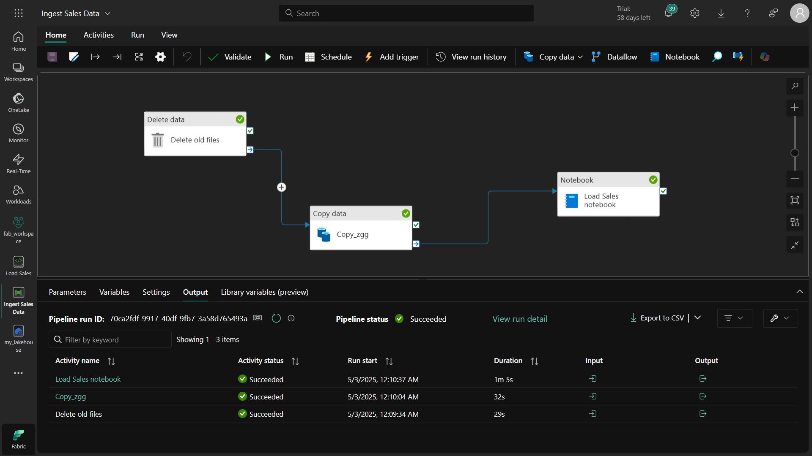

# 📊 Microsoft Fabric'te Veri Alımı ve Dönüşümü Projesi
## 🌟 Proje Özeti
Bu projede, Microsoft Fabric ortamında veri alımı boru hattı oluşturarak harici bir kaynaktan veri çekme, dönüştürme ve analiz etme sürecini tamamladım.

## 🎯 Projenin Amacı
HTTP kaynağından veri alımı yapmak

Veri boru hattı oluşturarak otomatik iş akışı tasarlamak

PySpark ile veri dönüşümleri gerçekleştirmek

Delta tablo olarak verileri depolamak

## 🛠️ Kullanılan Teknolojiler
Microsoft Fabric Data Pipeline

PySpark

Delta Lake

HTTP Connector

# 🔍 Adım Adım Yapılanlar
1. Ortam Hazırlığı
Lakehouse oluşturuldu

new_data adında bir klasör hazırlandı

2. Veri Alım Boru Hattı
python
# HTTP kaynağından veri çekme
```
source_url = "https://raw.githubusercontent.com/MicrosoftLearning/dp-data/main/sales.csv"
destination_path = "Files/new_data/sales.csv"
```
## Nasıl Çalışır?

HTTP bağlantısıyla satış verileri çekildi

CSV formatında lakehouse'a kaydedildi

3. Veri Dönüşümleri
```
python
from pyspark.sql.functions import *
```
# Veriyi okuma
```
df = spark.read.format("csv").option("header","true").load("Files/new_data/*.csv")
```
# Tarih dönüşümleri
```
df = df.withColumn("Year", year(col("OrderDate"))) 
       .withColumn("Month", month(col("OrderDate")))
```
# İsim ayrıştırma
```
df = df.withColumn("FirstName", split(col("CustomerName"), " ").getItem(0))
       .withColumn("LastName", split(col("CustomerName"), " ").getItem(1))
```
Dönüşüm Mantığı:
✔️ Tarihten yıl ve ay çıkarma
✔️ Müşteri adını ad-soyad olarak ayırma

4. Delta Tabloya Kaydetme
python
# Delta formatında kaydetme
```
df.write.format("delta").mode("append").saveAsTable("sales")
```
## Neden Delta?

Veri versiyonlama özelliği

Yüksek performanslı sorgular

ACID transaction desteği

📈 Elde Edilen Çıktılar
Otomatik veri alımı boru hattı

Dönüştürülmüş veriler ile Delta tablo

Analize hazır yapılandırılmış veri seti

## 💡 Öğrenilenler
✔️ Fabric boru hatları oluşturma
✔️ Spark ile veri dönüşüm teknikleri
✔️ Delta tablo avantajları ve kullanım senaryoları

## 🚀 Sonraki Adımlar
Boru hattını zamanlanmış olarak çalıştırma

Veri kalite kontrolleri ekleme

Power BI raporları oluşturma






