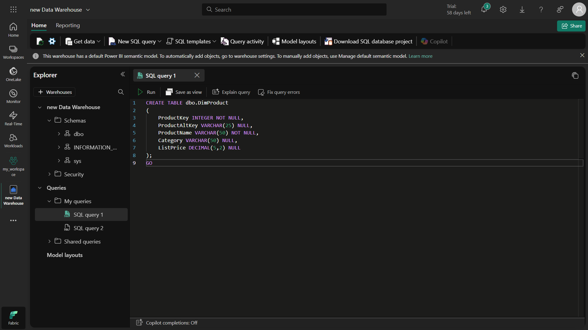
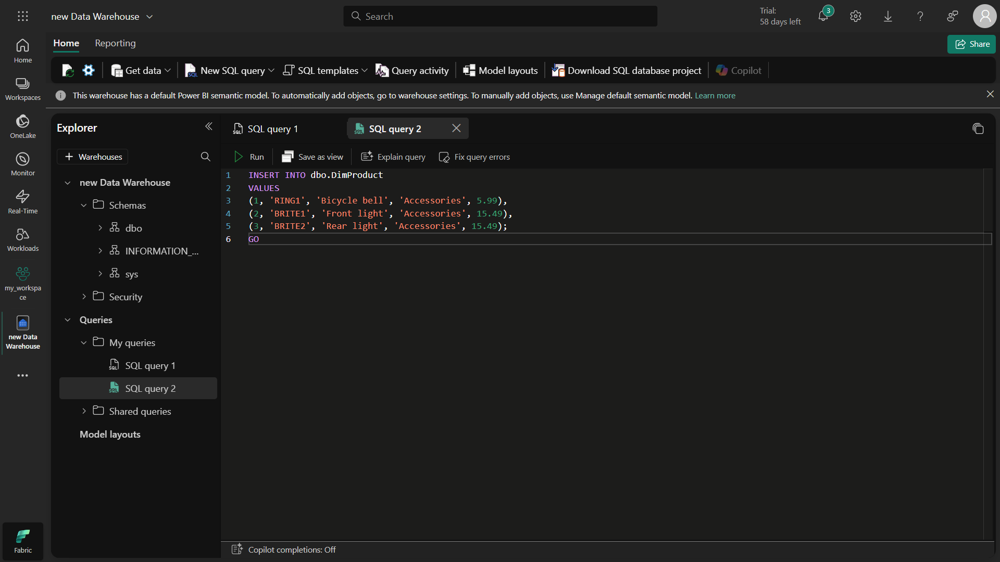
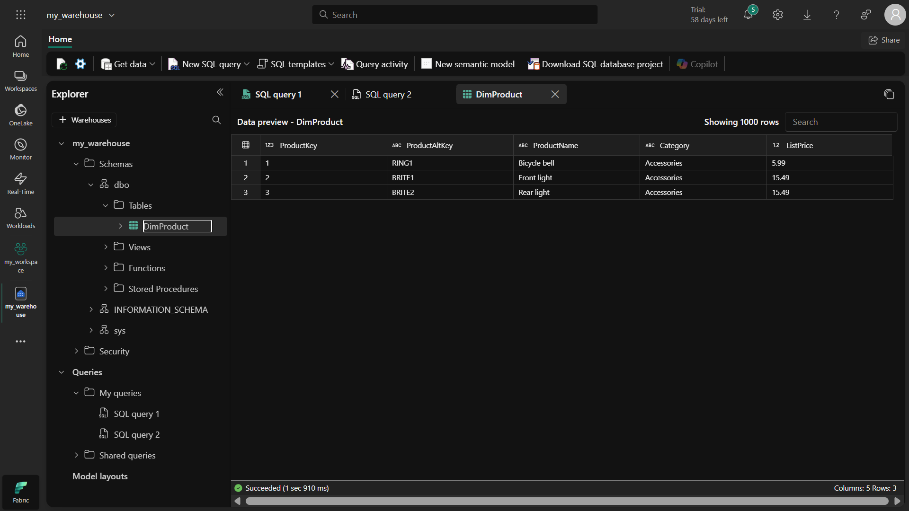
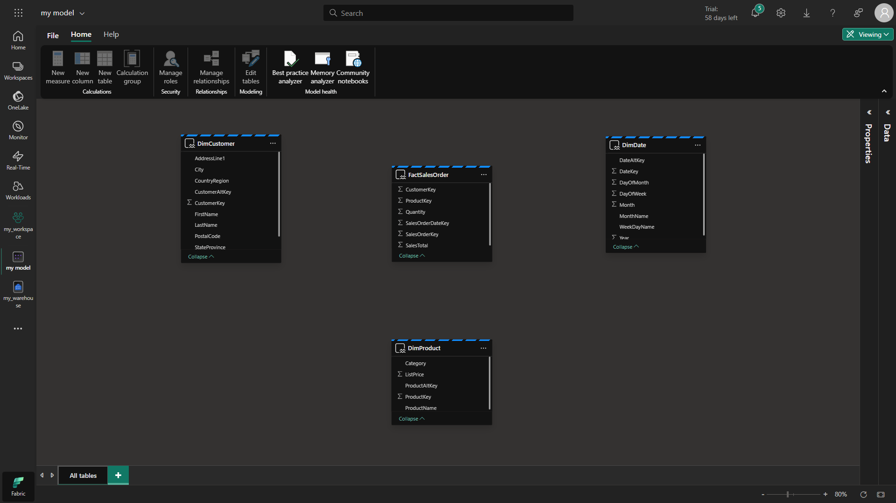
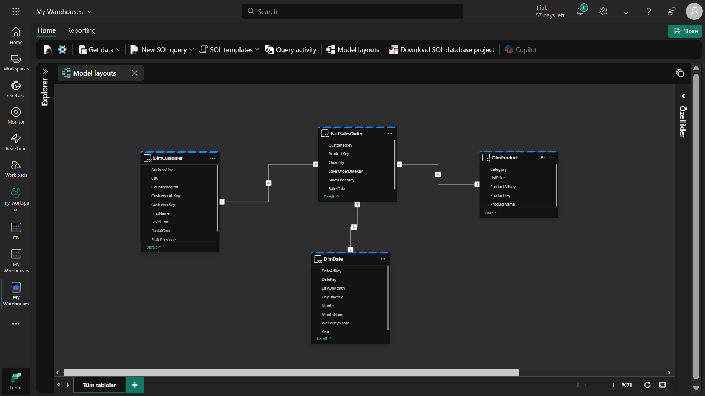
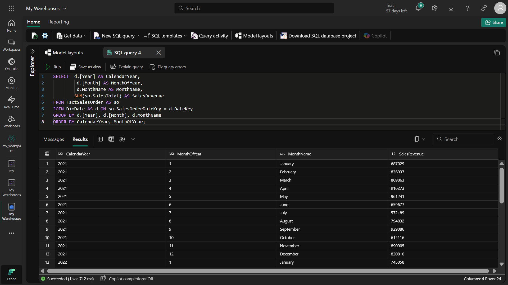
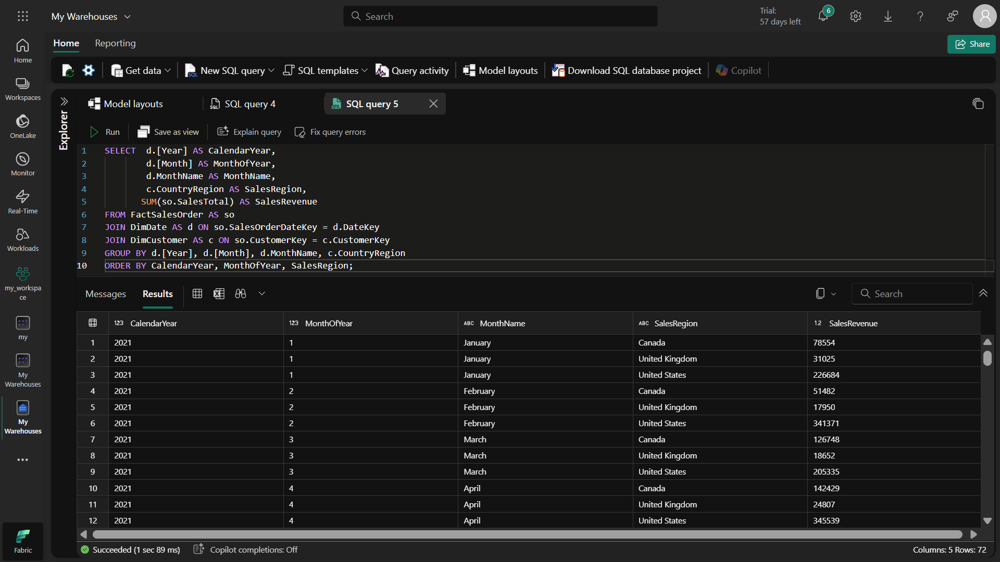
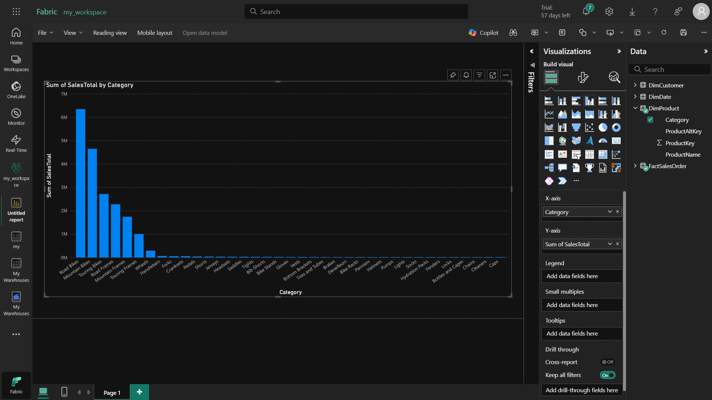
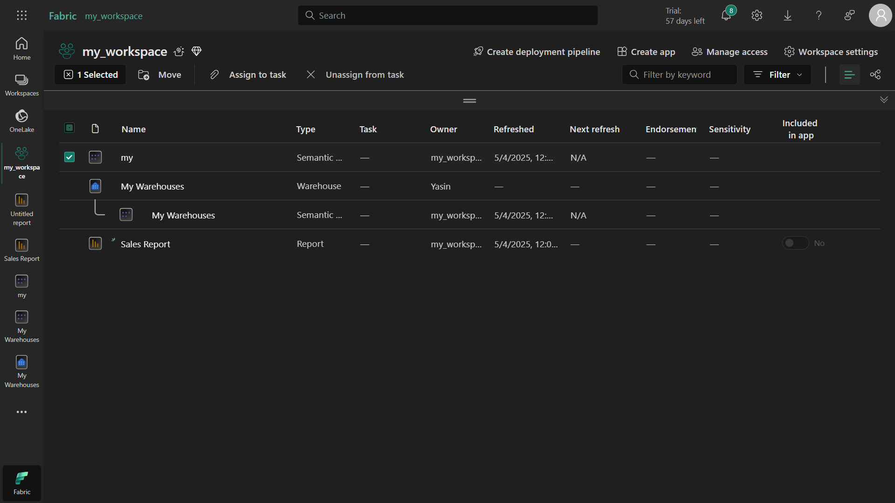

# 📊 Microsoft Fabric Data Warehouse Analyse Module
Dit project biedt een handleiding voor het creëren van een data warehouse, data modellering en analyseprocessen op Microsoft Fabric.

## 🌍 Wat doen we in deze studie?
In deze module leren we hoe we een enterprise-level data warehouse kunnen opzetten op het Microsoft Fabric platform en hoe we analytische oplossingen kunnen ontwikkelen met dit data warehouse. We voeren de volgende stappen uit:

Data warehouse aanmaken: We bouwen een structuur met volledige SQL-ondersteuning, anders dan Lakehouse

Data modellering: We optimaliseren voor analytische queries door relaties tussen tabellen te leggen

Data visualisatie: We maken Power BI-rapporten direct vanuit het data warehouse

## 🧠 Wat leren we met deze studie?
Na afloop van deze module beschik je over deze competenties:

✔ Data warehouse concepten: Wat feiten- en dimensietabellen zijn en hoe ze gebruikt worden
✔ Fabric integratie: De rol van data warehouse in het Microsoft Fabric ecosysteem
✔ End-to-end analytische oplossing: Het volledige proces van ruwe data tot rapportage
✔ Visuele query's: Data-analyse zonder code te schrijven
✔ Data modellering: Correct definiëren van relaties tussen tabellen

## 🛠️ Gebruikte tools en terminologie
### Basisconcepten:
#### Data Warehouse: Relationele dataopslag geoptimaliseerd voor analytische query's

#### Feitentabel (Fact Table): Centrale tabel met meetwaarden (bijv. verkoopbedrag)

#### Dimensietabel (Dimension Table): Tabellen die analyse-dimensies definiëren (product, klant, tijd)

#### Sterrenschema (Star Schema): Model met feitentabel in het centrum en dimensietabellen eromheen

## Microsoft Fabric Componenten:
Warehouse: Data warehouse component met volledige SQL-ondersteuning

T-SQL Editor: Geïntegreerde omgeving voor het schrijven en uitvoeren van SQL-query's

Visuele Query: Interface voor data-analyse via drag-and-drop

Standaard Dataset: Automatisch gegenereerd datamodel gereed voor rapportage

## 💼 Waar zijn deze kennis en vaardigheden voor nodig?
Met wat je in deze module leert, kun je deze real-world scenario's oplossen:

Retail Analytics: Verkoopprestatie-analyse per winkel, product en tijd

Financiële Rapportage: Periodieke inkomsten-uitgaven tracking en trendanalyses

Operationeel Dashboard: Real-time prestatiemonitoring dashboards

Klantsegmentatie: Gedragsanalyse van klanten op basis van demografie

## 🏢 Industriële toepassingsgebieden
Pas deze technieken toe in deze sectoren:

E-commerce: Analyse van klantaankoopgedrag

Gezondheidszorg: Patiëntbehandelprocessen en klinische prestatie-monitoring

Productie: Productiviteitsanalyse en machineprestatie-monitoring

Financiën: Risicoanalyse en kredietscoringsmodellen

## ⏰ Wanneer hebben we dit nodig?
Gebruik deze methoden in de volgende situaties:

✅ Wanneer traditionele databases tekortschieten voor analytische query's
✅ Wanneer data uit verschillende bronnen gecombineerd moet worden voor betekenisvolle inzichten
✅ Voor complexe analyses op grote datasets
✅ Om data-gedreven besluitvorming te ondersteunen

## 📈 Leerresultaten
Na het voltooien van deze module kun je:

Enterprise data warehouse-architectuur ontwerpen

Optimale relaties leggen tussen feiten- en dimensietabellen

Data-analyse uitvoeren met SQL en visuele tools

End-to-end analytische oplossingen ontwikkelen in Fabric

Direct Power BI-rapporten genereren vanuit een data warehouse

## 🌟 Uitgelichte kenmerken
Volledige SQL-ondersteuning: Data toevoegen, bijwerken en verwijderen

Visuele query-tool: Data-analyse zonder code

Geïntegreerde Power BI-rapportage: Rapporten direct vanuit data warehouse

Relationele data modellering: Definieren van relaties tussen tabellen

## 🚀 Aan de slag
Vereisten
Waarom? Toegang tot Microsoft Fabric is nodig voor deze module.

Microsoft Fabric proefversie verkrijgen

Ga naar de Microsoft Fabric startpagina in je browser en log in met je credentials

## 🏗️ Stapsgewijze installatie
### 1. Werkruimte aanmaken
Doel: Een werkruimte maken om je projectbronnen te organiseren.

Selecteer het "Werkruimten" pictogram in het linkermenu (lijkt op 🗇)

Klik op de knop voor nieuwe werkruimte

Kies een licentie met Fabric-capaciteit (Proef, Premium of Fabric)

Geef je werkruimte een naam en maak deze aan

Let op: Je begint met een lege werkruimte.

### 2. Data warehouse aanmaken
Waarom? Je hebt een data warehouse nodig om data op te slaan en analyseren.

Selecteer "Maken" in het linkermenu

Klik op "Warehouse" onder de Data Warehouse sectie

Geef een unieke naam op en maak deze aan

Binnen 1-2 minuten is je nieuwe data warehouse gereed

## 📦 Data warehouse configuratie
### 1. Tabellen aanmaken en data invoegen
Doel: Gestructureerde tabellen maken in je data warehouse.

```
sql
-- Voorbeeld tabel aanmaken
CREATE TABLE dbo.DimProduct
(
    ProductKey INTEGER NOT NULL,
    ProductAltKey VARCHAR(25) NULL,
    ProductName VARCHAR(50) NOT NULL,
    Category VARCHAR(50) NULL,
    ListPrice DECIMAL(5,2) NULL
);
GO
```

-- Voorbeeld data invoegen
```
INSERT INTO dbo.DimProduct
VALUES
(1, 'RING1', 'Fietsbel', 'Accessoires', 5.99),
(2, 'BRITE1', 'Voorlicht', 'Accessoires', 15.49),
(3, 'BRITE2', 'Achterlicht', 'Accessoires', 15.49);
GO
```

Stappen:

Selecteer de T-SQL tegel en plak bovenstaande code

Klik op "Uitvoeren" om de query te draaien

Vernieuw om te verifiëren dat de tabel is aangemaakt

### 2. Voorbeeldschema en data laden
Waarom? Om een realistische data warehouse omgeving te creëren.

Maak een nieuwe SQL query

Plak de T-SQL code van deze link

Voer de query uit (duurt ongeveer 30 seconden)

Verifieer dat deze tabellen zijn aangemaakt:

DimCustomer

DimDate

DimProduct

FactSalesOrder

### 🔗 Datamodel definiëren
Doel: Relaties tussen tabellen definiëren voor efficiëntere analytische queries.

Selecteer "Model layouts" in de toolbar

Rangschik tabellen met FactSalesOrder in het midden

Definieer relaties:

FactSalesOrder.ProductKey → DimProduct.ProductKey

FactSalesOrder.CustomerKey → DimCustomer.CustomerKey

FactSalesOrder.SalesOrderDateKey → DimDate.DateKey

Relatie-instellingen:

Kardinaliteit: Veel-op-een (*:1)

Kruisfilterrichting: Enkel

Relatie actief: Ja

Referentiële integriteit aannemen: Nee

## 🔍 Data bevragen
### 1. Basisquery's
Waarom? Om informatie in het data warehouse te analyseren.

```
sql
-- Jaarlijks en maandelijks verkoopbedrag
SELECT  d.[Year] AS KalenderJaar,
        d.[Month] AS MaandVanJaar,
        d.MonthName AS MaandNaam,
        SUM(so.SalesTotal) AS VerkoopOmzet
FROM FactSalesOrder AS so
JOIN DimDate AS d ON so.SalesOrderDateKey = d.DateKey
GROUP BY d.[Year], d.[Month], d.MonthName
ORDER BY KalenderJaar, MaandVanJaar;
```

### 2. View aanmaken
Doel: Vaak gebruikte query's opslaan.

```
sql
CREATE VIEW vVerkoopPerRegio
AS
SELECT  d.[Year] AS KalenderJaar,
        d.[Month] AS MaandVanJaar,
        d.MonthName AS MaandNaam,
        c.CountryRegion AS VerkoopRegio,
        SUM(so.SalesTotal) AS VerkoopOmzet
FROM FactSalesOrder AS so
JOIN DimDate AS d ON so.SalesOrderDateKey = d.DateKey
JOIN DimCustomer AS c ON so.CustomerKey = c.CustomerKey
GROUP BY d.[Year], d.[Month], d.MonthName, c.CountryRegion;
```

## 🎨 Visueel bevragen
Waarom? Data-analyse zonder code te schrijven.

Selecteer "Nieuwe visuele query"

Sleep FactSalesOrder naar het canvas

Voeg DimProduct tabel toe

Verbind tabellen via ProductKey

Selecteer benodigde kolommen en pas filters toe

## 📊 Data visualiseren
Doel: Je data op een betekenisvolle manier presenteren.

Klik op "Model layouts"

Verberg onnodige kolommen voor rapportage:

FactSalesOrder: SalesOrderDateKey, CustomerKey, ProductKey

DimCustomer: CustomerKey, CustomerAltKey

DimDate: DateKey, DateAltKey

DimProduct: ProductKey, ProductAltKey

Klik op "Nieuw rapport"

Maak visualisaties in Power BI

Sla het rapport op

## 🧹 Resources opruimen
Waarom? Om geen kosten te betalen voor ongebruikte resources.

Ga naar werkruimte-instellingen

Selecteer "Deze werkruimte verwijderen"

Bevestig

## 📚 Aanvullende bronnen
Microsoft Fabric Documentatie

T-SQL Referentie

Power BI Documentatie


















