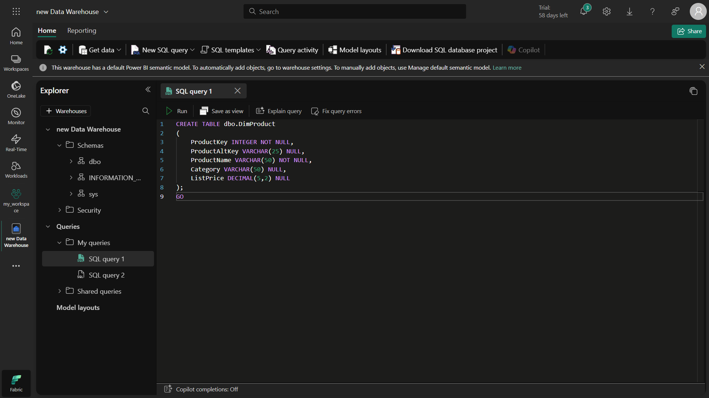
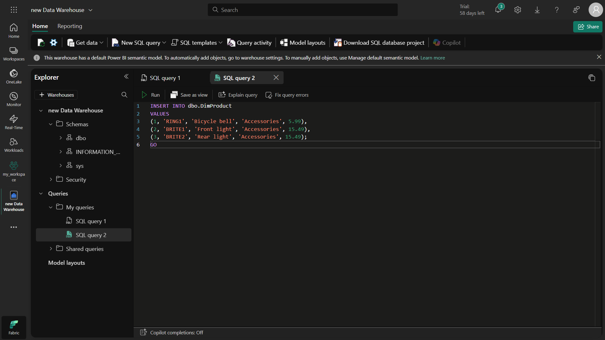
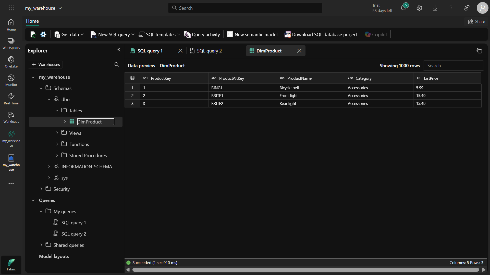
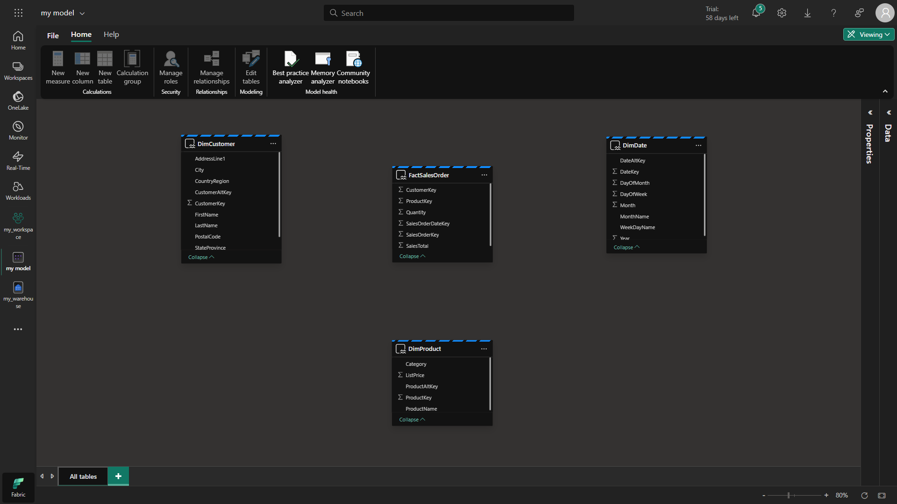
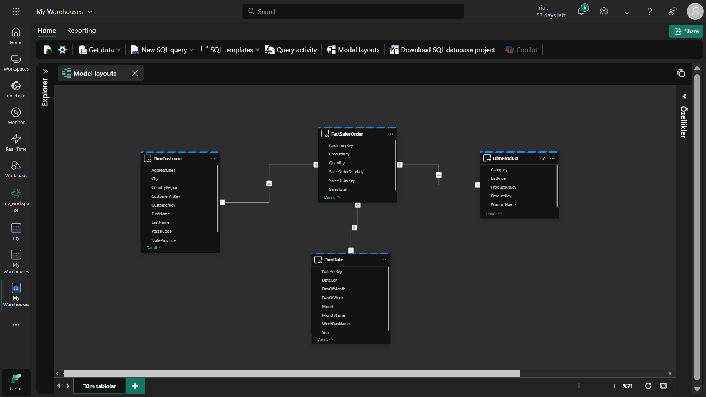
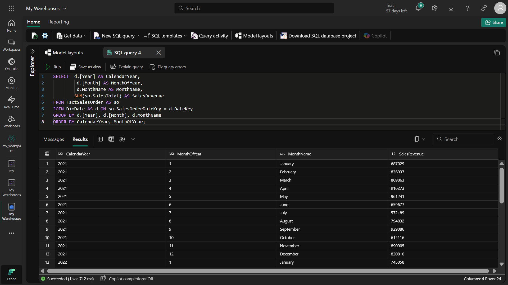
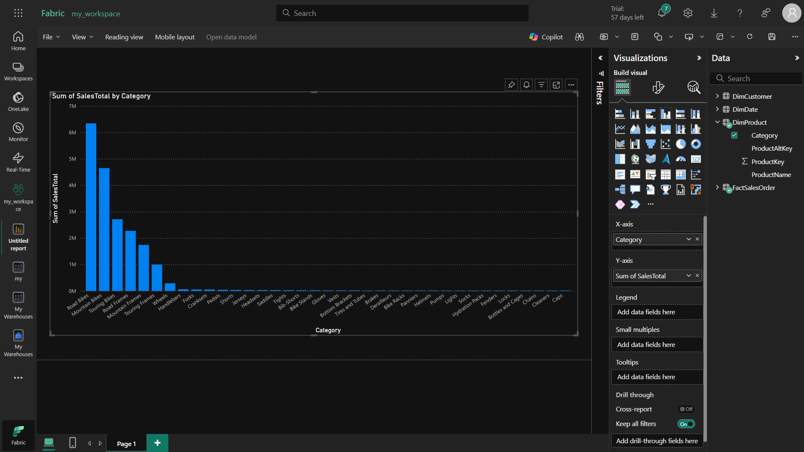
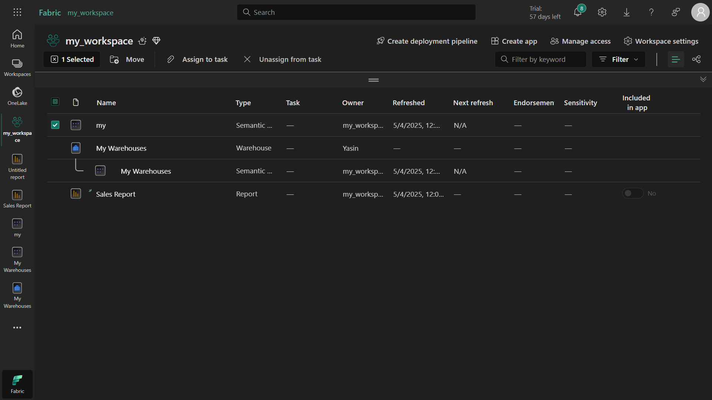

# 📊 Microsoft Fabric ile Veri Ambarı Analizi Modülü
Bu proje, Microsoft Fabric üzerinde veri ambarı oluşturma, veri modelleme ve analiz süreçlerini kapsayan bir rehber sunmaktadır.

## 🌍 Bu Çalışmada Ne Yapıyoruz?
Bu modülde, Microsoft Fabric platformu üzerinde kurumsal düzeyde bir veri ambarı oluşturmayı ve bu veri ambarını kullanarak analitik çözümler geliştirmeyi öğreniyoruz. Temelde şu adımları gerçekleştiriyoruz:

Veri ambarı oluşturma: Lakehouse'tan farklı olarak tam SQL desteği sunan bir yapı kuruyoruz

Veri modelleme: İlişkisel tablolar arasında bağlantılar kurarak analitik sorgular için optimize ediyoruz

Veri görselleştirme: Doğrudan veri ambarından Power BI raporları oluşturuyoruz

## 🧠 Bu Çalışmayla Neyi Öğreniyoruz?
Bu modül sonunda elde edeceğiniz yetkinlikler:

✔ Veri ambarı kavramları: Fact ve dimension tablolarının ne olduğunu ve nasıl kullanıldığını
✔ Fabric entegrasyonu: Microsoft Fabric ekosisteminde veri ambarının rolünü
✔ End-to-end analitik çözüm: Ham veriden raporlama aşamasına kadar tüm süreci
✔ Görsel sorgulama: Kod yazmadan veri analizi yapabilme becerisi
✔ Veri modelleme: Tablolar arası ilişkileri doğru şekilde tanımlayabilme

## 🛠️ Kullanılan Araçlar ve Terimler
### Temel Kavramlar:
#### Data Warehouse (Veri Ambarı): Analitik sorgular için optimize edilmiş ilişkisel veri deposu

#### Fact Table (Gerçek Tablo): Ölçümleri içeren (örn. satış tutarı) merkezi tablo

#### Dimension Table (Boyut Tablosu): Analiz boyutlarını tanımlayan (ürün, müşteri, zaman) tablolar

#### Star Schema (Yıldız Şema): Merkezde fact tablosu, etrafında dimension tablolarıyla oluşan model

Microsoft Fabric Bileşenleri:
Warehouse: Tam SQL desteği olan veri ambarı bileşeni

T-SQL Editor: SQL sorguları yazmak ve yürütmek için entegre ortam

Visual Query: Sürükle-bırak ile veri analizi yapmayı sağlayan arayüz

Default Dataset: Otomatik oluşturulan ve raporlamaya hazır veri modeli

## 💼 Bu Bilgiler Ne İşe Yarar?
Bu modülde öğrendiklerinizle şu gerçek dünya senaryolarını çözebilirsiniz:

Perakende Analitiği: Mağaza, ürün ve zaman bazlı satış performansı analizi

Finansal Raporlama: Dönemsel gelir-gider takibi ve trend analizleri

Operasyonel Dashboard: Anlık iş performansı izleme panoları

Müşteri Segmentasyonu: Demografik özelliklere göre müşteri davranış analizi

🏢 Endüstriyel Uygulama Alanları
Bu teknikleri şu sektörlerde uygulayabilirsiniz:

E-ticaret: Müşteri satın alma davranışı analizi

Sağlık: Hasta tedavi süreçleri ve klinik performans takibi

Üretim: Üretim verimliliği ve makine performansı izleme

Finans: Risk analizi ve kredi skorlama modelleri

## ⏰ Ne Zaman İhtiyaç Duyarız?
Bu çalışmadaki yöntemlere şu durumlarda başvurmalısınız:

✅ Geleneksel veritabanlarının analitik sorgular için yetersiz kaldığı durumlarda

✅ Farklı kaynaklardan gelen verileri birleştirip anlamlı bilgiler çıkarmak gerektiğinde

✅ Büyük ölçekli veriler üzerinde karmaşık analizler yapılması gerektiğinde

✅ Veriye dayalı karar alma süreçlerini desteklemek için

## 📈 Öğrenme Çıktıları
Bu modülü tamamladığınızda:

Kurumsal veri ambarı mimarisi tasarlayabileceksiniz

Fact ve dimension tabloları arasında optimal ilişkiler kurabileceksiniz

SQL ve görsel araçlarla veri analizi yapabileceksiniz

Fabric ortamında end-to-end analitik çözümler geliştirebileceksiniz

Veri ambarından doğrudan Power BI raporları oluşturabileceksiniz

## 🌟 Öne Çıkan Özellikler
Tam SQL desteği: Veri ekleme, güncelleme ve silme işlemleri

Görsel sorgu aracı: Kod yazmadan veri analizi

Entegre Power BI raporlama: Doğrudan veri ambarından rapor oluşturma

İlişkisel veri modelleme: Tablolar arası ilişkilerin tanımlanması

## 🚀 Başlarken
Önkoşullar
Neden? Modülün çalışması için Microsoft Fabric erişimi gereklidir.

Microsoft Fabric deneme sürümü edinin

Tarayıcınızda Microsoft Fabric giriş sayfasına gidin ve kimlik bilgilerinizle oturum açın

# 🏗️ Adım Adım Kurulum
## 1. Çalışma Alanı Oluşturma
Amaç: Proje kaynaklarınızı düzenlemek için bir çalışma alanı oluşturun.

Sol menüden "Çalışma Alanları" simgesini seçin (🗇 benzeri simge)

Yeni çalışma alanı oluştur butonuna tıklayın

Fabric kapasitesi içeren bir lisans modu seçin (Deneme, Premium veya Fabric)

Çalışma alanınıza bir ad verin ve oluşturun

Not: Boş bir çalışma alanıyla başlayacaksınız.

## 2. Veri Ambarı Oluşturma
Neden? Verilerinizi depolamak ve analiz etmek için bir veri ambarına ihtiyacınız var.

Sol menüden "Oluştur" seçeneğini seçin

"Veri Ambarı" bölümünden "Warehouse" seçeneğini tıklayın

Benzersiz bir ad verin ve oluşturun

1-2 dakika içinde yeni veri ambarınız hazır olacaktır

# 📦 Veri Ambarı Yapılandırma
## 1. Tablo Oluşturma ve Veri Ekleme
Amaç: Veri ambarınızda yapılandırılmış tablolar oluşturmak.
```
sql
-- Örnek tablo oluşturma

CREATE TABLE dbo.DimProduct
(
    ProductKey INTEGER NOT NULL,
    ProductAltKey VARCHAR(25) NULL,
    ProductName VARCHAR(50) NOT NULL,
    Category VARCHAR(50) NULL,
    ListPrice DECIMAL(5,2) NULL
);
GO
```
```
-- Örnek veri ekleme

INSERT INTO dbo.DimProduct
VALUES
(1, 'RING1', 'Bicycle bell', 'Accessories', 5.99),
(2, 'BRITE1', 'Front light', 'Accessories', 15.49),
(3, 'BRITE2', 'Rear light', 'Accessories', 15.49);
GO
```
### Adımlar:

T-SQL döşemesini seçin ve yukarıdaki kodu yapıştırın

"Çalıştır" butonuna basarak sorguyu yürütün

"Yenile" butonuyla tablonun oluştuğunu doğrulayın

## 2. Örnek Şema ve Veri Yükleme
Neden? Gerçekçi bir veri ambarı ortamı oluşturmak için.

Yeni SQL sorgusu oluşturun

Bu bağlantıdaki T-SQL kodunu yapıştırın

Sorguyu çalıştırın (yaklaşık 30 saniye sürecektir)

Aşağıdaki tabloların oluştuğunu doğrulayın:

DimCustomer

DimDate

DimProduct

FactSalesOrder

### 🔗 Veri Modeli Tanımlama
Amaç: Tablolar arası ilişkileri tanımlayarak analitik sorguları kolaylaştırmak.

Araç çubuğundan "Model düzenleri" butonunu seçin

Tabloları FactSalesOrder ortada olacak şekilde düzenleyin

#### İlişkileri tanımlayın:

FactSalesOrder.ProductKey → DimProduct.ProductKey

FactSalesOrder.CustomerKey → DimCustomer.CustomerKey

FactSalesOrder.SalesOrderDateKey → DimDate.DateKey

#### İlişki Ayarları:

Kardinalite: Çoktan bire (*:1)

Çapraz filtre yönü: Tek

İlişki aktif: Evet

Referans bütünlüğü varsay: Hayır

# 🔍 Veri Sorgulama
## 1. Temel Sorgular
Neden? Veri ambarındaki bilgileri analiz etmek.

```
sql
-- Yıllık ve aylık satış geliri
SELECT  d.[Year] AS CalendarYear,
        d.[Month] AS MonthOfYear,
        d.MonthName AS MonthName,
        SUM(so.SalesTotal) AS SalesRevenue
FROM FactSalesOrder AS so
JOIN DimDate AS d ON so.SalesOrderDateKey = d.DateKey
GROUP BY d.[Year], d.[Month], d.MonthName
ORDER BY CalendarYear, MonthOfYear;
```

## 2. Görünüm Oluşturma
Amaç: Sık kullanılan sorguları saklamak.

```
sql
CREATE VIEW vSalesByRegion
AS
SELECT  d.[Year] AS CalendarYear,
        d.[Month] AS MonthOfYear,
        d.MonthName AS MonthName,
        c.CountryRegion AS SalesRegion,
        SUM(so.SalesTotal) AS SalesRevenue
FROM FactSalesOrder AS so
JOIN DimDate AS d ON so.SalesOrderDateKey = d.DateKey
JOIN DimCustomer AS c ON so.CustomerKey = c.CustomerKey
GROUP BY d.[Year], d.[Month], d.MonthName, c.CountryRegion;
```

# 🎨 Görsel Sorgulama
Neden? Kod yazmadan veri analizi yapabilmek.

"Yeni görsel sorgu" seçeneğini seçin

FactSalesOrder tablosunu tuval üzerine sürükleyin

DimProduct tablosunu ekleyin

Tabloları ProductKey üzerinden birleştirin

Gerekli sütunları seçin ve filtreler uygulayın

# 📊 Veri Görselleştirme
Amaç: Verilerinizi anlamlı şekilde sunmak.

"Model düzenleri" butonuna tıklayın

### Raporlarda gerekmeyen sütunları gizleyin:

FactSalesOrder: SalesOrderDateKey, CustomerKey, ProductKey

DimCustomer: CustomerKey, CustomerAltKey

DimDate: DateKey, DateAltKey

DimProduct: ProductKey, ProductAltKey

"Yeni rapor" butonuna tıklayın

Power BI'da görselleştirmeler oluşturun

Raporu kaydedin

# 🧹 Kaynakları Temizleme
Neden? Kullanmadığınız kaynaklar için maliyet ödememek.

Çalışma alanı ayarlarına gidin

"Bu çalışma alanını kaldır" seçeneğini seçin

Onaylayın

# 📚 Ek Kaynaklar
Microsoft Fabric Dokümantasyonu

T-SQL Referansı

Power BI Dokümantasyonu


















