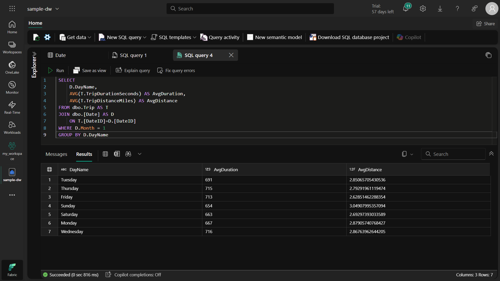

# 📊 Data Analyse en Rapportage met SQL - Projectdocumentatie
## 🌟 Projectoverzicht
Dit project richt zich op het ontwikkelen van data-analyse- en rapportagevaardigheden door SQL-query's te schrijven op de AdventureWorks-database. Ik heb analyses uitgevoerd van verkoopprestaties, klantgedrag en productcategorieën met behulp van basis- en geavanceerde SQL-technieken.

## 🎯 Doelstellingen
Praktische SQL-ervaring opdoen met real-world data

Verschillende SQL-functies en join-technieken leren toepassen

Analytisch denkvermogen ontwikkelen

Zinvolle inzichten uit data kunnen halen

## 🔧 Gebruikte Technieken
### 📌 Basis SQL-bewerkingen
```
sql
-- Voorbeeldquery: Basis SELECT-gebruik
SELECT ProductID, Name, ListPrice
FROM Production.Product
WHERE ListPrice > 100
ORDER BY ListPrice DESC;
``` 
Reden voor gebruik: Om basisvaardigheden in datafiltering en sortering te oefenen.

### 📌 JOIN-operaties
```
sql
-- INNER JOIN-voorbeeld
SELECT p.Name, sod.OrderQty, sod.UnitPrice
FROM Production.Product p
INNER JOIN Sales.SalesOrderDetail sod ON p.ProductID = sod.ProductID;
```

### Belangrijke aandachtspunten:

#### Correct join-type kiezen (INNER, LEFT, RIGHT, FULL)

#### Controleren op geschikte indexen voor prestaties

#### JOIN-voorwaarde correct formuleren (ON-clausule)

### 📌 Groepering en aggregatiefuncties
```
sql
-- GROUP BY en SUM gebruik
SELECT c.CustomerID, SUM(soh.TotalDue) AS TotalUitgegeven
FROM Sales.Customer c
JOIN Sales.SalesOrderHeader soh ON c.CustomerID = soh.CustomerID
GROUP BY c.CustomerID
HAVING SUM(soh.TotalDue) > 10000;
``` 

### Wat ik heb geleerd:

#### Verschil tussen GROUP BY en HAVING

#### Gebruik van aggregatiefuncties (SUM, AVG, COUNT)

#### Groeperingsstrategieën voor prestatieoptimalisatie

### 📌 Subquery's en CTE's
```
sql
-- WITH-gebruik (CTE)
WITH VerkopenPerRegio AS (
    SELECT st.Name AS Regio, SUM(soh.TotalDue) AS TotaleVerkopen
    FROM Sales.SalesOrderHeader soh
    JOIN Sales.SalesTerritory st ON soh.TerritoryID = st.TerritoryID
    GROUP BY st.Name
)
SELECT Regio, TotaleVerkopen
FROM VerkopenPerRegio
WHERE TotaleVerkopen > 1000000;
``` 
Belang:

Vereenvoudigt complexe query's

Verhoogt codeleesbaarheid

Maakt hergebruik mogelijk

## 🚀 Belangrijkste Analyses in het Project
### 1. Verkoopprestatie-analyse
Maandelijkse verkooptrends

Regionale verkoopvergelijkingen

Verkoopverdeling per productcategorie

### 2. Klantsegmentatie
Bestedende klanten

Demografische analyses

Herhaalaankoopratio's

### 3. Voorraadanalyse
Best verkochte producten

Relatie tussen voorraadniveaus en verkoopsnelheid

Levertijden en tijdige leveringspercentages

## 💡 Tips voor Beginners
### Stapsgewijs werken: Begin met eenvoudige query's en verhoog geleidelijk de complexiteit

### Testen: Voer query's eerst uit op kleine datasets

### Commentaar toevoegen: Schrijf uitleg bij complexe query's

### Prestaties monitoren: Let op uitvoeringstijden van query's

### Back-ups maken: Maak back-ups voor belangrijke wijzigingen

## 📈 Wanneer Deze Technieken Gebruiken?
Voor dataopschoning en transformatie

Tijdens rapportage en dashboardcreatie

Voor datakwaliteitscontroles

Bij bedrijfsbeslissingen die data-analyse vereisen

Bij het ontwerpen van ETL-processen

## 🔍 Aandachtspunten bij het Schrijven van Query's
**Vermijd SELECT *** : Selecteer alleen benodigde kolommen

JOIN's optimaliseren: Vermijd onnodige joins

WHERE-clausules zorgvuldig gebruiken: Grote impact op prestaties

INDEX-gebruik overwegen: Cruciaal voor grote tabellen

Query's documenteren: Voor toekomstig begrip en verbetering

## 📚 Leermiddelen
### Microsoft SQL-documentatie

### SQL Style Guide

### Geavanceerde SQL-technieken

### SQL-prestaties





