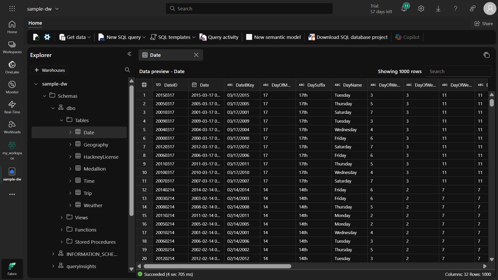
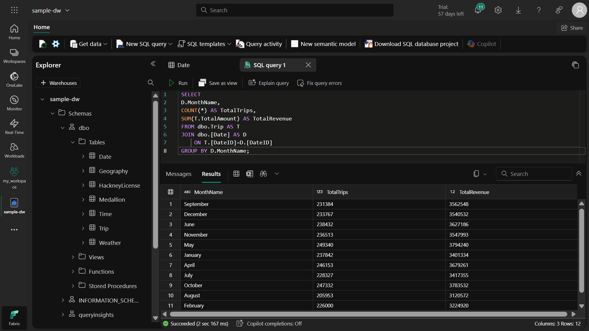
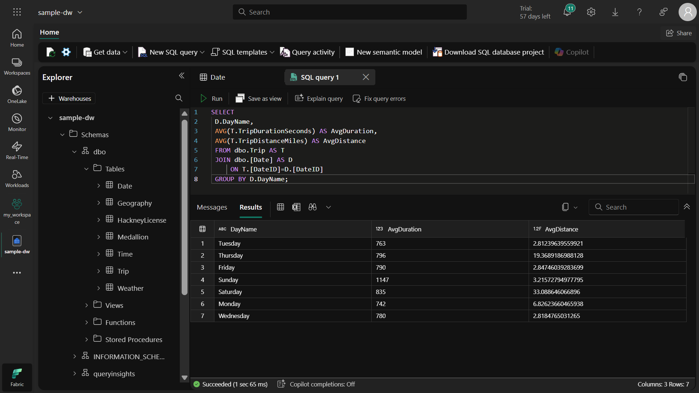
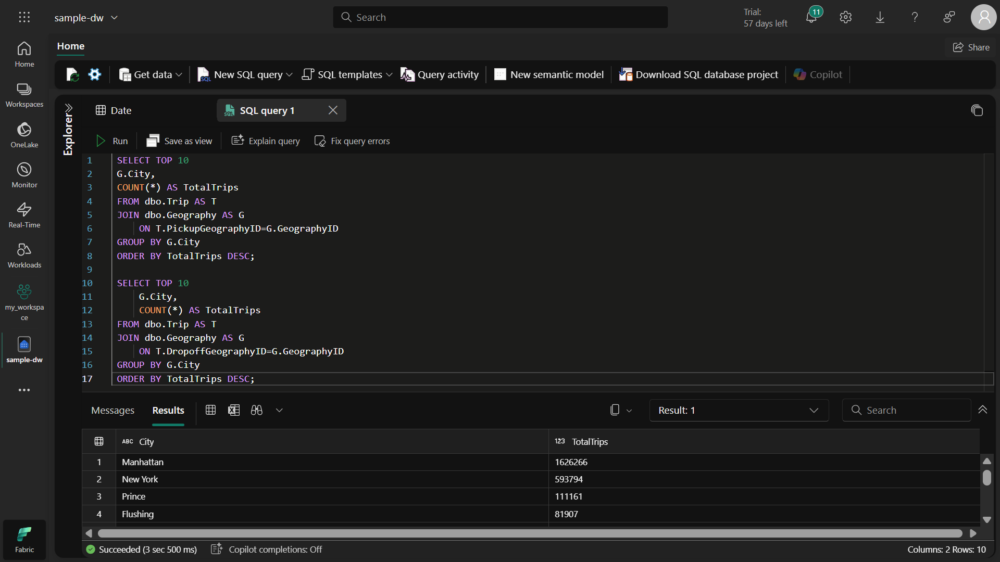
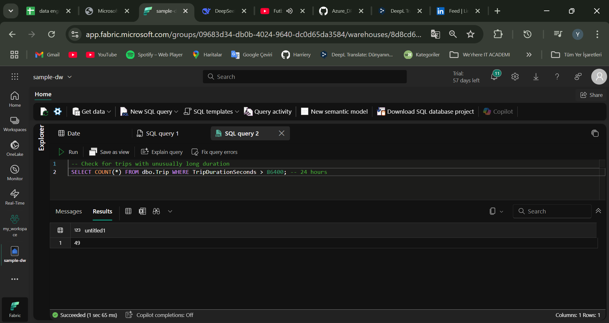
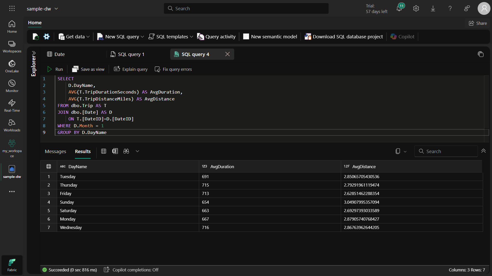
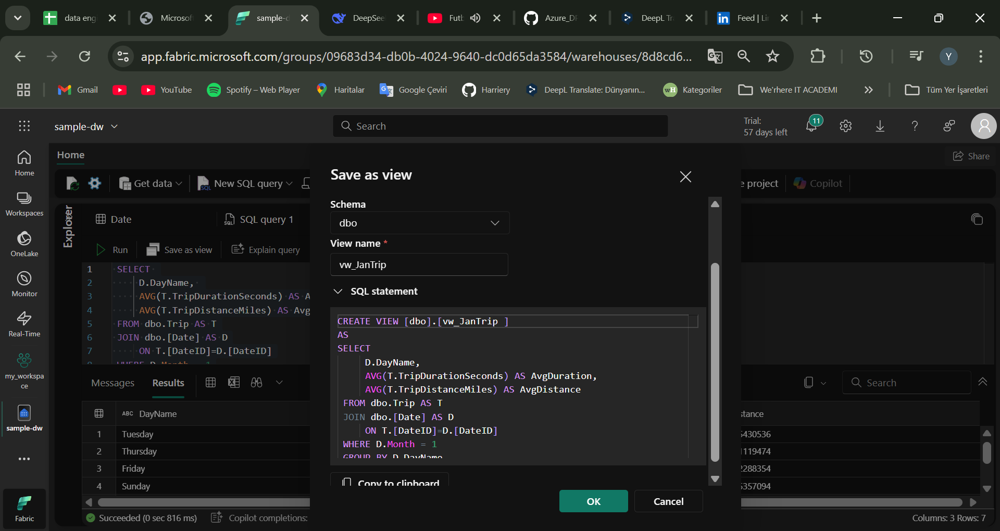
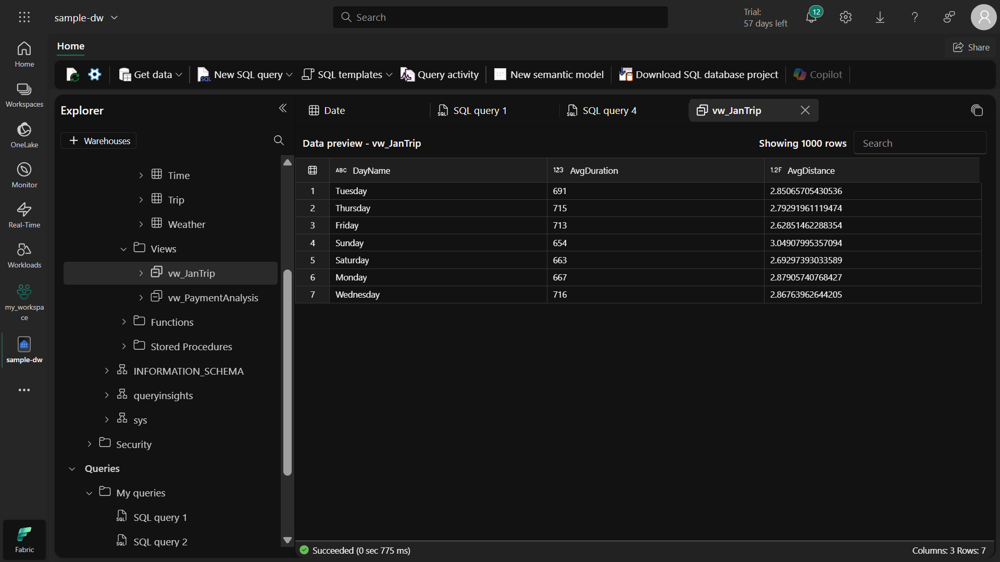

# 📊 SQL ile Veri Analizi ve Raporlama Projesi
## 🌟 Proje Özeti
Bu proje, AdventureWorks veritabanı üzerinde SQL sorguları yazarak veri analizi ve raporlama becerilerimi geliştirmeyi amaçlamaktadır. Temel ve orta düzey SQL tekniklerini kullanarak satış performansı, müşteri davranışları ve ürün kategorileri analizleri gerçekleştirdim.

## 🎯 Projenin Amacı
Gerçek dünya verileri üzerinde pratik SQL deneyimi kazanmak

Farklı SQL fonksiyonlarını ve birleştirme tekniklerini uygulamalı olarak öğrenmek

Analitik düşünce yeteneğini geliştirmek

Verilerden anlamlı çıkarımlar yapabilmek

## 🔧 Kullanılan Teknikler ve Yöntemler
### 📌 Temel SQL Operasyonları
```
sql
-- Örnek sorgu: Temel SELECT kullanımı
SELECT ProductID, Name, ListPrice
FROM Production.Product
WHERE ListPrice > 100
ORDER BY ListPrice DESC;
```

#### Neden kullandım? Veri filtreleme ve sıralama temel becerilerini pekiştirmek için.

### 📌 JOIN Operasyonları
```
sql
-- INNER JOIN örneği
SELECT p.Name, sod.OrderQty, sod.UnitPrice
FROM Production.Product p
INNER JOIN Sales.SalesOrderDetail sod ON p.ProductID = sod.ProductID;
```

### Dikkat edilmesi gerekenler:

#### JOIN türlerini (INNER, LEFT, RIGHT, FULL) doğru seçmek

#### Performans için uygun indekslerin olup olmadığını kontrol etmek

#### JOIN koşulunu doğru yazmak (ON kısmı)

### 📌 Gruplama ve Toplama Fonksiyonları

```
sql
-- GROUP BY ve SUM kullanımı
SELECT c.CustomerID, SUM(soh.TotalDue) AS TotalSpent
FROM Sales.Customer c
JOIN Sales.SalesOrderHeader soh ON c.CustomerID = soh.CustomerID
GROUP BY c.CustomerID
HAVING SUM(soh.TotalDue) > 10000;
```

### Öğrendiklerim:

GROUP BY ile HAVING arasındaki fark

Toplama fonksiyonlarının (SUM, AVG, COUNT) kullanımı

Performans optimizasyonu için gruplama stratejileri

### 📌 Alt Sorgular ve CTE'ler
```
sql
-- WITH kullanımı (CTE)
WITH SalesByRegion AS (
    SELECT st.Name AS Region, SUM(soh.TotalDue) AS TotalSales
    FROM Sales.SalesOrderHeader soh
    JOIN Sales.SalesTerritory st ON soh.TerritoryID = st.TerritoryID
    GROUP BY st.Name
)
SELECT Region, TotalSales
FROM SalesByRegion
WHERE TotalSales > 1000000;
``` 
### Neden önemli?

Karmaşık sorguları basitleştirir

Kod okunabilirliğini artırır

Tekrar kullanım sağlar

## 🚀 Projede Yer Alan Temel Analizler
### 1. Satış Performansı Analizi
Aylık satış trendleri

Bölgesel satış karşılaştırmaları

Ürün kategorilerine göre satış dağılımı

### 2. Müşteri Segmentasyonu
En çok harcama yapan müşteriler

Demografik analizler

Tekrar satın alma oranları

### 3. Envanter ve Stok Analizi
En çok satan ürünler

Stok seviyeleri ve satış hızı ilişkisi

Zamanında teslimat oranları

## 💡 Yeni Başlayanlar İçin Öneriler
#### Adım adım ilerleyin: Basit sorgularla başlayıp yavaşça karmaşıklaştırın

#### Test edin: Her sorguyu küçük veri kümelerinde test edin

#### Yorum satırları ekleyin: Karmaşık sorgulara açıklamalar yazın

#### Performansı gözlemleyin: Sorgu çalışma sürelerini kontrol edin

#### Backup alın: Önemli değişiklikler öncesi veri yedekleyin

## 📈 Ne Zaman Bu Teknikleri Kullanmalıyım?
Veri temizleme ve dönüştürme ihtiyacı olduğunda

Raporlama ve dashboard oluşturma aşamasında

Veri kalitesi kontrolleri yaparken

İş kararları için veri analizi gerektiğinde

ETL süreçleri tasarlarken

## 🔍 Sorgu Yazarken Dikkat Edilmesi Gerekenler
SELECT * kullanmaktan kaçının: Sadece ihtiyacınız olan sütunları seçin

JOIN'leri optimize edin: Gereksiz JOIN'lerden kaçının

WHERE koşullarını akıllıca kullanın: Sorgu performansını önemli ölçüde etkiler

INDEX kullanımını göz önünde bulundurun: Büyük tablolarda kritik öneme sahiptir

Sorgularınızı dokümante edin: Gelecekte anlamak ve geliştirmek için

## 📚 Öğrenme Kaynakları
Microsoft SQL Dokümantasyonu

SQL Style Guide

Advanced SQL Techniques

SQL Performance Explained















