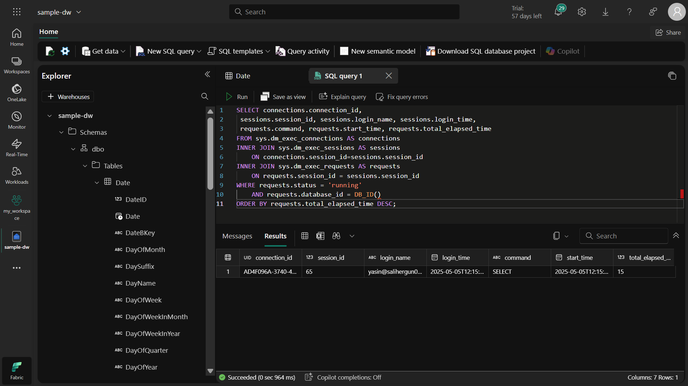
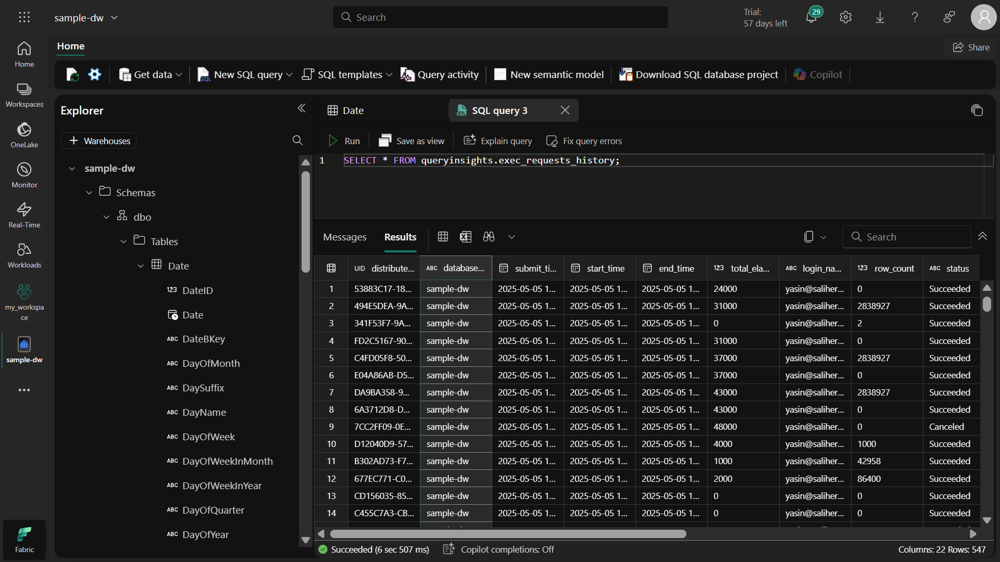

# 📊 Microsoft Fabric Data Warehouse Monitoring en Prestatieanalyse
## 🌟 Projectoverzicht
Dit project richt zich op het monitoren van data warehouses in Microsoft Fabric en het uitvoeren van prestatieanalyses. Ik heb geleerd hoe je Dynamic Management Views (DMV's) en query insights kunt gebruiken om data warehouse-activiteiten te volgen.

## 🎯 Projectdoelen
Vaardigheden ontwikkelen voor het monitoren van data warehouse-prestaties

Gebruiksscenario's van DMV's begrijpen

Query-prestatieanalyses kunnen uitvoeren

Strategieën ontwikkelen voor resource-optimalisatie

## 🔍 Wat ik heb geleerd
### 1. Dynamic Management Views (DMV's)
sys.dm_exec_connections: Toont alle verbindingen met het data warehouse

sys.dm_exec_sessions: Toont alle geauthenticeerde sessies

sys.dm_exec_requests: Toont alle actieve verzoeken

Belangrijk omdat:
✔ Je kunt zien wie systeembronnen gebruikt
✔ Langlopende queries kunt identificeren
✔ Verbindingsproblemen kunt analyseren

### 2. Query Insights
queryinsights.exec_requests_history: Historische query-uitvoeringen

queryinsights.frequently_run_queries: Regelmatig uitgevoerde queries

queryinsights.long_running_queries: Langlopende queries

Nut:

Prestatieproblemen identificeren

Regelmatige queries optimaliseren

Historische prestatie trends analyseren

## 🛠️ Stapsgewijze Implementatie
### 1. Werkruimte aanmaken
Waarom? Om resources te organiseren en toegang te beheren.

Ga naar de Microsoft Fabric startpagina

Selecteer "Werkruimten" in het linkermenu

Maak een nieuwe werkruimte aan (kies Fabric-capaciteit)

### 2. Voorbeeld Data Warehouse aanmaken
Doel: Werken met demogegevens.

Selecteer "Maken" > "Voorbeeld warehouse"

Maak een nieuw data warehouse aan met naam sample-dw

Wacht tot het systeem is gevuld met voorbeeldgegevens (taxiritanalyse)

### 3. Monitoring met DMV's
Hoe werkt het?
``` 
sql
-- Verbindingen tonen
SELECT * FROM sys.dm_exec_connections;
```
```
-- Sessies tonen
SELECT * FROM sys.dm_exec_sessions;
```
```
-- Actieve verzoeken tonen
SELECT * FROM sys.dm_exec_requests;
```

Aandachtspunten:

DMV's geven real-time informatie

Alleen geautoriseerde gebruikers hebben toegang

Kan prestatie-impact hebben op grote systemen

### 4. Query Insights verkennen
Implementatiestappen:

Open een nieuwe SQL-query

Toon querygeschiedenis:
```
sql
SELECT * FROM queryinsights.exec_requests_history;
```
Analyseer regelmatige queries:
```
sql
SELECT * FROM queryinsights.frequently_run_queries;
```

Identificeer langlopende queries:
```
sql
SELECT * FROM queryinsights.long_running_queries;
```

## 💡 Belangrijke Inzichten
Wanneer deze technieken gebruiken?
Bij prestatieproblemen

Voor resourceverbruiksanalyse

Bij het monitoren van gebruikersactiviteiten

Tijdens query-optimalisatie inspanningen

Voor capaciteitsplanning

Tips voor beginners
Begin klein: Leer eerst basis-DMV's

Test in ontwikkelomgeving: Wees voorzichtig met productiesystemen

Gebruik filters: WHERE-clausules in plaats van alle data

Lees documentatie: Begrijp wat elke DMV retourneert

Monitor prestaties: Monitoring tools gebruiken zelf ook resources

## 🚀 Gevorderde gebruiksscenario's
### 1. Prestatieproblemen identificeren
```
sql
-- Langlopende queries vinden
SELECT 
    session_id, 
    command, 
    start_time, 
    total_elapsed_time
FROM sys.dm_exec_requests
WHERE status = 'running'
ORDER BY total_elapsed_time DESC;
```

### 2. Resourcegebruik analyseren
```
sql
-- Verbindings- en sessiegegevens combineren
SELECT 
    conn.connection_id,
    sess.login_name,
    sess.login_time,
    req.command,
    req.start_time,
    req.total_elapsed_time
FROM sys.dm_exec_connections AS conn
INNER JOIN sys.dm_exec_sessions AS sess
    ON conn.session_id = sess.session_id
INNER JOIN sys.dm_exec_requests AS req
    ON req.session_id = sess.session_id
WHERE req.status = 'running'
ORDER BY req.total_elapsed_time DESC;
```

### 3. Historische prestatietrends
```
sql
-- Historische queryprestaties analyseren
SELECT 
    query_text,
    execution_count,
    avg_duration
FROM queryinsights.frequently_run_queries
ORDER BY avg_duration DESC;
```

## 📚 Aanvullende bronnen
Microsoft Fabric DMV-documentatie

Query Prestatieanalysegids

Beste praktijken voor datawarehouse-monitoring

## 🧹 Resources opschonen
Waarom? Onnodige kosten vermijden voor ongebruikte resources.

Ga naar werkruimte-instellingen

Selecteer "Deze werkruimte verwijderen"

Bevestig de verwijdering







