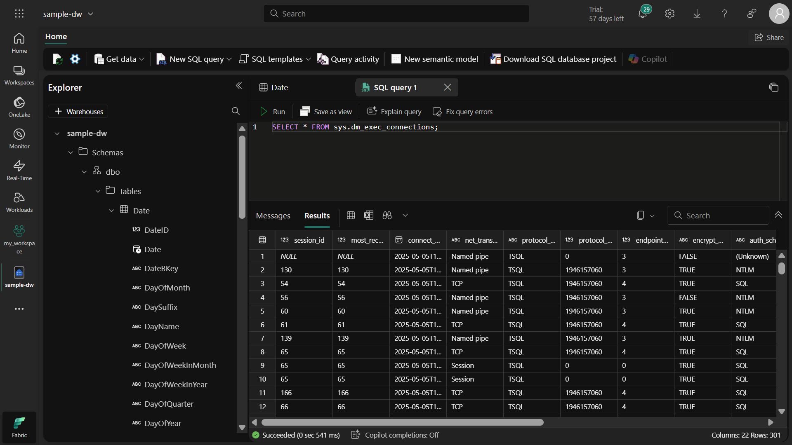
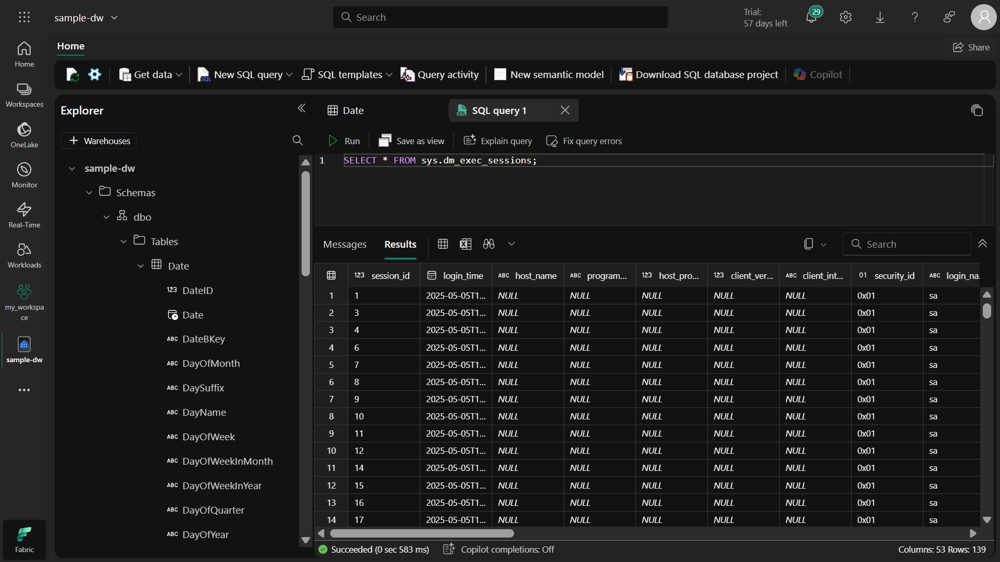
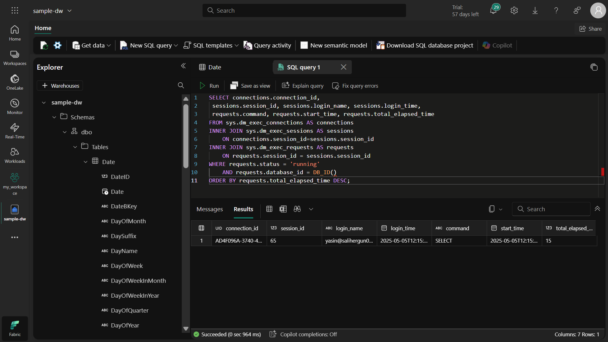
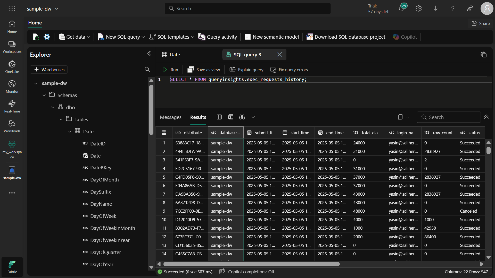
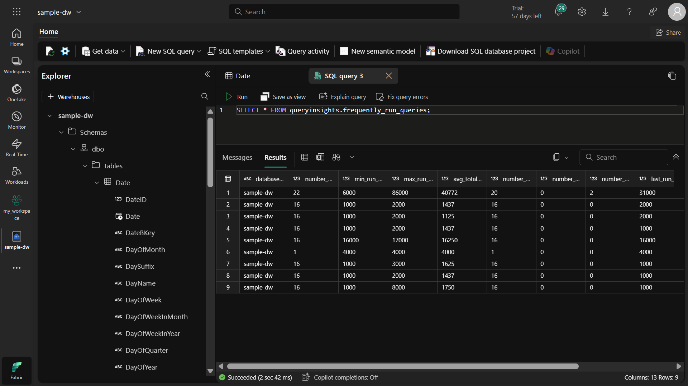
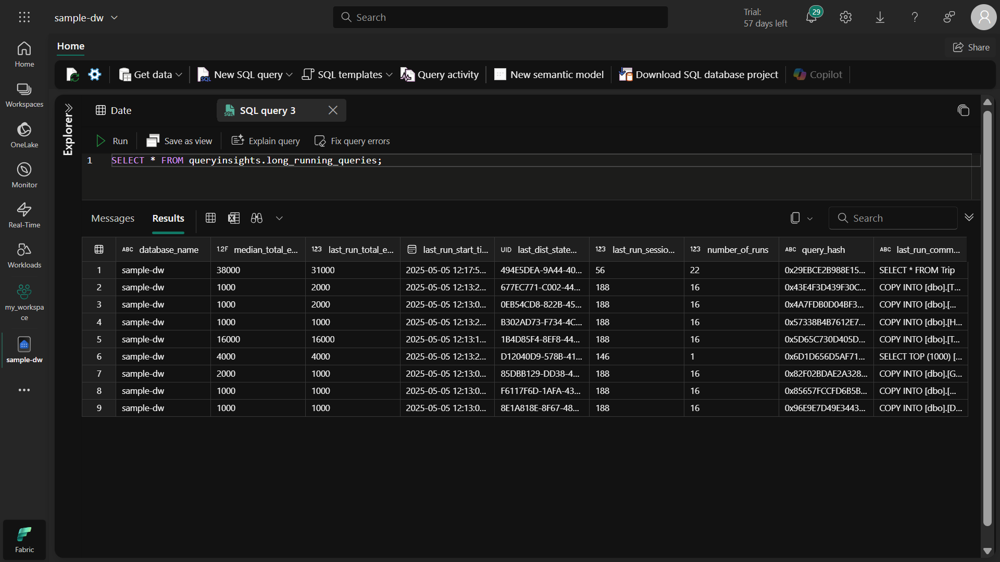

# 📊 Microsoft Fabric Veri Ambarı İzleme ve Performans Analizi
## 🌟 Proje Özeti
Bu proje, Microsoft Fabric'te oluşturulan veri ambarlarının nasıl izleneceğini ve performans analizlerinin nasıl yapılacağını kapsamaktadır. Dinamik Yönetim Görünümleri (DMV'ler) ve sorgu içgörüleri kullanılarak veri ambarı aktivitelerinin nasıl takip edileceğini öğrendim.

## 🎯 Projenin Amacı
Veri ambarı performansını izleme becerileri kazanmak

DMV'lerin kullanım senaryolarını anlamak

Sorgu performans analizleri yapabilmek

Kaynak kullanımını optimize etme stratejileri geliştirmek

## 🔍 Öğrendiklerim
### 1. Dinamik Yönetim Görünümleri (DMV'ler)
sys.dm_exec_connections: Veri ambarına yapılan tüm bağlantıları listeler

sys.dm_exec_sessions: Kimliği doğrulanmış tüm oturumları gösterir

sys.dm_exec_requests: Yürütülmekte olan tüm istekleri görüntüler

### Neden önemli?
Bu görünümler sayesinde:
#### ✔ Sistem kaynaklarını kimin kullandığını görebiliriz
#### ✔ Uzun süredir çalışan sorguları tespit edebiliriz
#### ✔ Bağlantı sorunlarını analiz edebiliriz

### 2. Sorgu İçgörüleri
queryinsights.exec_requests_history: Geçmiş sorgu çalıştırmaları

queryinsights.frequently_run_queries: Sık çalıştırılan sorgular

queryinsights.long_running_queries: Uzun süren sorgular

Ne işe yarar?

Performans sorunlarını tespit etmek

Sık çalıştırılan sorguları optimize etmek

Tarihsel performans eğilimlerini analiz etmek

## 🛠️ Adım Adım Uygulama
### 1. Çalışma Alanı Oluşturma
Neden? Kaynakları düzenlemek ve erişimi yönetmek için.

Microsoft Fabric ana sayfasına gidin

Sol menüden "Çalışma Alanları"nı seçin

Yeni çalışma alanı oluşturun (Fabric kapasitesi seçmeyi unutmayın)

### 2. Örnek Veri Ambarı Oluşturma
Amaç: Demo verileriyle çalışmak için.

"Oluştur" > "Örnek ambar" seçeneğini kullanın

sample-dw adında yeni bir veri ambarı oluşturun

Sistemin örnek verilerle (taksi yolculuğu analizi) doldurmasını bekleyin

### 3. DMV'leri Kullanarak İzleme
#### Nasıl çalıştı?
```
sql
-- Bağlantıları listeleme
SELECT * FROM sys.dm_exec_connections;
``` 

-- Oturumları görüntüleme
```
SELECT * FROM sys.dm_exec_sessions;
```

-- Çalışan istekleri kontrol etme
```
SELECT * FROM sys.dm_exec_requests;
```

#### Dikkat edilmesi gerekenler:

DMV'ler gerçek zamanlı bilgi sağlar

Sadece yetkili kullanıcılar erişebilir

Büyük sistemlerde performans etkisi olabilir

### 4. Sorgu İçgörülerini Keşfetme
Uygulama adımları:

Yeni SQL sorgusu açın

Sorgu geçmişini görüntüleyin:
```
sql
SELECT * FROM queryinsights.exec_requests_history;
```

Sık çalıştırılan sorguları analiz edin:
```
sql
SELECT * FROM queryinsights.frequently_run_queries;
```

Uzun süren sorguları tespit edin:
```
sql
SELECT * FROM queryinsights.long_running_queries;
```


## 💡 Önemli Çıkarımlar
### Ne Zaman Bu Teknikleri Kullanmalıyım?
#### Performans sorunları yaşandığında

#### Kaynak tüketimi analizi yaparken

#### Kullanıcı etkinliklerini izlerken

#### Sorgu optimizasyonu çalışmalarında

#### Kapasite planlaması yaparken

### Yeni Başlayanlar İçin Tavsiyeler
Küçük adımlarla başlayın: Önce temel DMV'leri öğrenin

Test ortamında deneyin: Canlı sistemlerde dikkatli olun

Filtre kullanın: Tüm veriyi çekmek yerine WHERE ile filtreleyin

Dokümantasyon okuyun: Her DMV'nin ne döndürdüğünü anlayın

Performansı gözlemleyin: İzleme araçlarının kendisi de kaynak tüketir

## 🚀 İleri Düzey Kullanım Senaryoları
### 1. Performans Sorunlarını Tespit Etme
```
sql
-- Uzun süren sorguları bulma
SELECT 
    session_id, 
    command, 
    start_time, 
    total_elapsed_time
FROM sys.dm_exec_requests
WHERE status = 'running'
ORDER BY total_elapsed_time DESC;
```

### 2. Kaynak Kullanım Analizi
```
sql
-- Bağlantı ve oturum bilgilerini birleştirme
SELECT 
    conn.connection_id,
    sess.login_name,
    sess.login_time,
    req.command,
    req.start_time,
    req.total_elapsed_time
FROM sys.dm_exec_connections AS conn
INNER JOIN sys.dm_exec_sessions AS sess
    ON conn.session_id = sess.session_id
INNER JOIN sys.dm_exec_requests AS req
    ON req.session_id = sess.session_id
WHERE req.status = 'running'
ORDER BY req.total_elapsed_time DESC;
```

### 3. Tarihsel Performans Eğilimleri
```
sql
-- Geçmiş sorgu performanslarını analiz etme
SELECT 
    query_text,
    execution_count,
    avg_duration
FROM queryinsights.frequently_run_queries
ORDER BY avg_duration DESC;
```

## 📚 Ek Kaynaklar
Microsoft Fabric DMV Dokümantasyonu

Sorgu Performans Analizi Rehberi

Veri Ambarı İzleme En İyi Uygulamaları

## 🧹 Kaynakları Temizleme
Neden? Kullanılmayan kaynaklar için gereksiz maliyet ödememek.

Çalışma alanı ayarlarına gidin

"Bu çalışma alanını kaldır" seçeneğini seçin

Silme işlemini onaylayın











