# Real-Time Analytics Lab met Microsoft Fabric

Dit lab leert u hoe u beursgegevens kunt analyseren met de Real-Time Analytics-mogelijkheden van Microsoft Fabric. Hieronder vindt u een stapsgewijze handleiding en praktische toepassingen van de geleerde concepten.

## 📌 Aangeleerde Concepten en Toepassingen

### 1. Data-opname met EventStream
**Wat deden we?**: Creëerden een real-time beursdatafeed  
**Waarom?**: Voor verwerking van live datastromen  
**Praktijkvoorbeeld**: IoT-data verzamelen, social media streams monitoren  
**Opgedane vaardigheid**: Beheer van real-time databronnen  

### 2. Dataopslag met EventHouse
**Wat deden we?**: Maakten een KQL-database voor streamdata  
**Waarom?**: Voor opslag en analyse van historische data  
**Praktijkvoorbeeld**: Klantinteracties vastleggen, transactiegeschiedenis bewaren  
**Opgedane vaardigheid**: Tijdreeksdata beheren  

### 3. Data-analyse met KQL
**Wat deden we?**: Query's uitvoeren met Kusto Query Language  
**Waarom?**: Voor real-time analyses  
**Praktijkvoorbeeld**: Anomaliedetectie, trendanalyses  
**Opgedane vaardigheid**: KQL-queryvaardigheden  

### 4. Real-time Dashboard
**Wat deden we?**: Live datavisualisaties gemaakt  
**Waarom?**: Voor directe data monitoring  
**Praktijkvoorbeeld**: Operationele dashboards, live prestatiebewaking  
**Opgedane vaardigheid**: Real-time visualisatietechnieken  

### 5. Waarschuwingssystemen met Activator
**Wat deden we?**: Geautomatiseerde alerts geconfigureerd  
**Waarom?**: Voor directe actie bij kritieke situaties  
**Praktijkvoorbeeld**: Systeemfoutmeldingen, abnormale transactiedetectie  
**Opgedane vaardigheid**: Automatische waarschuwingsmechanismen  

## 🛠️ Stapsgewijze Labhandleiding

### 1. Werkruimte aanmaken
1. Ga naar [Microsoft Fabric](https://app.fabric.microsoft.com)
2. Selecteer "Werkruimten" > "Nieuwe werkruimte"
3. Kies "Fabric (Proef)" capaciteit

### 2. EventStream maken
1. Selecteer "Real-Time Hub" in het linkermenu
2. Kies "Beursvoorbeelddata" onder "Gegevensbronnen"
3. Noem de verbinding "stock" en de eventstream "stock-data"
4. Klik op "Maken" en open de eventstream

### 3. EventHouse aanmaken
1. Selecteer "Maken" > "EventHouse"
2. Geef een unieke naam op
3. Klik op "Gegevens ophalen" in de KQL-database
4. Selecteer "EventStream" > "Bestaande EventStream"
5. Maak een nieuwe tabel "stock" en configureer de verbinding

### 4. Data bevragen
```kql
// Eerste 100 records ophalen
stock
| take 100
```

// Gemiddelde prijzen laatste 5 minuten
```
stock
| where ["time"] > ago(5m)
| summarize avgPrice = avg(todecimal(bidPrice)) by symbol
| project symbol, avgPrice
```
### 5. Real-time Dashboard maken
Selecteer de gemiddelde-prijzen query

Klik op "Vastmaken aan dashboard"

Maak een nieuw dashboard en zet visualisatie op "Kolomdiagram"

Sla wijzigingen op

### 6. Waarschuwing instellen
Klik op "Waarschuwing instellen" in dashboard

Configureer:

Uitvoeren elke: 5 minuten

Groeperen op: symbol

Voorwaarde: avgPrice stijgt met >100

Actie: E-mail versturen

Sla waarschuwing op

## 📝 Belangrijke Leerpunten
Wat heb ik geleerd?
Real-time dataverwerking: Data-opname met EventStream

Tijdreeksanalyse: Historische data bevragen met KQL

Live visualisaties: Dashboards voor real-time monitoring

Automatische alerts: Snelle respons op kritieke situaties

Praktische toepassingen:
Financiële sector: Live beursdata monitoren

Productie: Sensordata van machines volgen

E-commerce: Live klantgedrag analyseren

Operaties: Systeemprestaties bewaken

## 🧹 Opschonen
Ga naar werkruimte-instellingen

Selecteer "Deze werkruimte verwijderen"

## 🔍 Praktijkscenario's
### 1. Financieel toezicht
Probleem: Live marktbewegingen volgen
Oplossing: Real-time beursdashboard bouwen

### 2. IoT-toepassingen
Probleem: Fabriekssensordata analyseren
Oplossing: Data-opname met EventStream en anomaliedetectie

### 3. Klantervaring
Probleem: Website-interacties real-time analyseren
Oplossing: Live gebruikersgedrag dashboard

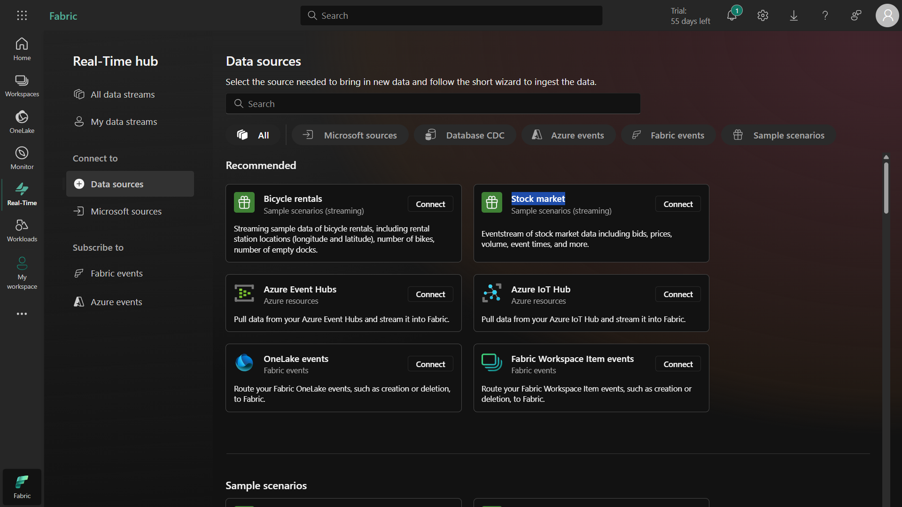

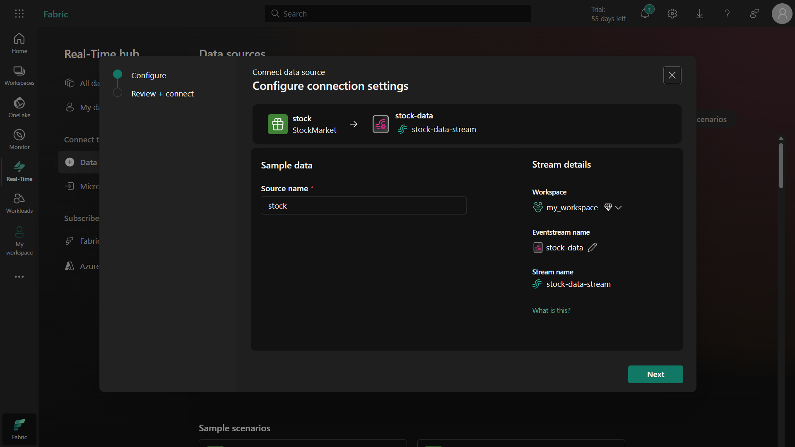

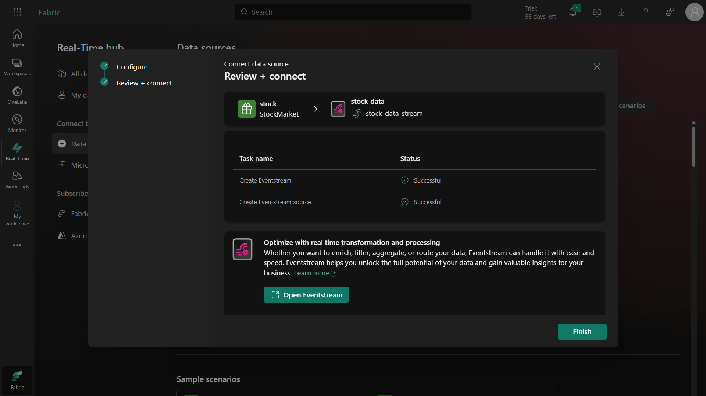

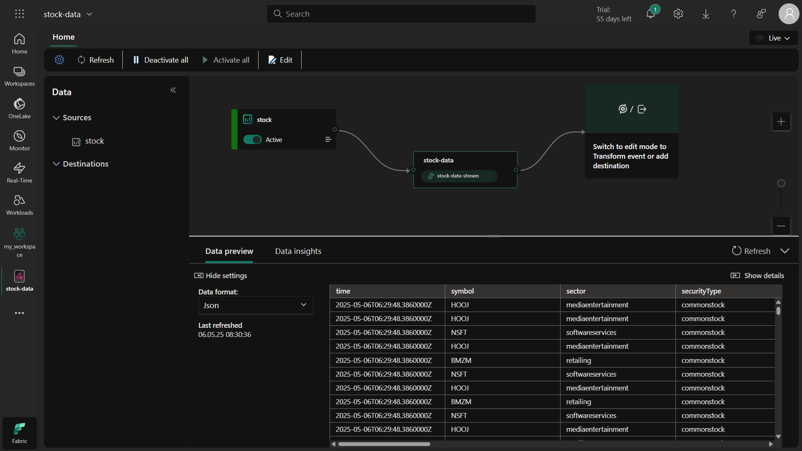

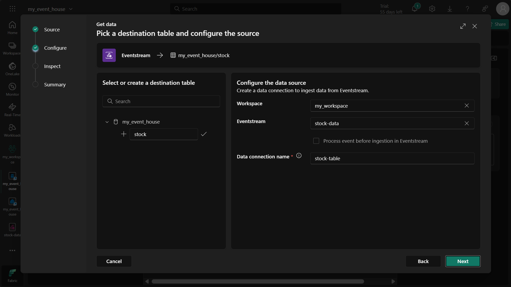

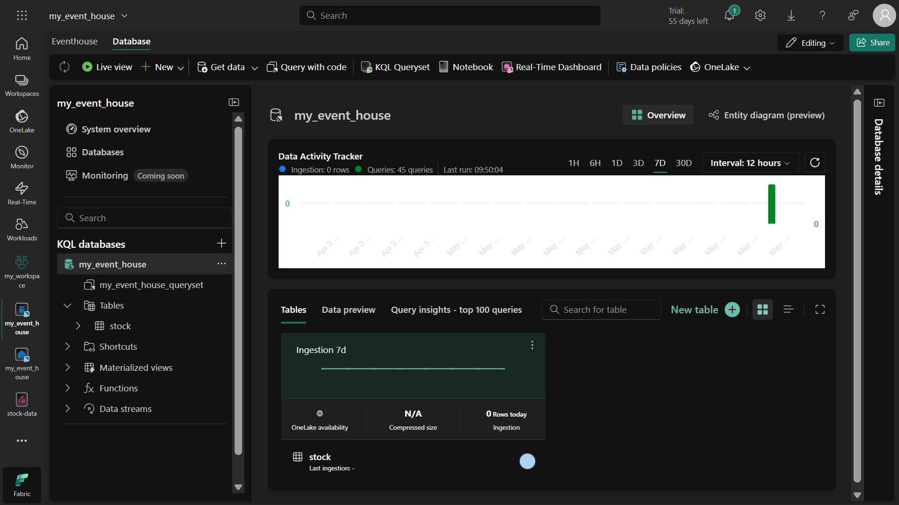

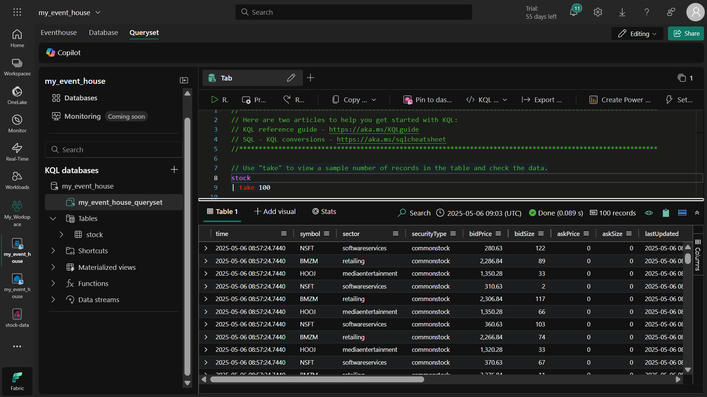

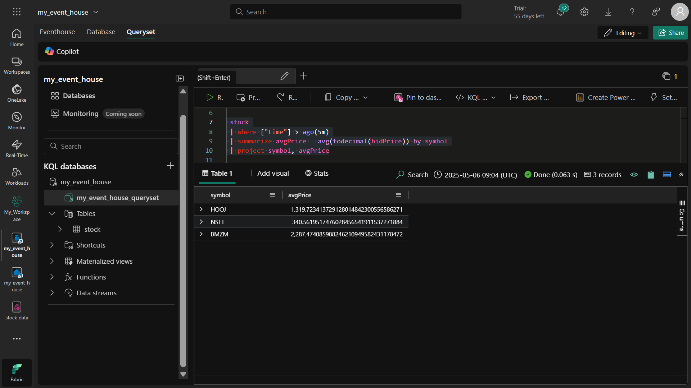

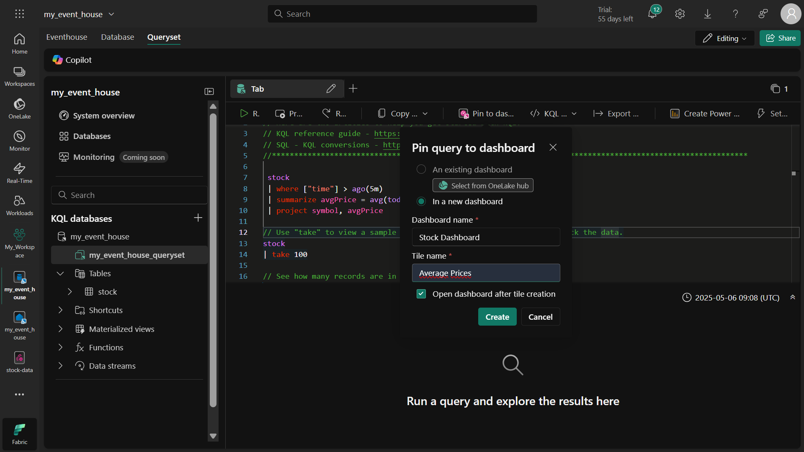

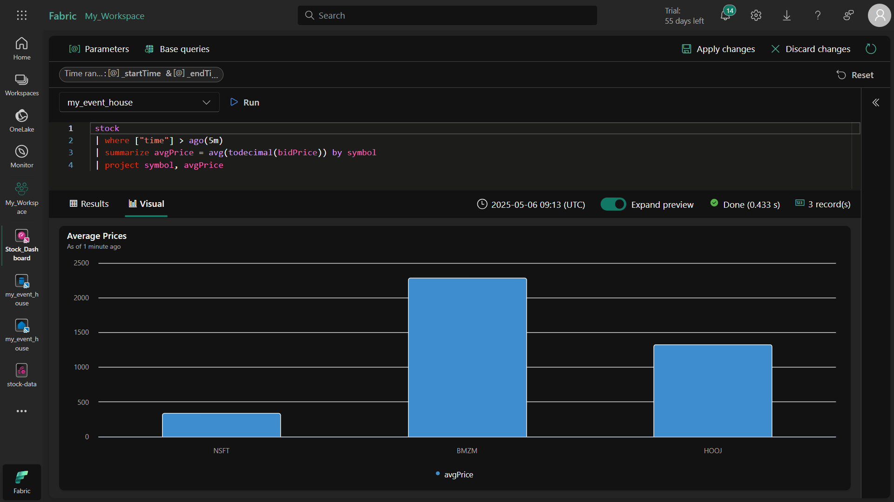

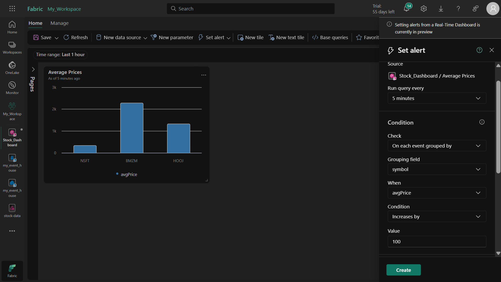

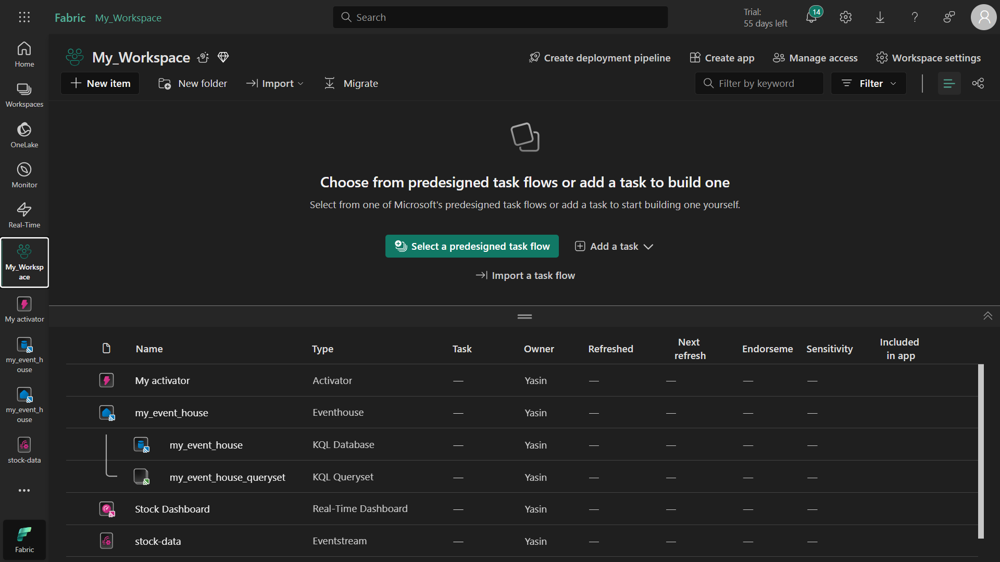