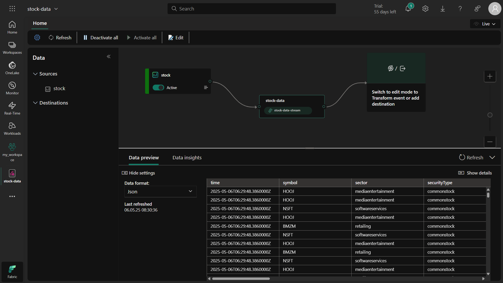
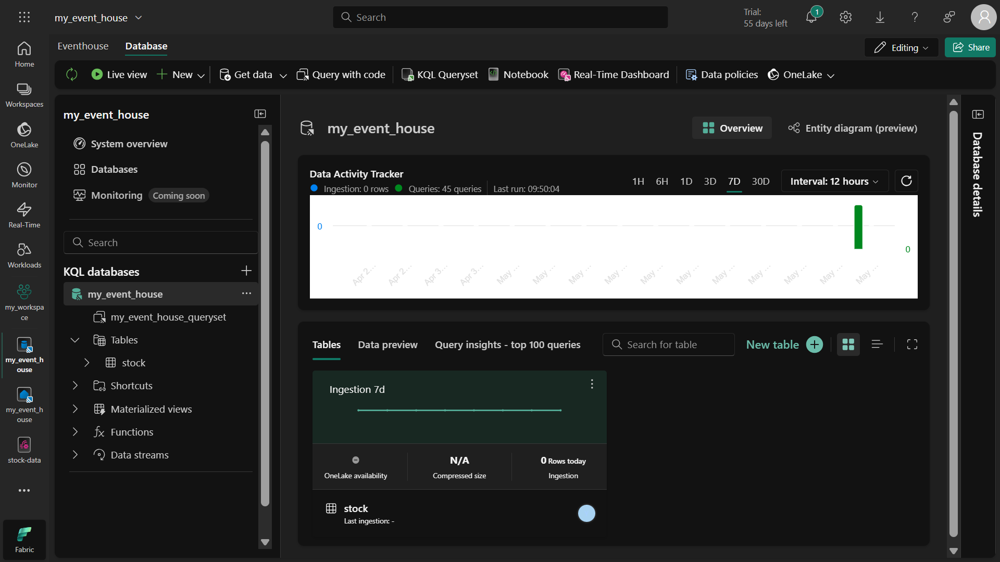
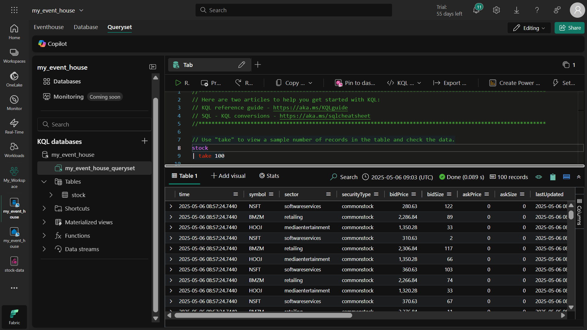
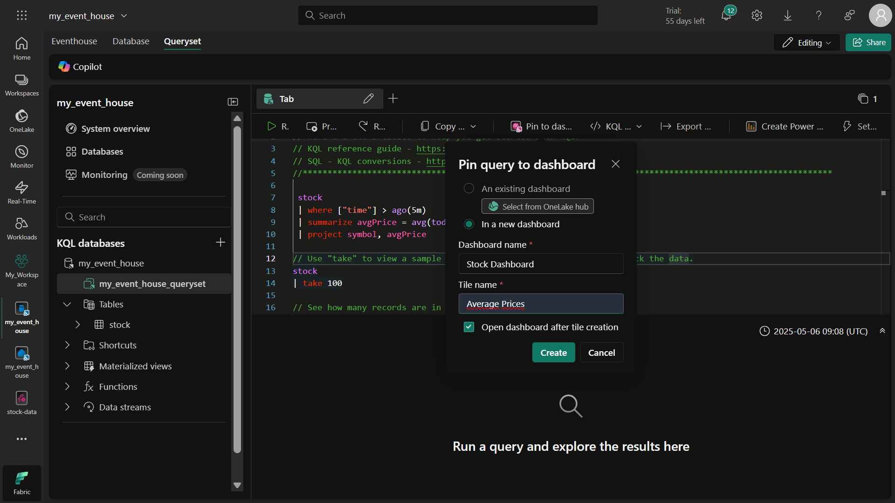
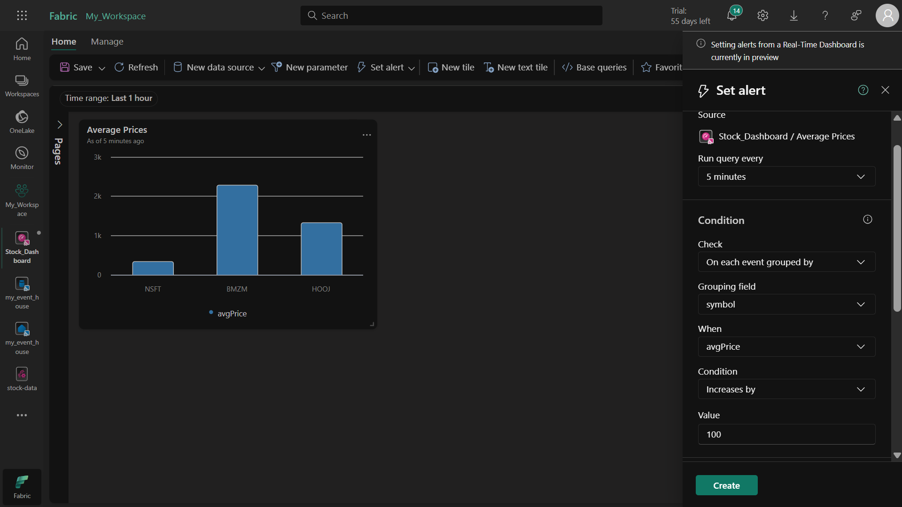

# Microsoft Fabric'te Gerçek Zamanlı Analiz Laboratuvarı
Bu laboratuvar, Microsoft Fabric'in Gerçek Zamanlı Analiz yeteneklerini kullanarak borsa verilerini analiz etmeyi öğretir. Aşağıda adım adım uygulama kılavuzu ve öğrenilen kavramların gerçek hayat uygulamaları bulunmaktadır.

# 📌 Öğrenilen Kavramlar ve Uygulamaları
## 1. EventStream ile Veri Yakalama
Ne Yaptık?: Gerçek zamanlı borsa verisi akışı oluşturduk

Neden?: Anlık veri akışlarını işlemek için

Gerçek Hayat Senaryosu: IoT cihaz verilerini toplama, sosyal medya akışlarını izleme

Kazanım: Gerçek zamanlı veri kaynaklarını yönetme becerisi

## 2. EventHouse ile Veri Depolama
Ne Yaptık?: Akış verilerini depolamak için KQL veritabanı oluşturduk

Neden?: Tarihsel verileri saklamak ve analiz etmek için

Gerçek Hayat Senaryosu: Müşteri etkileşimlerini kaydetme, işlem geçmişini saklama

Kazanım: Zaman serisi verilerini yönetme becerisi

## 3. KQL ile Veri Analizi
Ne Yaptık?: Kusto Query Language kullanarak verileri sorguladık

Neden?: Gerçek zamanlı analizler yapmak için

Gerçek Hayat Senaryosu: Anomali tespiti, trend analizleri

Kazanım: KQL sorgulama becerileri

## 4. Gerçek Zamanlı Dashboard
Ne Yaptık?: Canlı veri görselleştirmeleri oluşturduk

Neden?: Verileri anlık olarak izlemek için

Gerçek Hayat Senaryosu: Operasyonel panolar, canlı performans izleme

Kazanım: Gerçek zamanlı görselleştirme teknikleri

## 5. Activator ile Uyarı Sistemleri
Ne Yaptık?: Belirli koşullarda tetiklenen uyarılar tanımladık

Neden?: Kritik durumlarda anında müdahale için

Gerçek Hayat Senaryosu: Sistem hata uyarıları, anormal işlem tespiti

Kazanım: Otomatik uyarı mekanizmaları oluşturma

# 🛠️ Adım Adım Laboratuvar Kılavuzu
## 1. Çalışma Alanı Oluşturma
Microsoft Fabric adresine gidin

Sol menüden Çalışma Alanları > Yeni Çalışma Alanı seçin

"Fabric (Deneme)" kapasitesini seçerek çalışma alanınızı oluşturun

## 2. EventStream Oluşturma
Sol menüden Gerçek Zamanlı Hub'ı seçin

Veri Kaynakları bölümünden Borsa Örnek Verisi'ni seçin

Bağlantıyı "stock" olarak adlandırın ve eventstream adını "stock-data" yapın

Oluştur ve ardından EventStream'i Aç butonuna basın

## 3. EventHouse Oluşturma
Sol menüden Oluştur > EventHouse seçeneğini seçin

Benzersiz bir isim vererek EventHouse'unuzu oluşturun

Oluşturulan KQL veritabanında Veri Al butonuna basın

Kaynak olarak EventStream > Mevcut EventStream seçin

"stock" adında yeni bir tablo oluşturun ve bağlantıyı yapılandırın

## 4. Verileri Sorgulama
KQL veritabanınızın queryset dosyasını açın

Aşağıdaki sorguları çalıştırın:
```
kql
// İlk 100 kaydı getir
stock
| take 100

// Son 5 dakikadaki ortalama fiyatları göster
stock
| where ["time"] > ago(5m)
| summarize avgPrice = avg(todecimal(bidPrice)) by symbol
| project symbol, avgPrice
```
## 5. Gerçek Zamanlı Dashboard Oluşturma
Ortalama fiyat sorgusunu seçin ve Panoya Sabitle butonuna basın

Yeni bir pano oluşturun ve görseli Sütun Grafiği olarak ayarlayın

Değişiklikleri kaydedin ve panonuzu görüntüleyin

## 6. Uyarı Sistemi Kurma
Dashboard'da Uyarı Ayarla butonuna basın

Aşağıdaki ayarları yapın:

Çalıştırma sıklığı: 5 dakika

Gruplama alanı: symbol

Koşul: avgPrice 100'den fazla artarsa

Aksiyon: E-posta gönder

Uyarıyı kaydedin ve çalışma alanınızdan takip edin

# 📝 Önemli Çıkarımlar
## Ne Öğrendim?
### Gerçek Zamanlı Veri İşleme: EventStream ile veri yakalama

### Zaman Serisi Analizi: KQL ile tarihsel verileri sorgulama

### Canlı Görselleştirme: Anlık veri panoları oluşturma

### Otomatik Uyarılar: Activator ile kritik durum tespiti

## İş Hayatında Nasıl Karşıma Çıkar?
### Finans Sektörü: Anlık borsa verilerini izleme

### Üretim Sektörü: Makine sensör verilerini takip etme

### E-Ticaret: Canlı müşteri etkileşimlerini analiz etme

### Operasyon Takibi: Sistem performans metriklerini izleme

## 🧹 Temizlik
Oluşturduğunuz çalışma alanını silmek için:

Çalışma alanı ayarlarına gidin

Bu çalışma alanını kaldır seçeneğini seçin

## 🔍 Gerçek Dünya Senaryoları
### 1. Finansal İzleme
Problem: Anlık piyasa hareketlerini takip etme ihtiyacı

Çözüm: Gerçek zamanlı borsa panosu oluşturma

### 2. IoT Uygulamaları
Problem: Fabrika sensörlerinden gelen verileri analiz etme

Çözüm: EventStream ile veri toplama ve anomali tespiti

### 3. Müşteri Deneyimi
Problem: Web sitesi etkileşimlerini anlık analiz etme

Çözüm: Canlı kullanıcı davranış panosu oluşturma
















