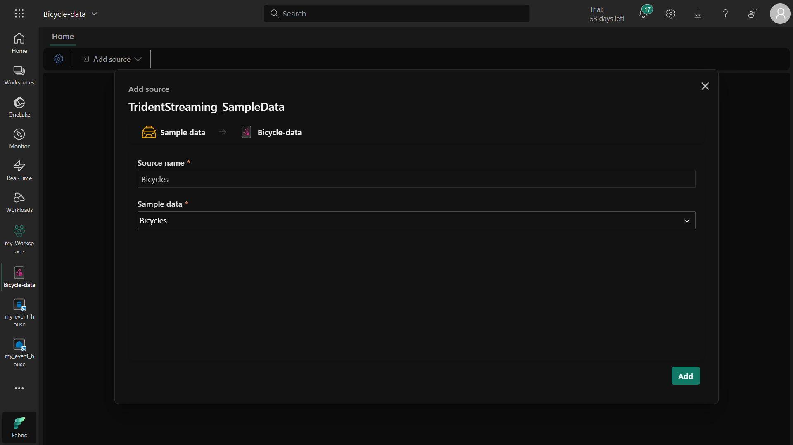
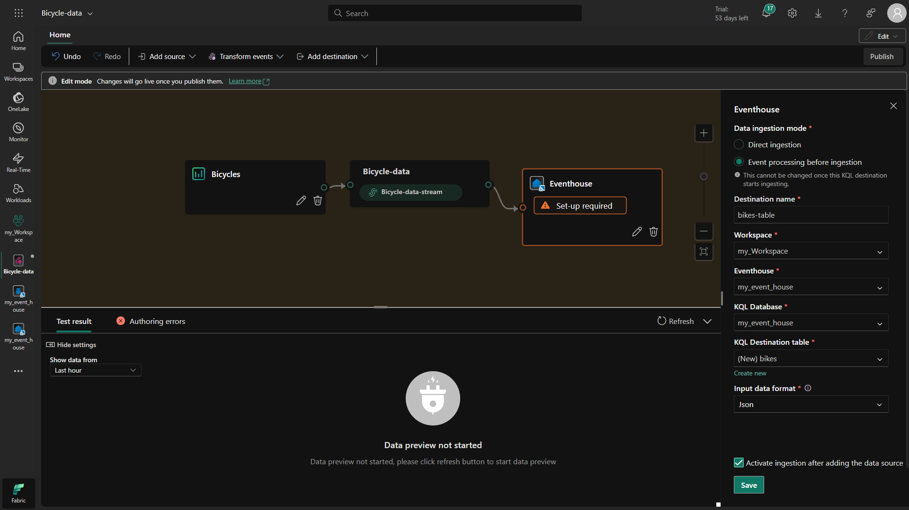
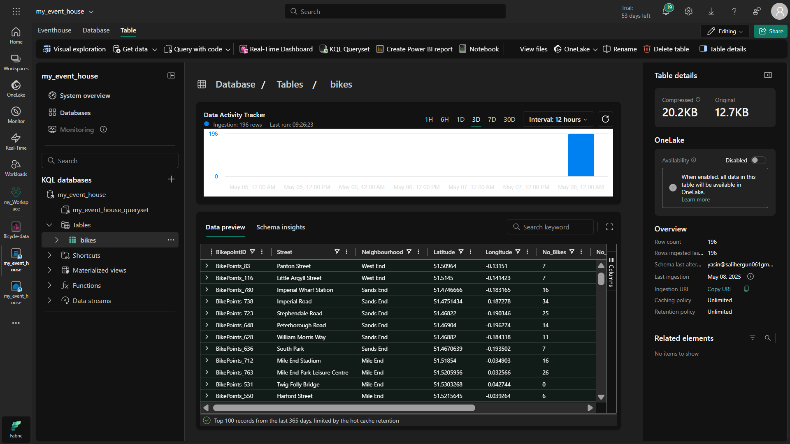
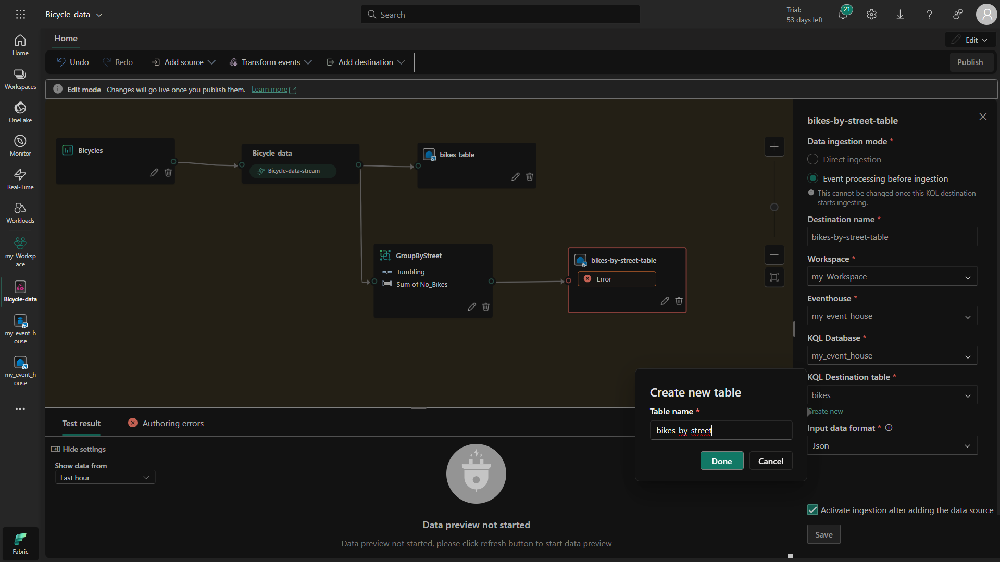
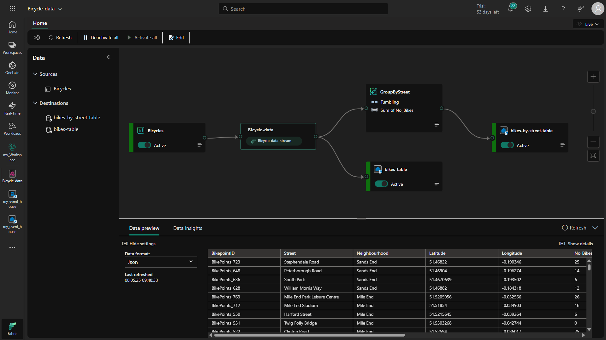

# 🚀 Real-time Gegevensverwerking met Microsoft Fabric: Eventstream en Eventhouse
## 📍 Projectsamenvatting

In deze oefening hebben we geleerd hoe we real-time gegevens van een fietsdeelsysteem kunnen vastleggen en verwerken met Eventstream en Eventhouse in Microsoft Fabric. We hebben de gegevens geanalyseerd, getransformeerd en gerapporteerd.

## 🔍 Voor wie is deze oefening nuttig?
✔ Data engineers (voor het bouwen van streaming data pipelines)
✔ Data analysts (voor real-time analyse met KQL)
✔ Azure/Fabric gebruikers (om Eventstream en Eventhouse te leren)

## 📌 Basisconcepten (gebruikt in dit project)
### 1️⃣ Wat is een Eventhouse?
Doel: Een database voor opslag en query van real-time gegevens

Waarom gebruikt? Om fietsgegevens op te slaan en te analyseren met KQL

Alternatieven: Azure Data Explorer, Delta Lake

### 2️⃣ Wat is een Eventstream?
Doel: Vangt gebeurtenissen op, verwerkt ze en routeert naar bestemmingen

Waarom gebruikt? Om real-time fietsdata naar het Eventhouse te sturen

Alternatieven: Azure Event Hubs, Kafka

### 3️⃣ Wat is KQL (Kusto Query Language)?
Doel: Snel query's uitvoeren op grote datasets

Waarom gebruikt? Om fietsgegevens te analyseren

Alternatieven: SQL, Spark SQL

## 🔍 Stap voor Stap Uitgevoerde Acties & Waarom
### 1️⃣ Workspace aangemaakt (Waarom?)
Doel: Een werkruimte creëren in Microsoft Fabric

Resultaat: Nieuwe projectomgeving voor alle resources

Toepassing: Alle Fabric-componenten werken hierin

### 2️⃣ Eventhouse gemaakt (Waarom?)
Doel: Database voor fietsgegevens

Resultaat: Eventhouse met KQL-database

Toepassing: Opslag en query van gegevens

### 3️⃣ Eventstream gestart (Waarom?)
Doel: Real-time fietsdata vastleggen

Resultaat: Voorbeelddata van fietsdeelsysteem verbonden

Toepassing: Kan ook IoT-data of applicatielogs verwerken

### 4️⃣ Bestemming (Destination) ingesteld (Waarom?)
Doel: Gegevens naar Eventhouse sturen

Resultaat: Tabel 'bikes' aangemaakt met stromende data

Toepassing: Voor latere analyse

### 5️⃣ Gegevens bevraagd met KQL (Waarom?)
Doel: Data controleren en analyseren

Resultaat: Laatste 100 records bekeken

Toepassing: Data quality checks of samenvattingen

### 6️⃣ Gegevenstransformatie uitgevoerd (Waarom?)
Doel: Data betekenisvoller maken

Resultaat: Aantal fietsen per straat elke 5 seconden

Toepassing: Voor real-time dashboards

### 7️⃣ Getransformeerde data geanalyseerd (Waarom?)
Doel: Verwerkte data rapporteren

Resultaat: Gefilterde data uit 'bikes-by-street'

Toepassing: Bijv. "Welke straat heeft meeste fietsen?"

## 📌 Wanneer is dit nuttig?
✅ Real-time data monitoring (IoT, logs)
✅ Streaming data pipelines bouwen
✅ Loganalyse met KQL
✅ Microsoft Fabric leren

## 🚀 Wat hebben we geleerd?
✔ Data vastleggen met Eventstream
✔ Opslag en analyse met Eventhouse & KQL
✔ Gegevenstransformaties
✔ Real-time verwerking in Fabric

