# 🚀 Microsoft Fabric ile Gerçek Zamanlı Veri İşleme: Eventstream ve Eventhouse Kullanımı
## 📍 Proje Özeti

Bu çalışmada, Microsoft Fabric üzerinde Eventstream ve Eventhouse kullanarak bir bisiklet paylaşım sisteminden gelen gerçek zamanlı verileri nasıl yakalayıp işleyeceğimizi öğrendik. Verileri analiz ettik, dönüştürdük ve raporladık.

## 🔍 Bu çalışma kimler için faydalı?
✔ Veri mühendisleri (Streaming data pipeline oluşturmak isteyenler)
✔ Veri analistleri (KQL ile gerçek zamanlı analiz yapmak isteyenler)
✔ Azure/Fabric kullanıcıları (Eventstream ve Eventhouse öğrenmek isteyenler)

## 📌 Temel Kavramlar (Bu Projede Kullanılanlar)
### 1️⃣ Eventhouse Nedir?
Ne işe yarar? Gerçek zamanlı verileri depolamak ve sorgulamak için kullanılan bir veritabanı türüdür.

Neden kullandık? Bisiklet verilerini saklamak ve KQL ile analiz etmek için.

Alternatifi nedir? Azure Data Explorer, Delta Lake gibi diğer veri depolama çözümleri.

### 2️⃣ Eventstream Nedir?
Ne işe yarar? Veri kaynaklarından gelen olayları (events) yakalar, işler ve farklı hedeflere yönlendirir.

Neden kullandık? Bisiklet paylaşım sisteminden gelen anlık verileri alıp Eventhouse’a aktarmak için.

Alternatifi nedir? Azure Event Hubs, Kafka gibi mesajlaşma sistemleri.

### 3️⃣ KQL (Kusto Query Language) Nedir?
Ne işe yarar? Büyük veri kümelerini hızlıca sorgulamak için kullanılan bir dil.

Neden kullandık? Bisiklet verilerini analiz etmek ve raporlamak için.

Alternatifi nedir? SQL, Spark SQL gibi diğer sorgu dilleri.

## 🔍 Adım Adım Yapılanlar & Neden Yaptık?
### 1️⃣ Workspace Oluşturduk (Neden?)
Amacı: Microsoft Fabric’de çalışmak için bir alan oluşturmak.

Ne oldu? Yeni bir proje başlattık ve tüm kaynaklarımızı burada yönettik.

Nasıl kullanılır? Tüm Fabric bileşenleri (Eventstream, Eventhouse) burada çalışır.

### 2️⃣ Eventhouse Oluşturduk (Neden?)
Amacı: Bisiklet verilerini depolayacak bir veritabanı oluşturmak.

Ne oldu? İçinde KQL veritabanı olan bir Eventhouse açıldı.

Nasıl kullanılır? Veriler burada saklanır ve KQL ile sorgulanır.

### 3️⃣ Eventstream ile Veri Akışı Başlattık (Neden?)
Amacı: Gerçek zamanlı bisiklet verilerini yakalamak.

Ne oldu? Örnek bir veri kaynağı (bisiklet paylaşım sistemi) bağlandı.

Nasıl kullanılır? IoT cihazları, uygulama logları gibi kaynaklardan veri almak için kullanılabilir.

### 4️⃣ Hedef (Destination) Belirledik (Neden?)
Amacı: Verileri Eventhouse’a kaydetmek.

Ne oldu? bikes adında bir tablo oluştu ve veriler buraya akmaya başladı.

Nasıl kullanılır? Verileri depolamak ve sonradan analiz etmek için kullanılır.

### 5️⃣ Verileri KQL ile Sorguladık (Neden?)
Amacı: Gelen verileri kontrol etmek ve analiz etmek.

Ne oldu? Son 24 saatte gelen 100 kaydı görüntüledik.

Nasıl kullanılır? Veri kalitesini kontrol etmek veya özet raporlar oluşturmak için.

### 6️⃣ Veri Dönüşümü (Transformasyon) Yaptık (Neden?)
Amacı: Verileri daha anlamlı hale getirmek.

Ne oldu? Her 5 saniyede bir, sokak bazında toplam bisiklet sayısı hesaplandı.

Nasıl kullanılır? Gerçek zamanlı dashboard’lar veya alarm sistemleri için kullanılabilir.

### 7️⃣ Dönüştürülmüş Verileri Analiz Ettik (Neden?)
Amacı: İşlenmiş verileri raporlamak.

Ne oldu? bikes-by-street tablosundaki verileri KQL ile filtreledik.

Nasıl kullanılır? Örneğin: "Hangi sokakta en çok bisiklet var?" sorusuna cevap bulmak için.

## 📌 Bu Çalışma Ne Zaman İşe Yarar?
✅ Gerçek zamanlı veri izleme yapmak istediğinizde (IoT, uygulama logları).
✅ Streaming veri pipeline’ları kurmanız gerektiğinde.
✅ KQL ile log analizi yapmak istediğinizde.
✅ Microsoft Fabric’i öğrenmek ve veri mühendisliği becerilerinizi geliştirmek istediğinizde.

## 🚀 Öğrendiklerimiz & Çıkarımlar
✔ Eventstream ile veri yakalama ve yönlendirme.
✔ Eventhouse ve KQL ile veri depolama & analiz.
✔ Veri dönüşümü (aggregation, filtreleme) teknikleri.
✔ Microsoft Fabric’in gerçek zamanlı veri işleme yetenekleri.

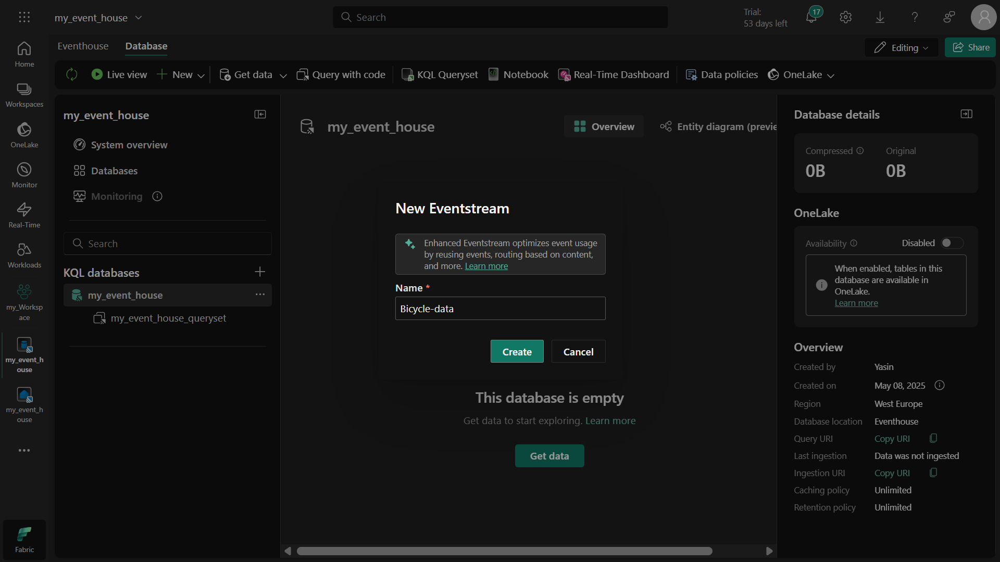

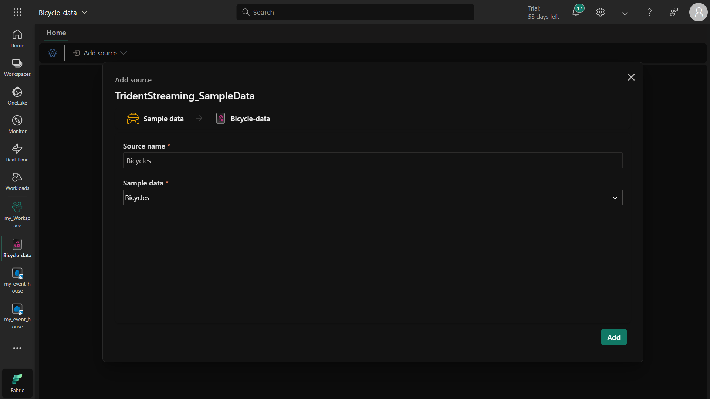

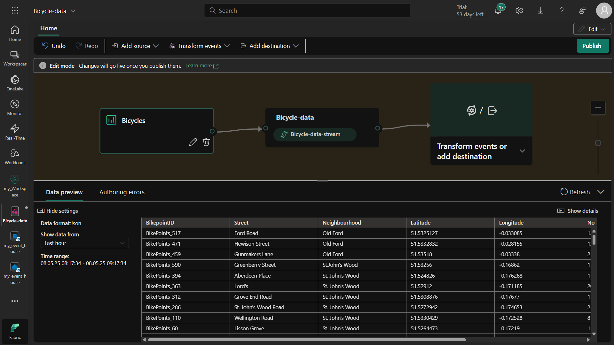

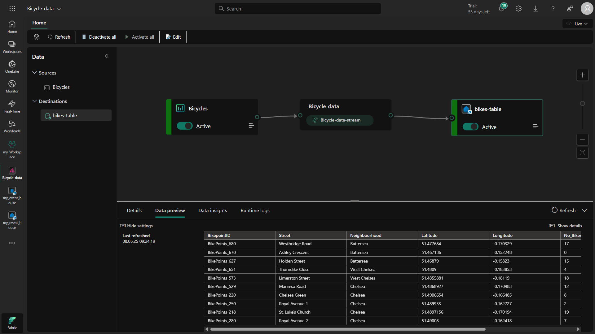

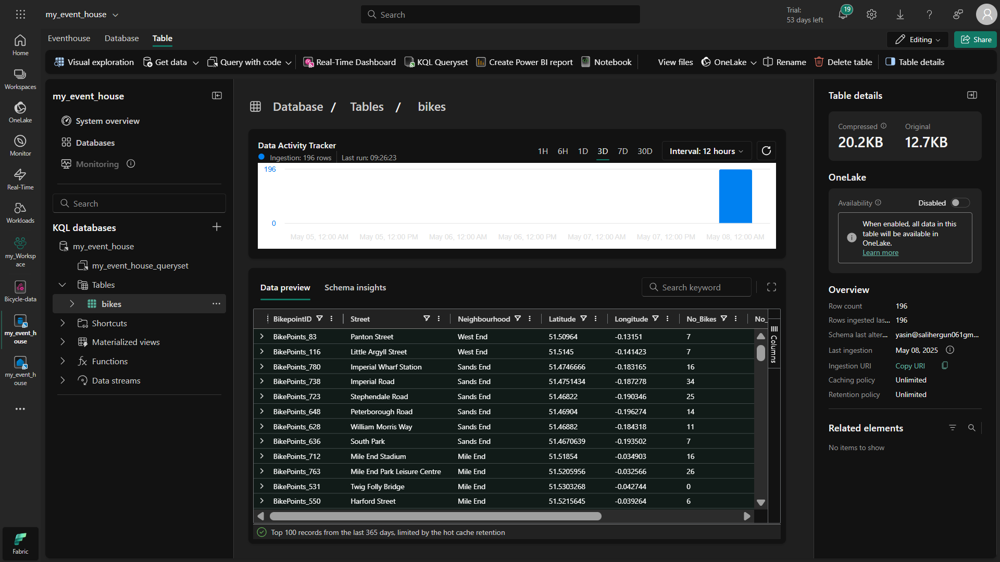

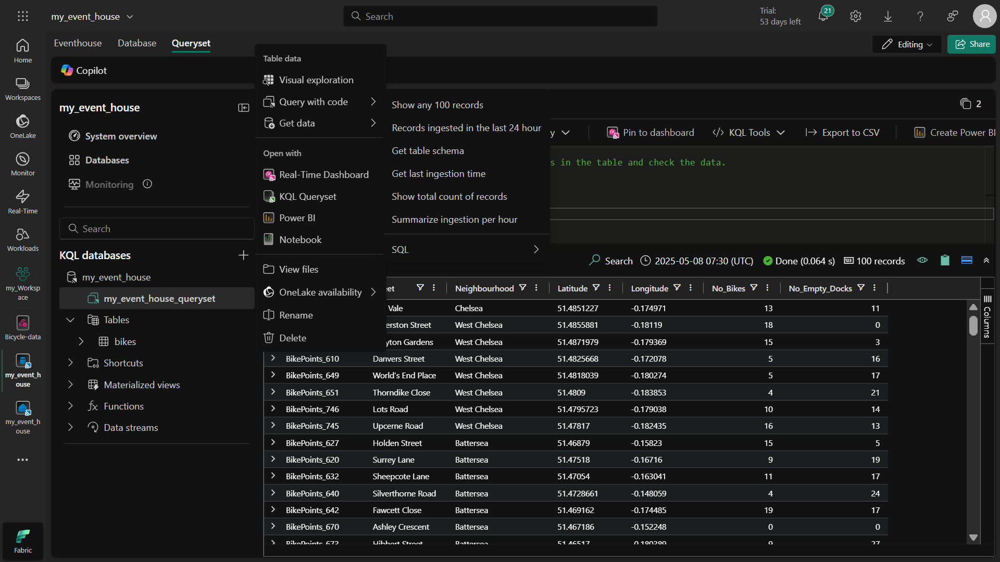

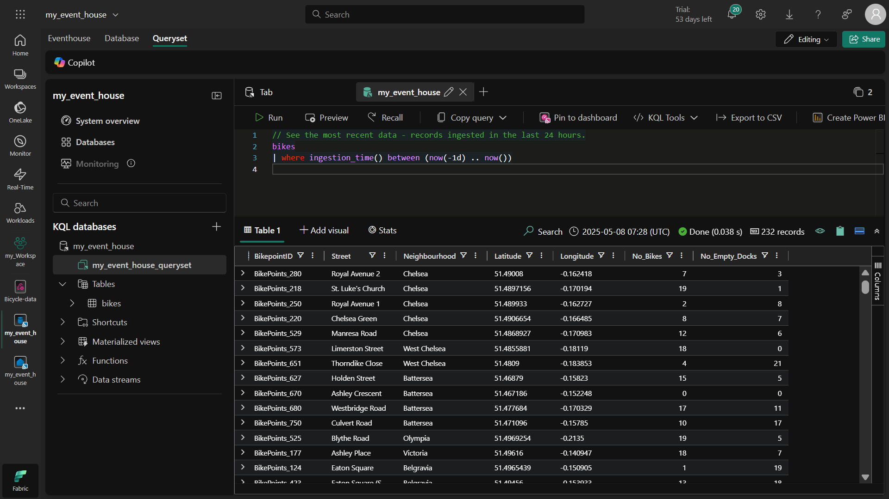

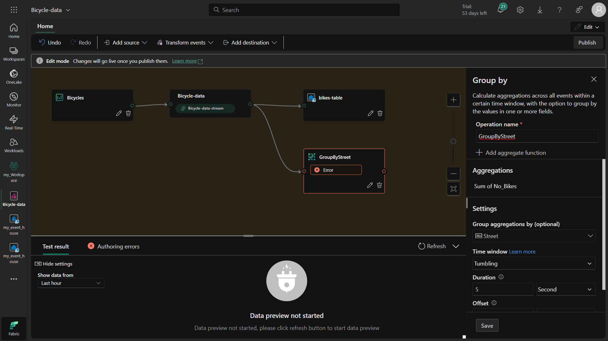

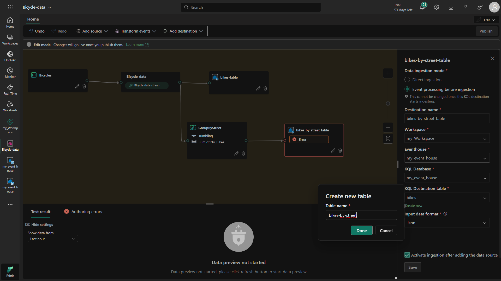

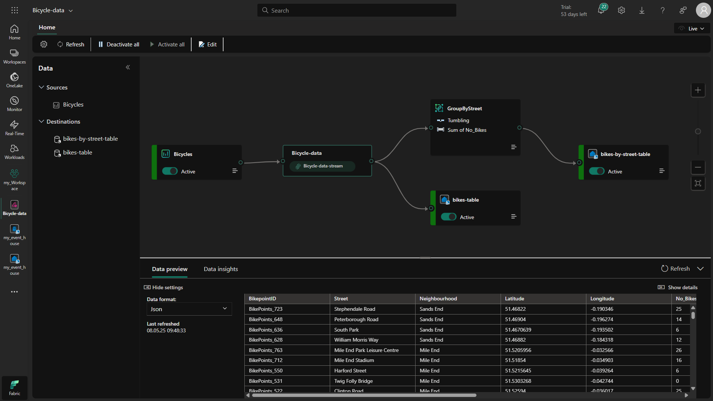

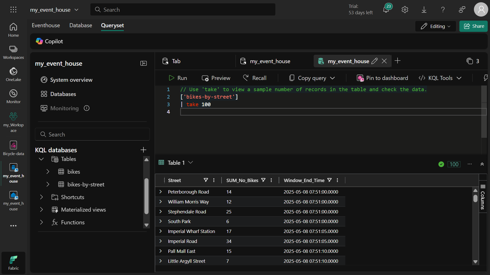

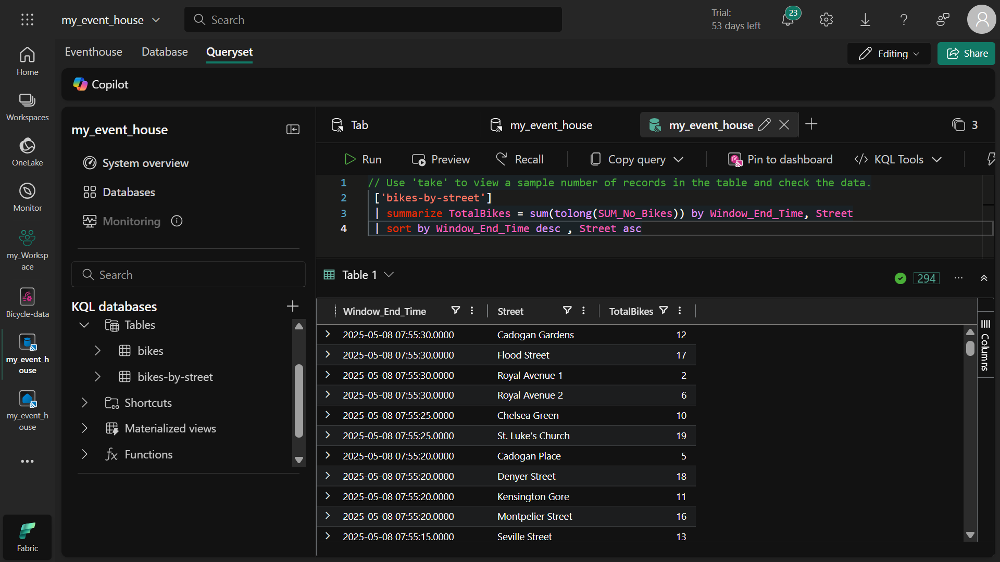