# Microsoft Fabric ile Gerçek Zamanlı Veri İşleme: Eventhouse Kullanımı

Bu projede, **Microsoft Fabric** platformunda bir **Eventhouse (Olay Evi)** oluşturarak, gerçek zamanlı bisiklet kiralama verileri üzerinde **KQL (Kusto Query Language)** ve **Transact-SQL (T-SQL)** sorguları kullanarak analiz gerçekleştirdim.

## 🚀 Proje Amacı

Microsoft Fabric ortamında Eventhouse kullanarak:
- Gerçek zamanlı veri işlemenin temelini öğrenmek,
- KQL ve SQL ile veri sorgulama tekniklerini karşılaştırmak,
- Veri modelleme, filtreleme, sıralama ve gruplayarak özetleme gibi işlemleri gerçekleştirmek.

---

## 📁 1. Workspace Oluşturma

İlk adımda Microsoft Fabric ana sayfası üzerinden:
- Fabric kapasitesi destekleyen bir **çalışma alanı (workspace)** oluşturdum.
- Çalışma alanı boş şekilde başlatıldı.

---

## 🏠 2. Eventhouse Oluşturma

- “Real-Time Intelligence” sekmesinden örnek veri seti içeren bir **eventhouse** (adı: RTISample) oluşturuldu.
- Bu eventhouse içinde **KQL veritabanı** ve **Bikestream** adında bir tablo otomatik olarak yüklendi.

---

## 🔍 3. Verilerin KQL ile Sorgulanması

### Basit Veri Sorgulama
```kql
Bikestream
| take 100
Veritabanındaki ilk 100 satırı listeler.
```

### Belirli Alanları Sorgulama
```
kql
Bikestream
| project Street, No_Bikes
| take 10
```

### Kolon Adlarını Yeniden Adlandırma
```
kql
Bikestream
| project Street, ["Boş İstasyon Sayısı"] = No_Empty_Docks
| take 10
```

## 📊 4. KQL ile Verileri Özetleme ve Gruplama
### Toplam Bisiklet Sayısını Hesaplama
```
kql
Bikestream
| summarize ["Toplam Bisiklet Sayısı"] = sum(No_Bikes)
```

### Mahallelere Göre Gruplama
```
kql

Bikestream
| summarize ["Toplam Bisiklet Sayısı"] = sum(No_Bikes) by Neighbourhood
```

### Eksik Mahalle Verisini Tanımlama
```
kql


Bikestream
| summarize ["Toplam Bisiklet Sayısı"] = sum(No_Bikes) by Neighbourhood
| project Neighbourhood = case(isempty(Neighbourhood) or isnull(Neighbourhood), "Belirsiz", Neighbourhood), ["Toplam Bisiklet Sayısı"]
```
## 🔃 5. KQL ile Verileri Sıralama ve Filtreleme
### Mahalle İsmine Göre Artan Sıralama
```
kql
Bikestream
| sort by Neighbourhood asc
```

### Chelsea Mahallesine Ait Kayıtları Filtreleme
```
kql
Bikestream
| where Neighbourhood == "Chelsea"
```

## 🧩 6. SQL (T-SQL) ile Sorgulama
### Tüm Verileri Listeleme
```
sql

SELECT TOP 100 * FROM Bikestream
```

### Belirli Alanlar ve Alias Kullanımı
```
sql

SELECT TOP 10 Street, No_Empty_Docks AS [Boş İstasyon Sayısı]
FROM Bikestream
```

### Toplam Sayıları ve Gruplama
```
sql

SELECT Neighbourhood, SUM(No_Bikes) AS [Toplam Bisiklet Sayısı]
FROM Bikestream
GROUP BY Neighbourhood
```

### Belirsiz Mahalleleri Gruplama
```
sql

SELECT CASE
         WHEN Neighbourhood IS NULL OR Neighbourhood = '' THEN 'Belirsiz'
         ELSE Neighbourhood
       END AS Neighbourhood,
       SUM(No_Bikes) AS [Toplam Bisiklet Sayısı]
FROM Bikestream
GROUP BY CASE
           WHEN Neighbourhood IS NULL OR Neighbourhood = '' THEN 'Belirsiz'
           ELSE Neighbourhood
         END
```

### Chelsea Mahallesine Filtreleme
```
sql

HAVING Neighbourhood = 'Chelsea'
```

## 🧹 7. Kaynakları Temizleme
Çalışma sonunda, oluşturulan çalışma alanı şu adımlarla silindi:

Workspace ayarları açıldı.

“Bu çalışma alanını kaldır” seçeneği ile silme işlemi tamamlandı.

## 🛠️ Kullanılan Teknolojiler
Microsoft Fabric

Kusto Query Language (KQL)

Transact-SQL (T-SQL)

## 📌 Öğrenilenler
Gerçek zamanlı verilerin Eventhouse üzerinde nasıl işlendiği,

KQL ile veriye ulaşma, dönüştürme ve analiz etme yöntemleri,

SQL ile benzer sorguların nasıl yazıldığı ve KQL ile farkları.

## 📂 Notlar
KQL, gerçek zamanlı analizler için SQL’e göre daha güçlüdür.

SQL sadece sınırlı sorgulama desteği sunar (insert/update/delete desteklenmez).

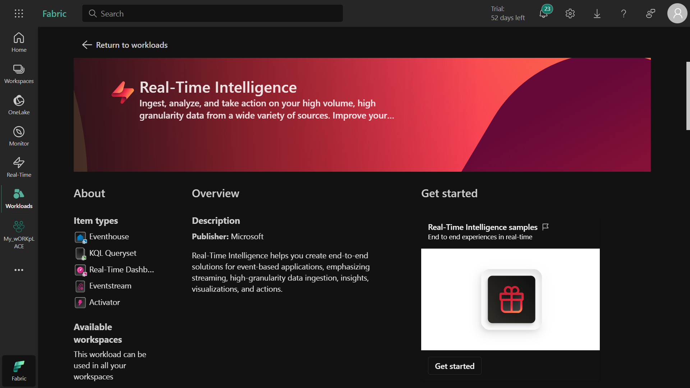

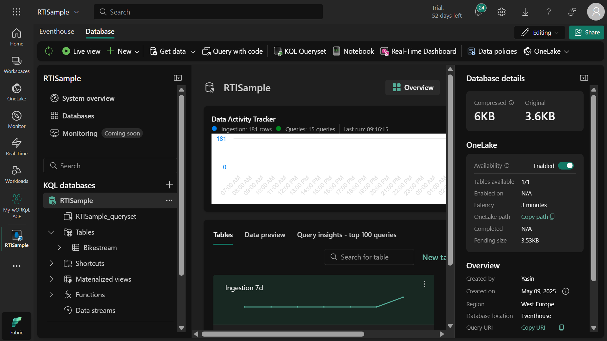

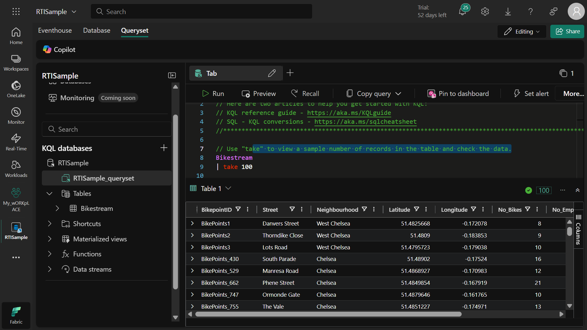

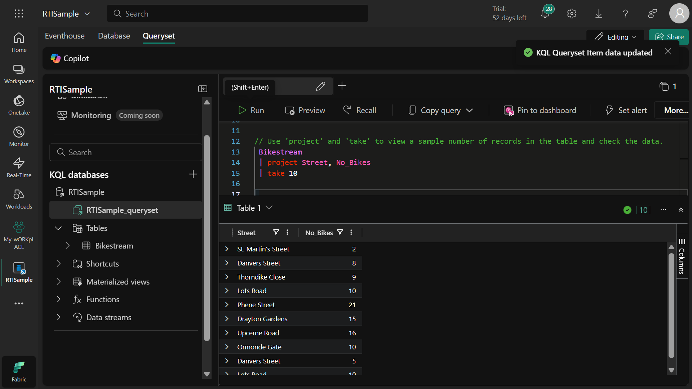

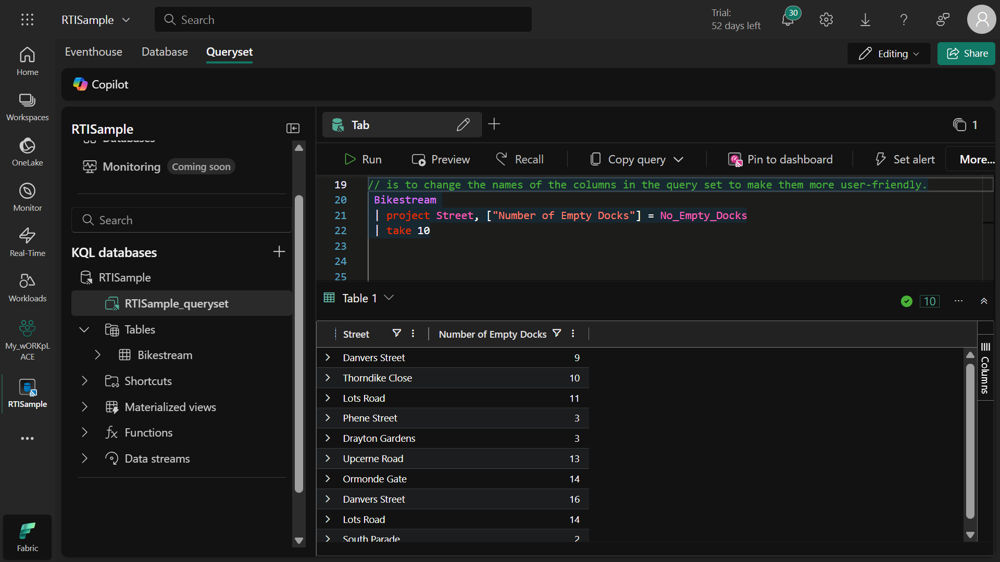

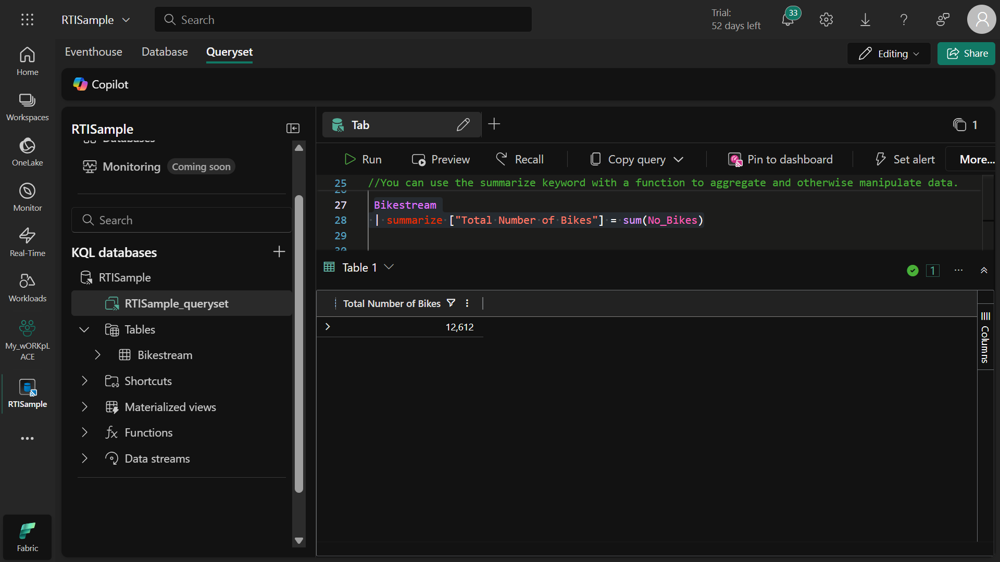

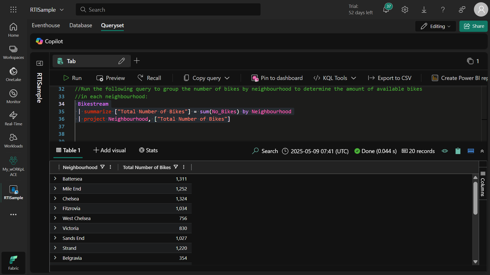

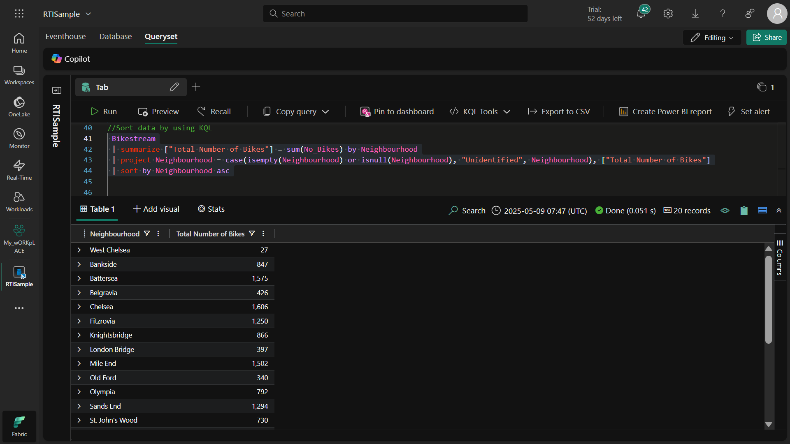

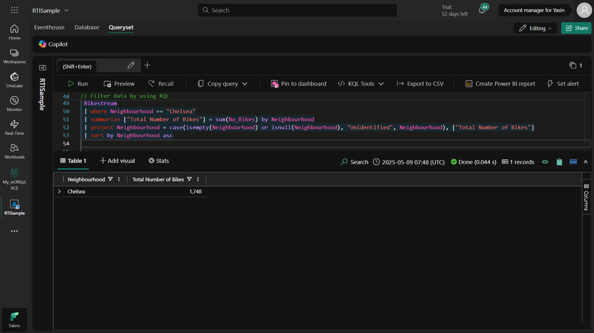

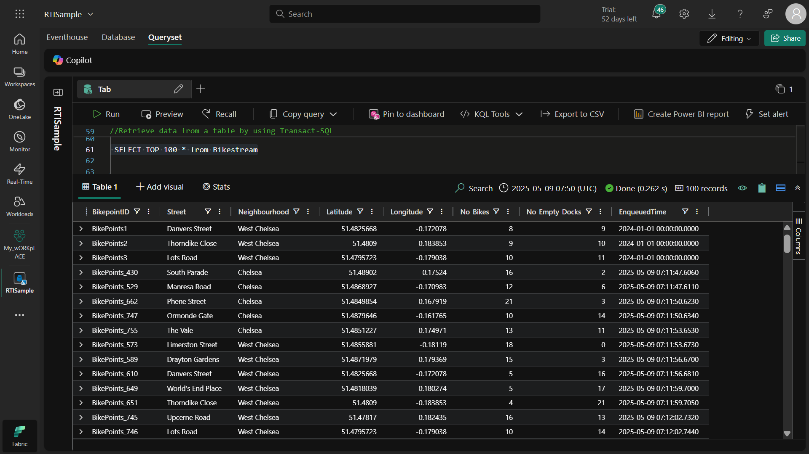

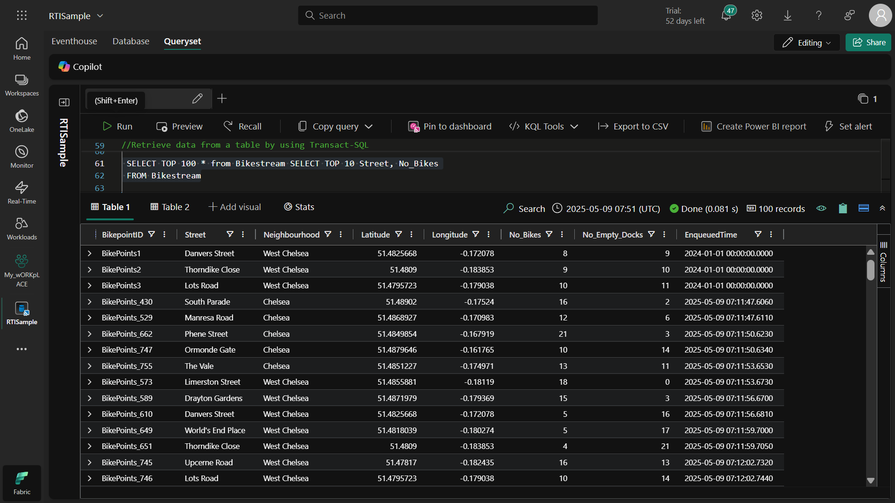

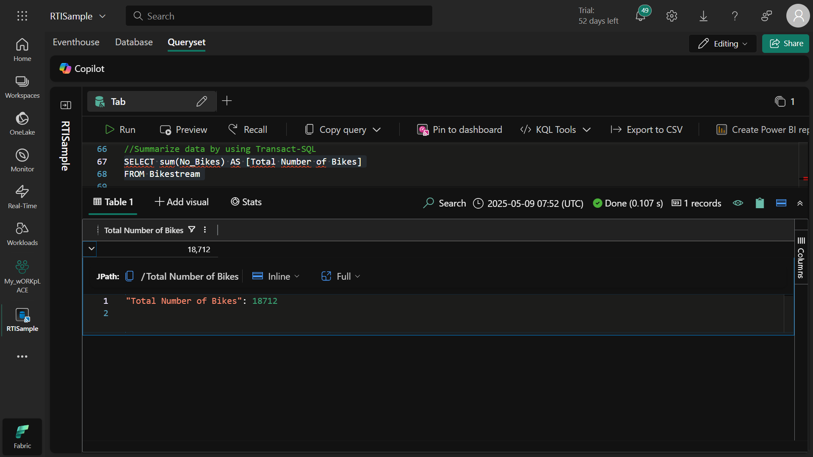

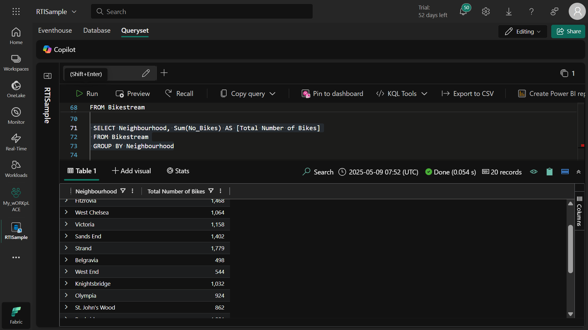

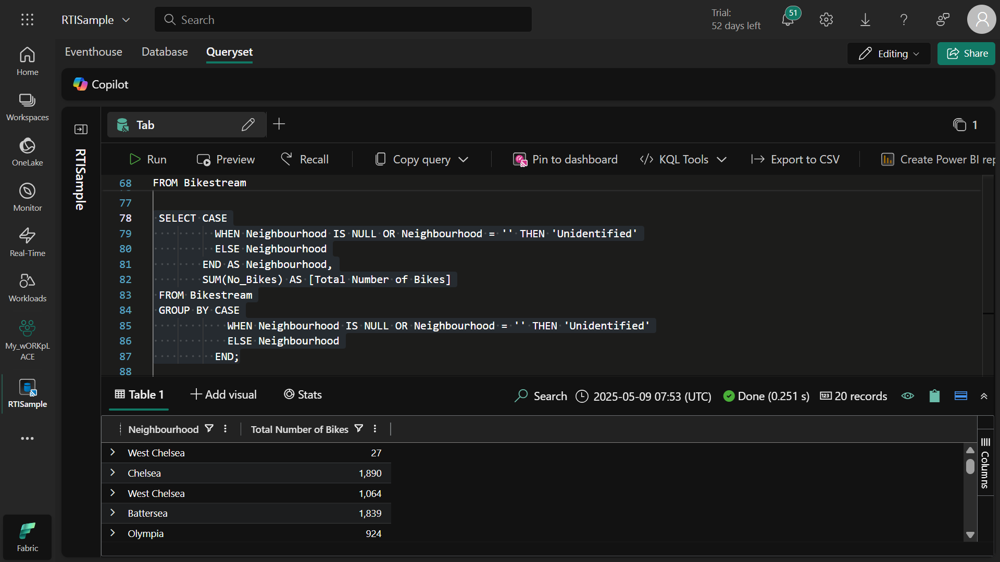

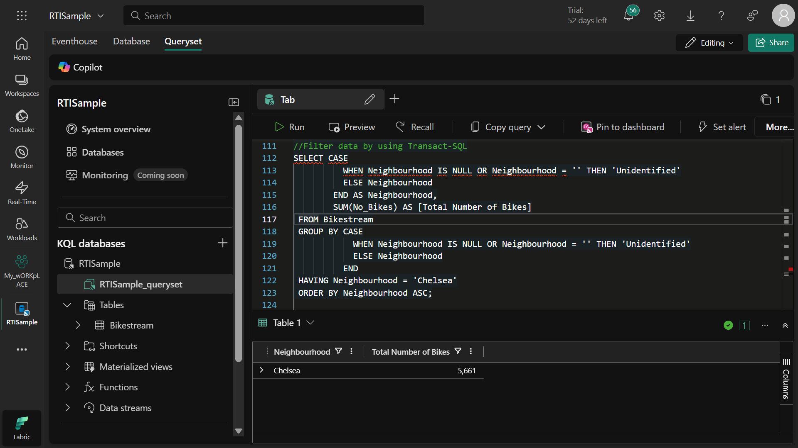

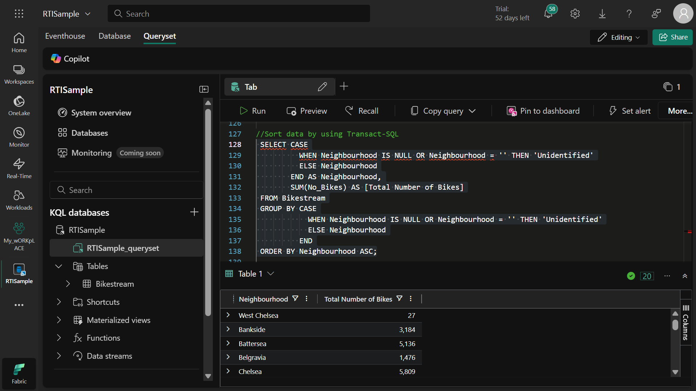