# Realtime Gegevensverwerking met Microsoft Fabric: Gebruik van Eventhouse
In dit project heb ik een Eventhouse gemaakt in Microsoft Fabric om realtime fietsverhuurgegevens te analyseren met behulp van KQL (Kusto ##Query Language) en T-SQL (Transact-SQL).

## 🚀 Doel van het Project
Met Eventhouse in Microsoft Fabric:

De basis van realtime gegevensverwerking leren,

KQL en SQL-querytechnieken vergelijken,

Gegevens modelleren, filteren, sorteren en samenvatten.

## 📁 1. Workspace Aanmaken
Als eerste stap:

Een werkruimte gemaakt in Microsoft Fabric (die Fabric-capaciteit ondersteunt),

De werkruimte werd leeg gestart.

## 🏠 2. Eventhouse Aanmaken
Vanuit het tabblad “Realtime Intelligence” werd een Eventhouse aangemaakt met voorbeeldgegevens (naam: RTISample),

Hierin werd automatisch een KQL-database en een tabel genaamd Bikestream toegevoegd.

## 🔍 3. Gegevens Opvragen met KQL
### Eenvoudige Query
```
kql

Bikestream
| take 100
▶️ Toont de eerste 100 rijen uit de tabel.
```
### Bepaalde Kolommen Opvragen
```
kql

Bikestream
| project Street, No_Bikes
| take 10
```
### Kolomnamen Hernoemen
```
kql

Bikestream
| project Street, ["Aantal lege plekken"] = No_Empty_Docks
| take 10
```

## 📊 4. Samenvatten en Groeperen met KQL
### Totale Aantal Fietsen Berekenen
```
kql

Bikestream
| summarize ["Totaal aantal fietsen"] = sum(No_Bikes)
```
## Groeperen op Wijk (Neighbourhood)
```
kql

Bikestream
| summarize ["Totaal aantal fietsen"] = sum(No_Bikes) by Neighbourhood
```
## Ontbrekende Wijkgegevens Aanduiden
```
kql

Bikestream
| summarize ["Totaal aantal fietsen"] = sum(No_Bikes) by Neighbourhood
| project Neighbourhood = case(isempty(Neighbourhood) or isnull(Neighbourhood), "Onbekend", Neighbourhood), ["Totaal aantal fietsen"]
```

## 🔃 5. Sorteren en Filteren met KQL
### Sorteren op Wijknaam
```
kql

Bikestream
| sort by Neighbourhood asc
```

### Alleen Gegevens uit Chelsea Tonen
```
kql

Bikestream
| where Neighbourhood == "Chelsea"
```

## 🧩 6. Query’s met SQL (T-SQL)
### Alle Gegevens Tonen
```
sql

SELECT TOP 100 * FROM Bikestream
```

### Bepaalde Kolommen en Alias Gebruiken
```
sql

SELECT TOP 10 Street, No_Empty_Docks AS [Aantal lege plekken]
FROM Bikestream
```
### Groeperen en Tellen
```
sql

SELECT Neighbourhood, SUM(No_Bikes) AS [Totaal aantal fietsen]
FROM Bikestream
GROUP BY Neighbourhood
```

### Onbekende Wijken Groeperen
```
sql

SELECT CASE
         WHEN Neighbourhood IS NULL OR Neighbourhood = '' THEN 'Onbekend'
         ELSE Neighbourhood
       END AS Neighbourhood,
       SUM(No_Bikes) AS [Totaal aantal fietsen]
FROM Bikestream
GROUP BY CASE
           WHEN Neighbourhood IS NULL OR Neighbourhood = '' THEN 'Onbekend'
           ELSE Neighbourhood
         END
```

### Filteren op Wijk Chelsea
```
sql

HAVING Neighbourhood = 'Chelsea'
```

## 🧹 7. Opruimen van Bronnen
Aan het einde van het project is de werkruimte verwijderd via:

“Instellingen” van de werkruimte openen,

De optie “Deze werkruimte verwijderen” aanklikken.

## 🛠️ Gebruikte Technologieën
Microsoft Fabric

Kusto Query Language (KQL)

Transact-SQL (T-SQL)

## 📌 Wat Ik Heb Geleerd
Hoe realtime gegevens worden verwerkt in Eventhouse,

Hoe je met KQL gegevens kunt opvragen, transformeren en analyseren,

Hoe soortgelijke query’s met SQL kunnen worden gemaakt, en wat de verschillen zijn met KQL.

## 📂 Notities
KQL is krachtiger dan SQL voor realtime analyse.

SQL biedt beperkte functionaliteit (geen ondersteuning voor insert/update/delete).


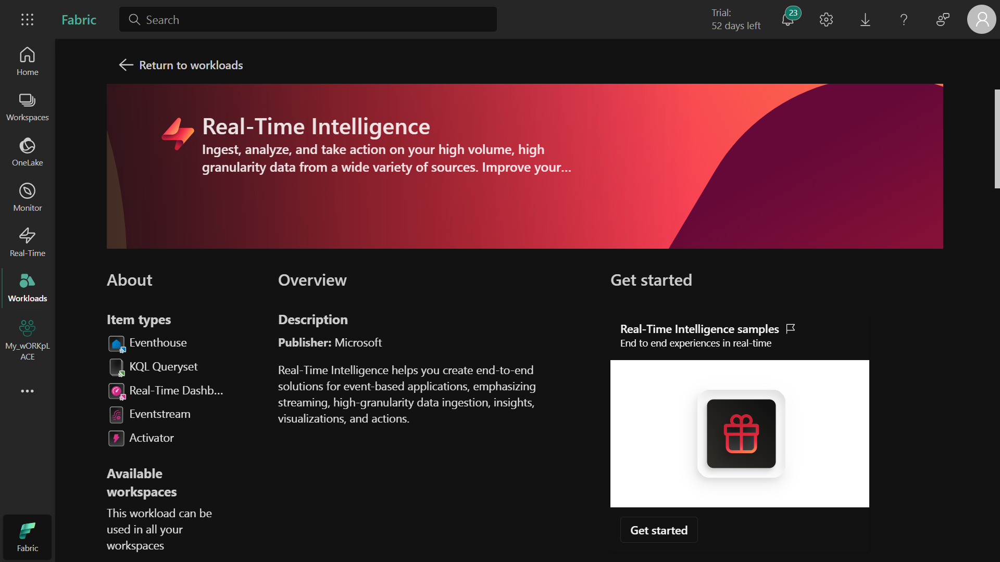

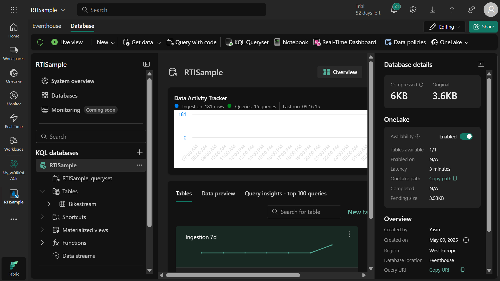

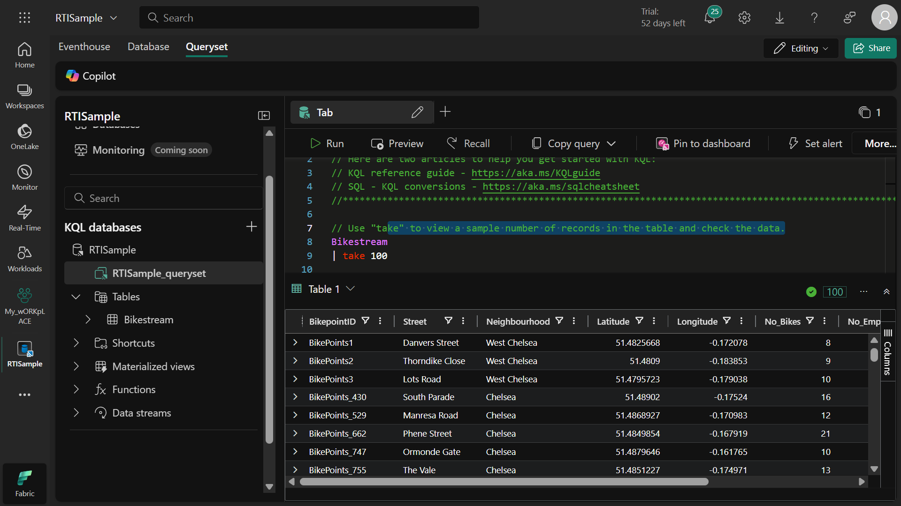

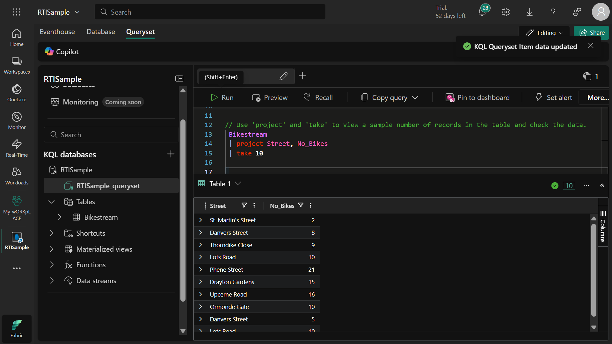

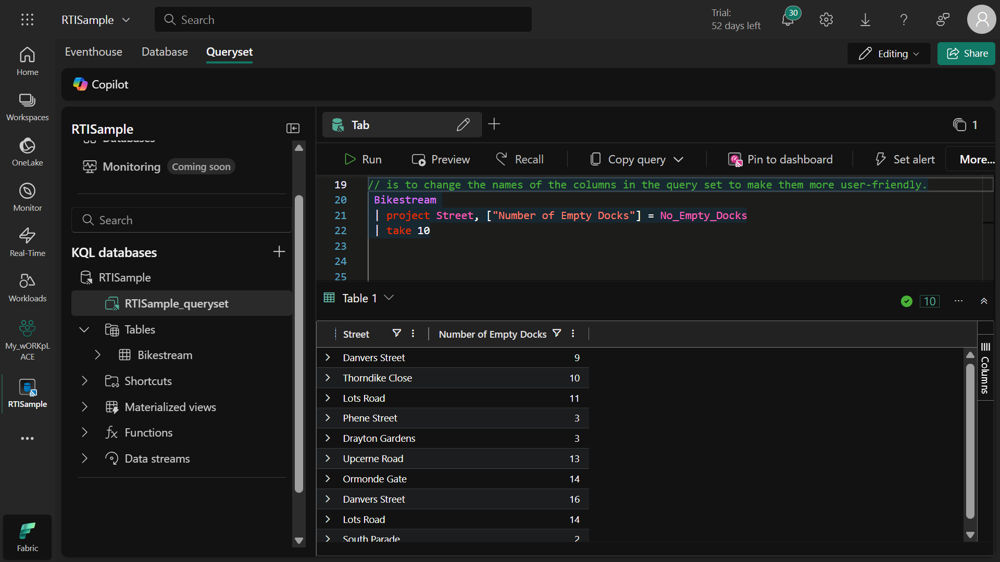

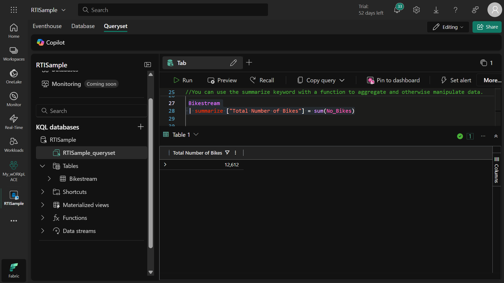

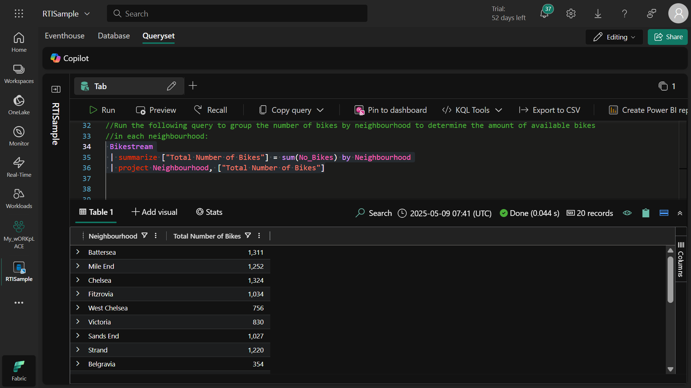

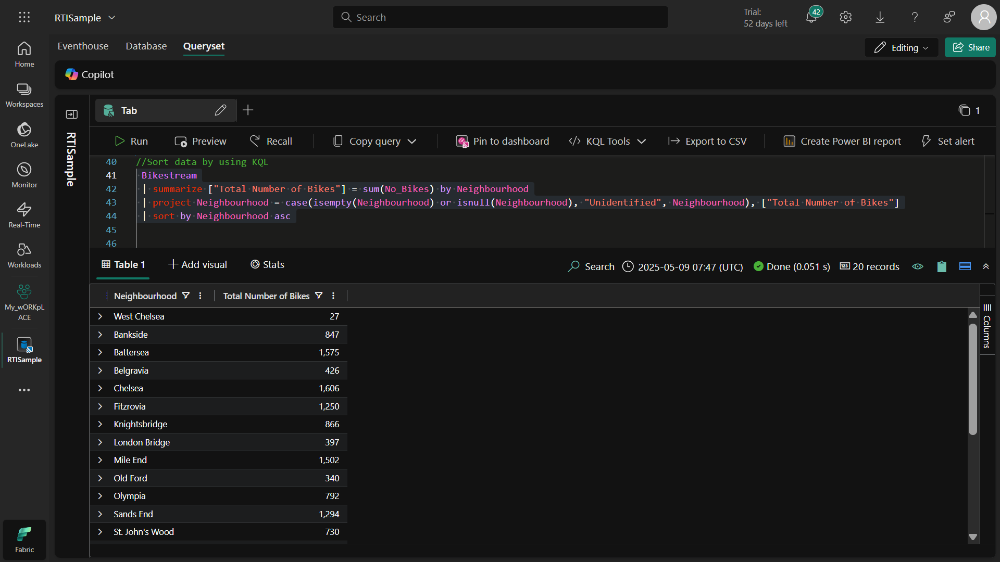

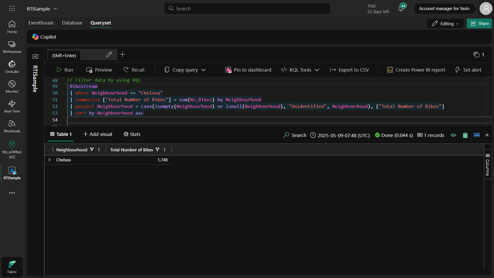

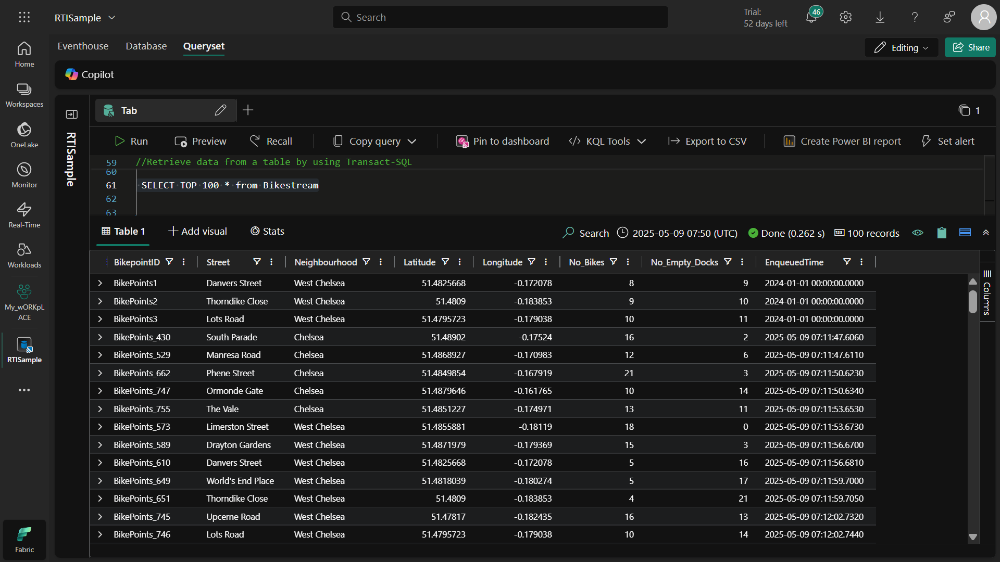

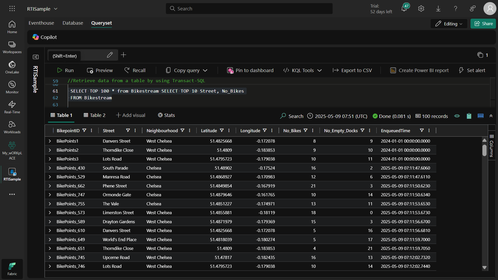

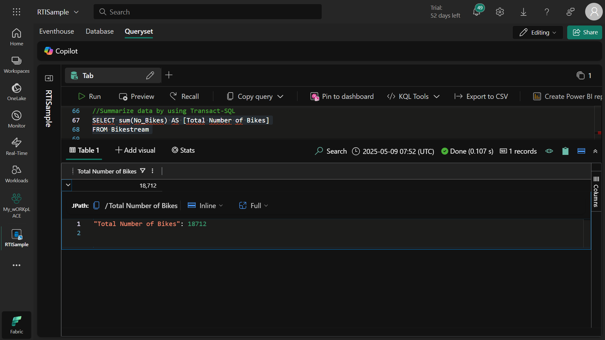

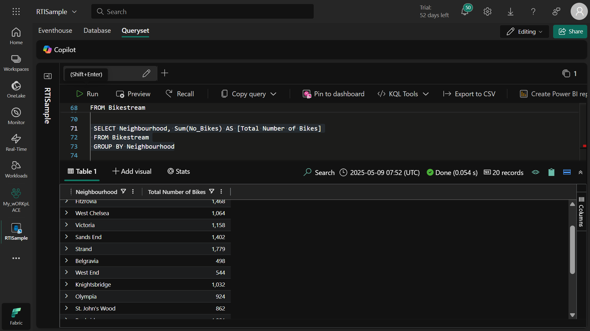

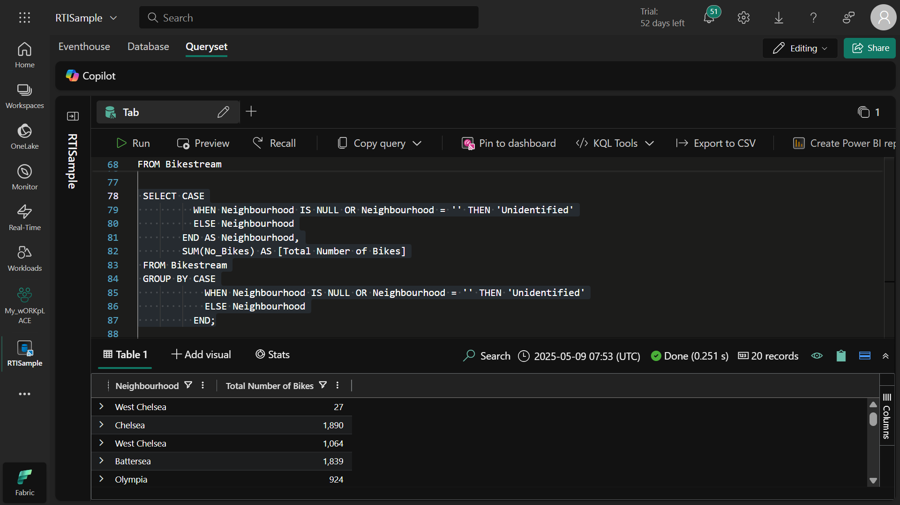

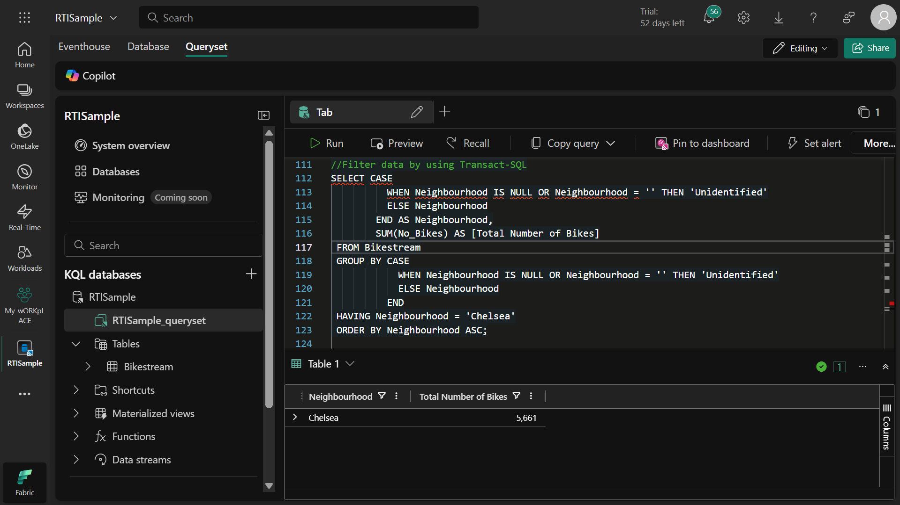

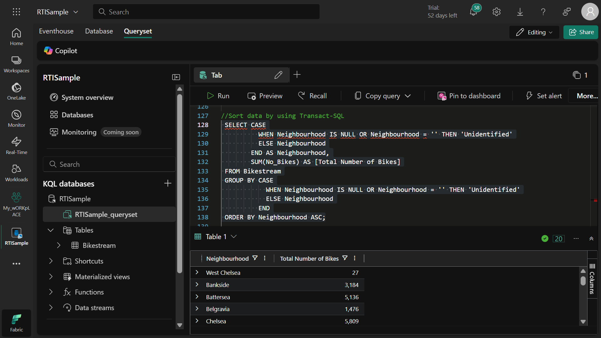