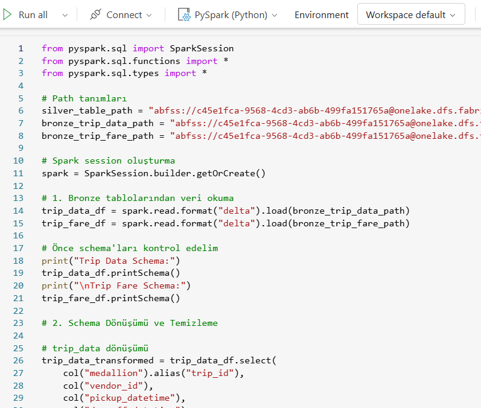
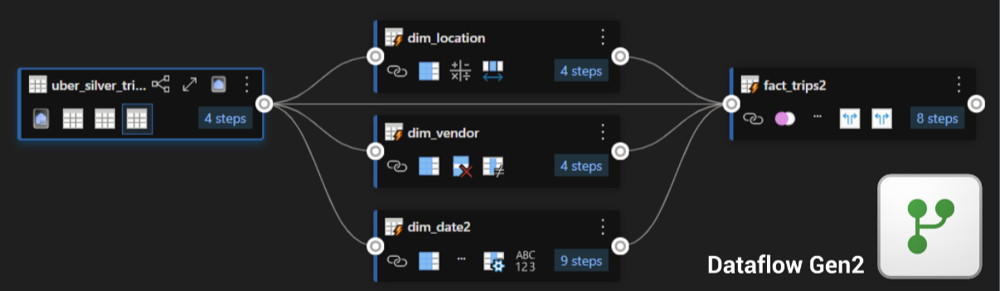
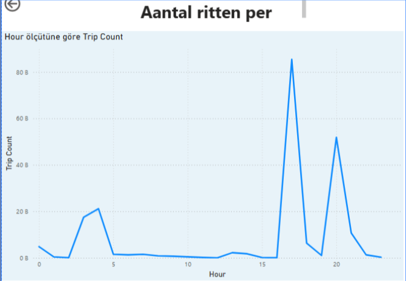

# Project Story – From Raw Taxi Data to Insight

###  Duration: 2 weeks
###   Team: Yasin (Team Leader), Kahraman, Emine, Ayşe

###  Tools: 

## Azure DP-700 Project
In this project, my goal was to demonstrate hands-on data engineering skills aligned with Microsoft Fabric’s DP-700 certification requirements. Key areas covered:

Ingesting, loading, and transforming data (both batch and streaming)

Using SQL, PySpark and Kusto Query Language (KQL) for data transformations

Designing data architecture for analytics solutions (e.g. lakehouse / data warehouse structures)

Implementing security, access controls, and data governance (workspace level, row/column level permissions, data masking etc.)

Automating workflows and scheduling (pipelines, triggers)

Monitoring performance and optimizing processes (data flow, query optimization, error tracking)

Through this project I wanted to showcase my proficiency in data engineering, my ability to design effective data solutions, and hands-on experience with Azure / Microsoft Fabric environment.

##  Project Diagram
We started the project by drawing a diagram to clearly visualize the steps to follow.

  

##  Task Distribution

As team leader, I used Trello to assign tasks and create sprints, which helped us deliver the project on time.

  

## Step 1: Receive Raw Data in Real-Time via Eventstream

We began by ingesting taxi data in real-time. Each time a taxi created an event (e.g., ride started or ended), the data flowed through Eventstream.

  

This data was stored in the Bronze layer of Delta Lake without any processing.

##  Step 2: Clean & Transform with PySpark
Before moving to the Silver layer, we cleaned the raw data using PySpark in a notebook.

  

We:

Filtered out invalid or incomplete rows

Converted date/time formats

Selected relevant columns for analysis

##  Step 3: Model in Gold with Star Schema
Using Dataflow Gen2, we modeled cleaned Silver data in the Gold layer with a star schema.

   

Example tables: dim_date2, dim_location, dim_vendor, fact_trip

##  Step 4: Analysis & Visualization in Power BI
We connected the Gold data to Power BI and designed a dynamic and informative dashboard.

    

Dashboard features:

Filters by date, location, and taxi

KPIs such as total rides, average distance

Map visualizations for location-based insights

##  Step 5: Real-Time Monitoring with Eventhouse
We used Eventhouse to monitor the live event stream.

   

This allowed us to detect any delays or issues in the data pipeline in real-time.

##  Step 6: Automation with Activator
Using Activator, we defined automated triggers, such as:

Alert when a taxi completes more than 5 rides in 1 hour

Special monitoring of long rides during nighttime

This enabled not just reporting but also proactive data reactions.