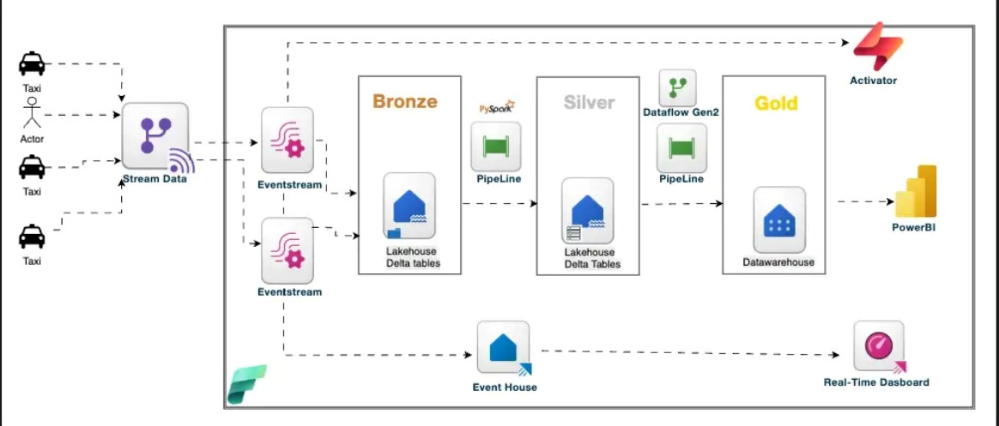
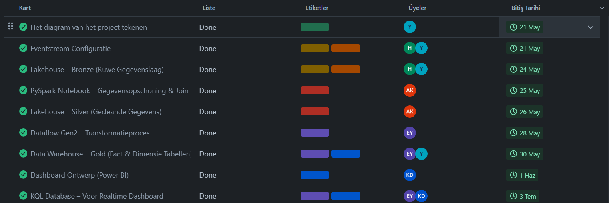
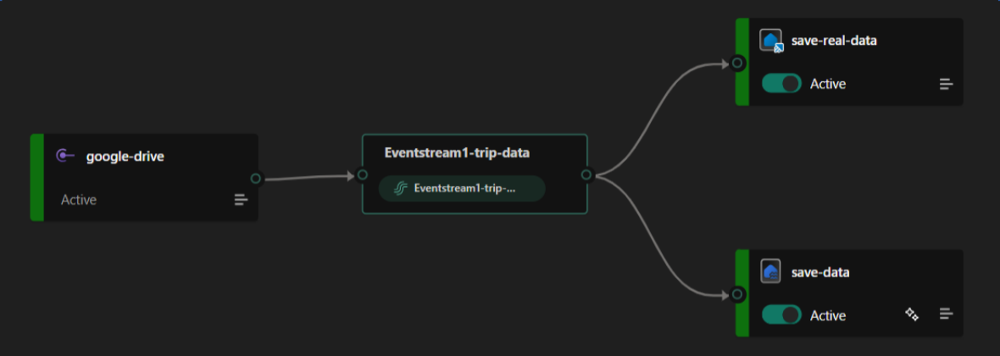
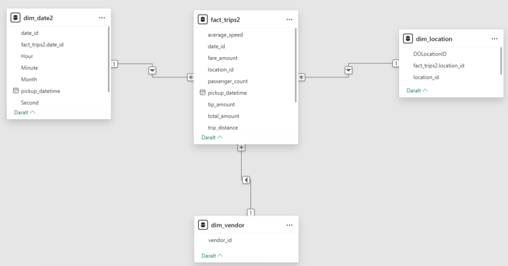
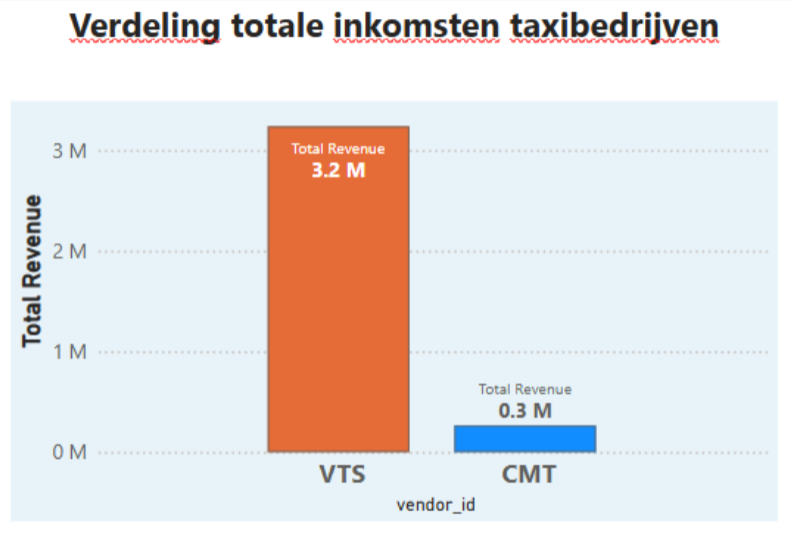
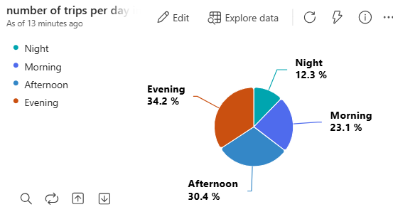

#  Projectverhaal – Van Ruwe Taxigegevens naar Inzichten

###   Duur: 2 weken

###  Team: Yasin (Teamleider), Kahraman, Emine, Ayşe

###  Tools: Microsoft Fabric | Eventstream | Delta Lake | Dataflow Gen2 | Power BI | Eventhouse | Activator | Trello

## Azure DP-700 Project
Het doel van dit project was om mijn data-engineeringvaardigheden te laten zien in het kader van het Microsoft Fabric DP-700 examen. In dit project heb ik gewerkt aan:

Het verzamelen, laden en transformeren van data (batch & streaming),

Data-transformaties met SQL, PySpark en KQL,

Het ontwerpen van data-architectuur (Lakehouse en Data Warehouse),

Beveiliging, toegangsbeheer en data-governance,

Automatisering met pipelines en triggers,

Monitoring en prestatie-optimalisatie.

Met dit project wilde ik mijn technische kennis en praktijkervaring in Azure/Microsoft Fabric aantonen.

##  Projectdiagram
We zijn begonnen met een diagram om de stappen van het project duidelijk te visualiseren.

  

##  Taakverdeling

Als teamleider gebruikte ik Trello om taken toe te wijzen en sprints te plannen.
Hierdoor konden we het project op tijd afronden.

  

##  Stap 1: Ruwe gegevens ontvangen via Eventstream (real-time)

We hebben taxigegevens in real-time ontvangen via Eventstream.
Elke keer als een taxi een actie deed (zoals rit begonnen of rit beëindigd), kwam er een gebeurtenis binnen.
Deze data werd onbewerkt opgeslagen in de Bronze-laag van Delta Lake.

  

##  Stap 2: Opschonen en transformeren met PySpark
Voor we naar de Silver-laag gingen, maakten we de data schoon met PySpark in een notebook.

  

We hebben:

Ongeldige of onvolledige rijen verwijderd

Datum/tijd-formats aangepast

Alleen nuttige kolommen geselecteerd

##  Stap 3: Modelleren in Gold-laag met Stermodel
Met Dataflow Gen2 hebben we de Silver-data gemodelleerd in de Gold-laag met een ster-schema (star schema).

   

Voorbeeldtabellen: dim_date2, dim_location, dim_vendor, fact_trip

##  Stap 4: Analyse & Visualisatie met Power BI

We verbonden de Gold-data met Power BI en maakten een interactief dashboard.

    

### Dashboard-functies:

Filters per datum, locatie en taxi

KPI's zoals totaal aantal ritten, gemiddelde afstand

Kaarten met locatie-inzichten

##  Stap 5: Real-time monitoring met Eventhouse

We gebruikten Eventhouse om de live datastroom te monitoren.

   

Zo konden we eventuele vertragingen of problemen direct zien.

##  Stap 6: Automatisering met Activator
Met Activator maakten we automatische meldingen, bijvoorbeeld:

Waarschuwing als een taxi meer dan 5 ritten per uur voltooit

Extra controle voor lange ritten 's nachts

Zo konden we niet alleen rapporteren, maar ook proactief reageren op dat

## Licentie
Dit project is gelicentieerd onder de MIT-licentie. Zie het [LICENSE](LICENSE) bestand voor meer informatie.

