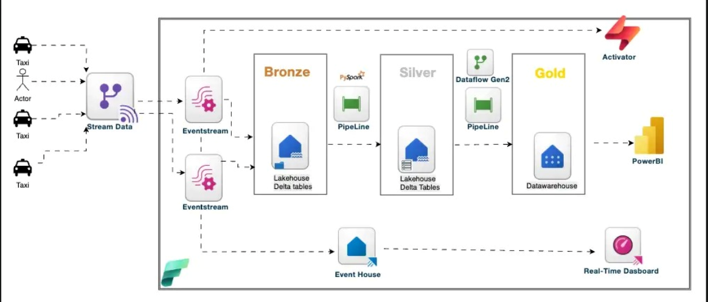
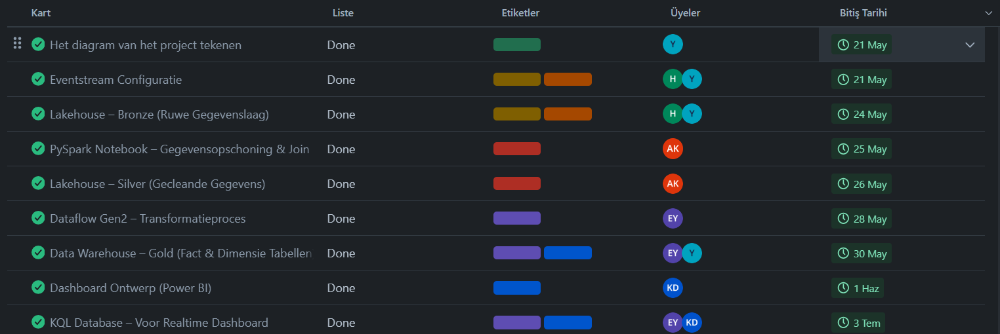
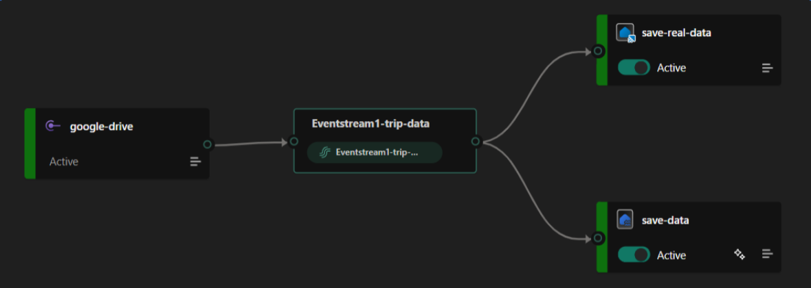
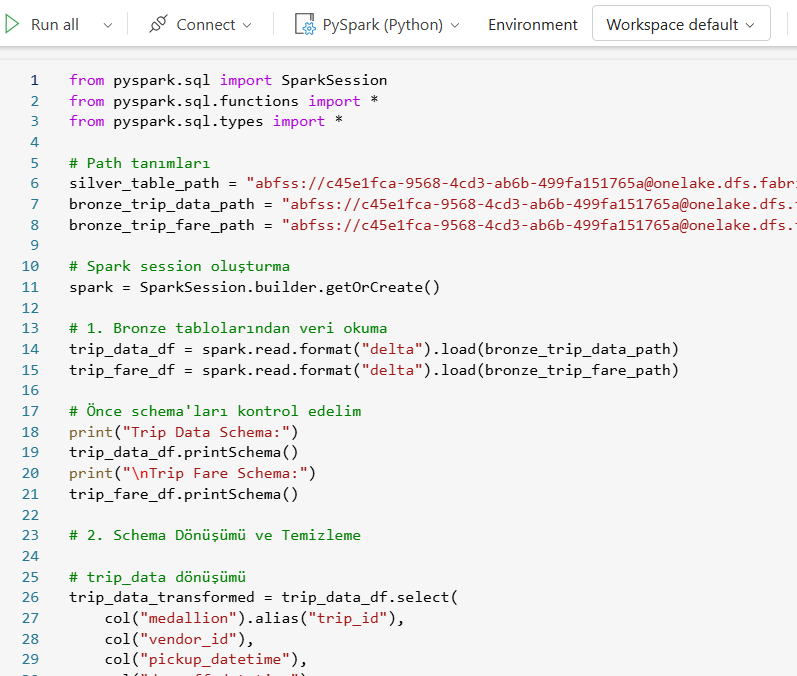
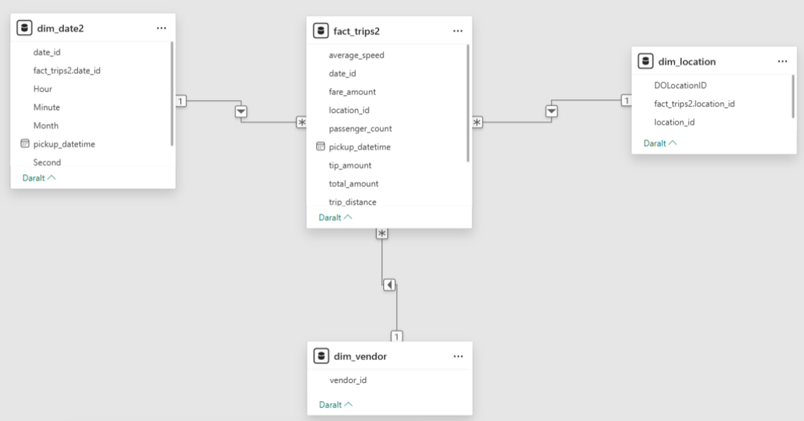
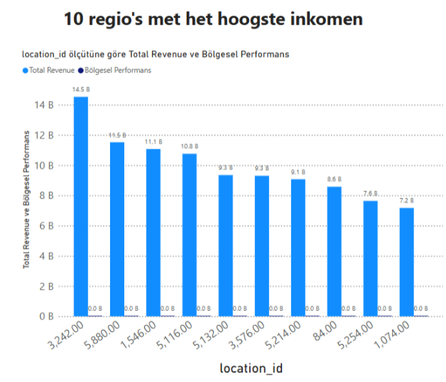
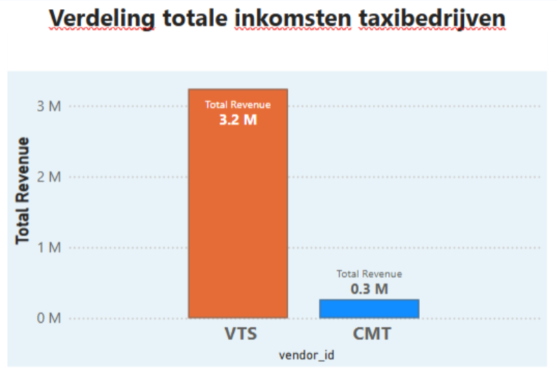
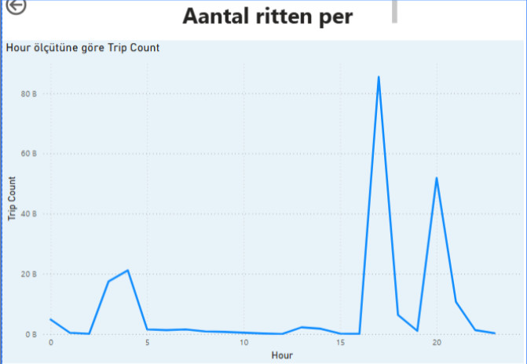

🟡 Projectverhaal – Van Directe Taxigegevens naar Inzicht

⏱ Duur: 2 weken

👥 Team: Yasin (Teamleider), Kahraman, Emine, Ayşe

🔧 Tools: Microsoft Fabric | Eventstream | Delta Lake | Dataflow Gen2 | Power BI | Eventhouse | Activator | Trello

## Proje Diyagrami
Önce projemize diyagram çizerek başladık. Böylece projede yapmamız gerekenleri gorselleştirerek izleyecegimiz adımları daha net görebildik.

## Görev paylaşımı

Team liderliğini yaptığım bu projede trello ile görev dağılımları yaptım ve sprintler oluşturdum. Böylece projemizi zamanında teslim edebildik.

## 🔹 Stap 1: Ruwe data realtime ontvangen via Eventstream

Projemize, taksilerden gelen veriyi gerçek zamanlı olarak alarak başladık. Her taksi bir olay (event) oluşturduğunda — örneğin bir yolculuk başladığında veya bittiğinde — bu veri anında Eventstream üzerinden sistemimize aktarıldı.

Bu veriler doğrudan herhangi bir işlem yapılmadan Delta Lake'in Bronze katmanına kaydedildi. Böylece elimizde her şeyin en ham haliyle tutulduğu bir veri deposu oluştu.

🔹 Stap 2: Opschonen en transformeren met Pyspark
Ham verileri Silver katmanına geçmeden önce temizlememiz gerekiyordu. Bunun için Notebook da Pyspark  aracını kullandık.

Bu aşamada:

Geçersiz/veri eksikliği olan kayıtları ayıkladık,

Tarih ve saat formatlarını dönüştürdük,

Kullanım amacına uygun sütunları hazırladık.

🔹 Stap 3: Modelleren in Gold met Star Schema
Silver katmandan gelen düzenlenmiş verileri, Dataflow Gen2 kullanarak Gold katmanda birleştirdik ve analiz ile raporlamaya hazır hale getirdik.
Burada dimension ve fact tabloları oluşturduk — örneğin:

dim_date2, dim_location, dım_vendor fact_trim

Bu modelleme sayesinde performanslı ve filtrelenebilir raporlar oluşturabildik.

🔹 Stap 4: Analyse & visualisatie in Power BI
Gold katmandaki verileri Power BI ile bağlayarak, kullanışlı ve şık bir dashboard tasarladık.

  

Dashboard özellikleri:

Tarih, lokasyon ve taksi bazlı filtreler

Toplam rit, ortalama mesafe, en yoğun saatler gibi KPIs

Harita görselleştirmeleri ile lokasyon bazlı analiz

🔹 Stap 5: Realtime monitoring met Eventhouse
Veri akışının düzgün ilerleyip ilerlemediğini anlık görmek için Eventhouse kullandık.

[dashboard1](./images/realtime-dashboard1.png) [dashboard2](./images/realtime-dashboard2.png)

 Burada:

Canlı event akışlarını takip ettik,

Gecikme ya da veri kaybı gibi problemleri önceden fark ettik.

🔹 Stap 6: Automatisering met Activator
Veri geldiğinde bazı tetikleyici (trigger) işlemler gerçekleştirmek istedik. Bunun için Activator kurduk.
Örneğin:

Belirli bir taksi bir saatte 5’ten fazla yolculuk yaparsa tetikleyici mesaj oluşturma

Gece saatlerinde uzun mesafeli yolculukları ayrı izleme

Bu sayede sadece raporlama değil, proaktif veri reaksiyonları da geliştirdik.

